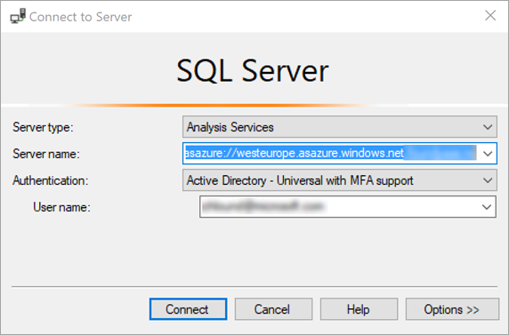
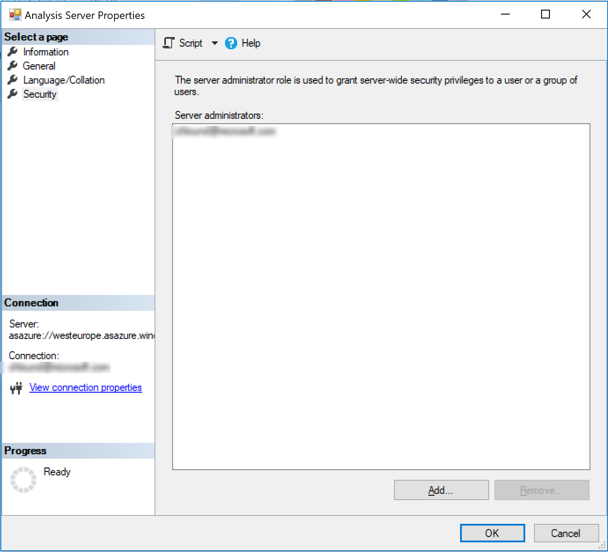
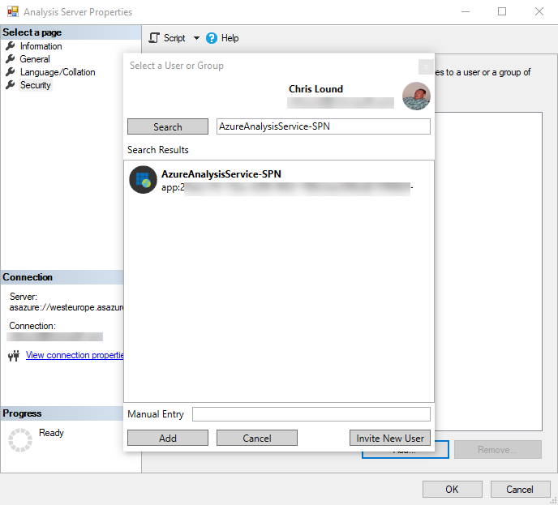

# Refresh with Logic Apps
By using Logic Apps and REST calls, you can do data-refresh operations on your Azure Analysis tabular models.  This includes synchronizations of read-only replicas for query scale-out.

> [!NOTE]
> For more information on using REST APIs with Azure Analysis Services, see the following article:  https://docs.microsoft.com/en-us/azure/analysis-services/analysis-services-async-refresh

## Authentication
All calls must be authenticated with a valid Azure Active Directory (OAuth 2) token.  The examples in this article will use a Service Principal (SPN) to authenticate to Azure Analysis Services.

> [!NOTE]
> For more information on creating a Service Principal, see the following article: https://docs.microsoft.com/en-us/azure/active-directory/develop/howto-create-service-principal-portal

## Designing the Logic App

> [!IMPORTANT]
> The following examples assume that the Azure Analysis Services firewall is disabled.  If the firewall is enabled then the public IP address of the request initiator will need to be white listed in the Azure Analysis Services firewall.
>
>See the following article for Logic App IP ranges per region:  https://docs.microsoft.com/en-us/azure/logic-apps/logic-apps-limits-and-config#firewall-configuration-ip-addresses

### Pre-requisites

Ensure you have a Service Principal created.  

Once the SPN is created, assign it permissions to Azure Analysis Services.  For example, to add the SPN as an Administrator:

1. Connect to the Azure Analysis Services instance through SQL Server Management Studio, and sign in when prompted.

 

2. In object explorer, right click the instance, and select **properties**

 

3. In the security tab, click **Add**.  Search for your Service Principal, and click **Add**.

 

If you are unable to find the SPN in the list, add it manually using the following format:
App:*SPN ClientID*@*TenantID*

In this example, the Logic App is designed to trigger when a HTTP request is received.  This will enable the use of an orchestration tool, such as Azure Data Factory, to trigger the Azure Analysis Services model refresh.

### Configure the Logic App

Once you have created a Logic App:

1. In the Logic App designer, choose the first action as **When a HTTP request is received**.

This step will populate with the HTTP POST URL once the Logic App is saved.

2. Add a new step and search for **HTTP**.  

3. Select **HTTP** to add this action.

Configure the HTTP activity as follows:

|Property  |Value  |
|---------|---------|
|**Method**     |POST         |
|**URI**     | https://*your server region*/servers/*aas server name*/models/*your database name*/     For example:  https://westus.asazure.windows.net/servers/myserver/models/AdventureWorks/|
|**Headers**     |   Content-Type, application/json          |
|**Body**     |   For more information, see the following article on forming the request body:  https://docs.microsoft.com/en-us/azure/analysis-services/analysis-services-async-refresh#post-refreshes |
|**Authentication**     |Active Directory OAuth         |
|**Tentant**     |Fill in your Azure Active Directory TenantId         |
|**Audience**     |https://*.asazure.windows.net         |
|**Client ID**     |Enter your Service Principal Name ClientID         |
|**Credential Type**     |Secret         |
|**Secret**     |Enter your Service Principal Name Secret         |

Example:

Now test the Logic App.  In the Logic App designer, click **Run**.

## Consume the Logic App with Azure Data Factory
Once the Logic App is saved, review the **When a HTTP request is received** activity and copy the **HTTP POST URL** that is now generated.  This is the URL that can be used by Azure Data Factory to make the asynchronous call to trigger the Logic App.

Here is an example Azure Data Factory Web Activity that does this action.

## Using a self-contained Logic App
If you do not plan on using an Orchestration tool such as Data Factory to trigger the model refresh, you can set the logic app to trigger the refresh based on a schedule.

Using the example above, delete the first activity and replace it with a **Schedule** activity.

This example will use **Recurrence**.

Once the activity has been added, configure the Interval and Frequency, then add a new parameter and choose **At these hours**.

Select the wanted hours.

Save the Logic App.

## See also

[Samples](analysis-services-samples.md)  
[REST API](https://docs.microsoft.com/rest/api/analysisservices/servers)
