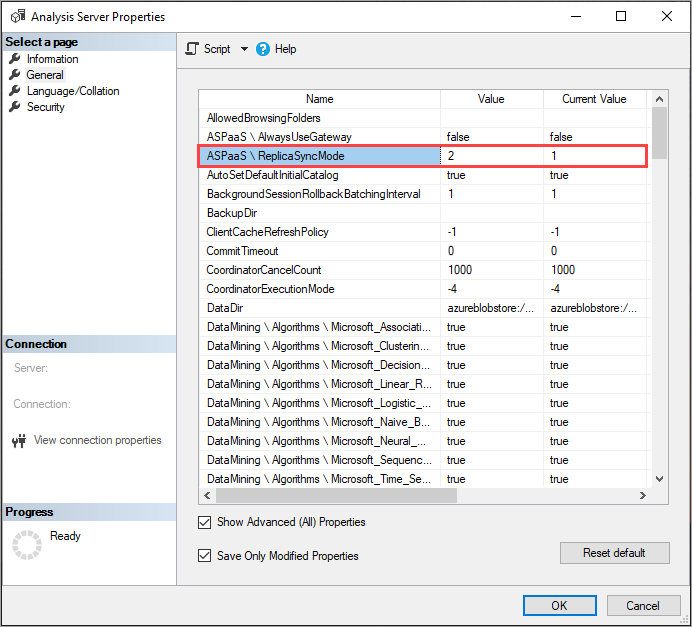
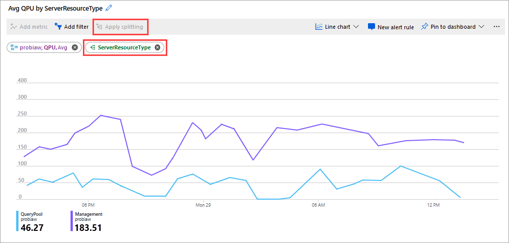
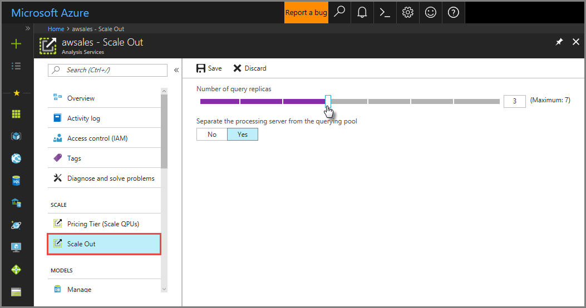
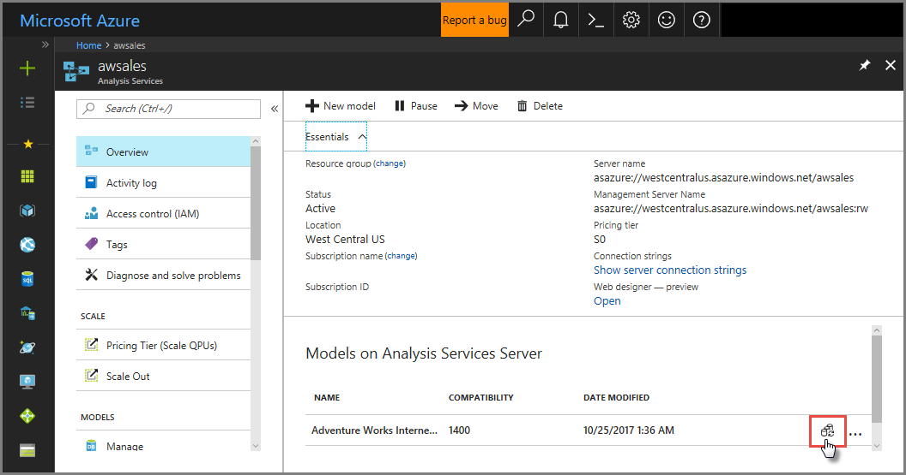
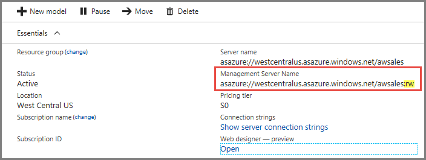

# Azure Analysis Services scale-out

With scale-out, client queries can be distributed among multiple *query replicas* in a *query pool*, reducing response times during high query workloads. You can also separate processing from the query pool, ensuring client queries are not adversely affected by processing operations. Scale-out can be configured in Azure portal or by using the Analysis Services REST API.

Scale-out is available for servers in the Standard pricing tier. Each query replica is billed at the same rate as your server. All query replicas are created in the same region as your server. The number of query replicas you can configure are limited by the region your server is in. To learn more, see [Availability by region](analysis-services-overview.md#availability-by-region). Scale-out does not increase the amount of available memory for your server. To increase memory, you need to upgrade your plan. 

## Why scale out?

In a typical server deployment, one server serves as both processing server and query server. If the number of client queries against models on your server exceeds the Query Processing Units (QPU) for your server's plan, or model processing occurs at the same time as high query workloads, performance can decrease. 

With scale-out, you can create a query pool with up to seven additional query replica resources (eight total, including your *primary* server). You can scale the number of replicas in the query pool to meet QPU demands at critical times, and you can separate a processing server from the query pool at any time. 

Regardless of the number of query replicas you have in a query pool, processing workloads are not distributed among query replicas. The primary server serves as the processing server. Query replicas serve only queries against the model databases synchronized between the primary server and each replica in the query pool. 

When scaling out, it can take up to five minutes for new query replicas to be incrementally added to the query pool. When all new query replicas are up and running, new client connections are load balanced across  resources in the query pool. Existing client connections are not changed from the resource they are currently connected to. When scaling in, any existing client connections to a query pool resource that is being removed from the query pool are terminated. Clients can reconnect to a remaining query pool resource.

## How it works

When configuring scale-out the first time, model databases on your primary server are *automatically* synchronized with new replicas in a new query pool. Automatic synchronization occurs only once. During automatic synchronization, the primary server's data files (encrypted at rest in blob storage) are copied to a second location, also encrypted at rest in blob storage. Replicas in the query pool are then *hydrated* with data from the second set of files. 

While an automatic synchronization is performed only when you scale-out a server for the first time, you can also perform a manual synchronization. Synchronizing assures data on replicas in the query pool match that of the primary server. When processing (refresh) models on the primary server, a synchronization must be performed *after* processing operations are completed. This synchronization copies updated data from the primary server's files in blob storage to the second set of files. Replicas in the query pool are then hydrated with updated data from the second set of files in blob storage. 

When performing a subsequent scale-out operation, for example, increasing the number of replicas in the query pool from two to five, the new replicas are hydrated with data from the second set of files in blob storage. There is no synchronization. If you then perform a synchronization after scaling out, the new replicas in the query pool would be hydrated twice - a redundant hydration. When performing a subsequent scale-out operation, it's important to keep in mind:

* Perform a synchronization *before the scale-out operation* to avoid redundant hydration of the added replicas. Concurrent synchronization and scale-out operations running at the same time are not allowed.

* When automating both processing *and* scale-out operations, it's important to first process data on the primary server, then perform a synchronization, and then perform the scale-out operation. This sequence assures minimal impact on QPU and memory resources.

* Synchronization is allowed even when there are no replicas in the query pool. If you are scaling out from zero to one or more replicas with new data from a processing operation on the primary server, perform the synchronization first with no replicas in the query pool, and then scale-out. Synchronizing before scaling out avoids redundant hydration of the newly added replicas.

* When deleting a model database from the primary server, it does not automatically get deleted from replicas in the query pool. You must perform a synchronization operation by using the [Sync-AzAnalysisServicesInstance](https://docs.microsoft.com/powershell/module/az.analysisservices/sync-AzAnalysisServicesinstance) PowerShell command that removes the file/s for that database from the replica's shared blob storage location and then deletes the model database on the replicas in the query pool. To determine if a model database exists on replicas in the query pool but not on the primary server, ensure the **Separate the processing server from querying pool** setting is to **Yes**. Then use SSMS to connect to the primary server using the `:rw` qualifier to see if the database exists. Then connect to replicas in the query pool by connecting without the `:rw` qualifier to see if the same database also exists. If the database exists on replicas in the query pool but not on the primary server, run a sync operation.   

* When renaming a database on the primary server, there's an additional step necessary to ensure the database is properly synchronized to any replicas. After renaming, perform a synchronization by using the [Sync-AzAnalysisServicesInstance](https://docs.microsoft.com/powershell/module/az.analysisservices/sync-AzAnalysisServicesinstance) command specifying the `-Database` parameter with the old database name. This synchronization removes the database and files with the old name from any replicas. Then perform another synchronization specifying the `-Database` parameter with the new database name. The second synchronization copies the newly named database to the second set of files and hydrates any replicas. These synchronizations cannot be performed by using the Synchronize model command in the portal.

### Synchronization mode

By default, query replicas are rehydrated in full, not incrementally. Rehydration happens in stages. They are detached and attached two at a time (assuming there are at least three replicas) to ensure at least one replica is kept online for queries at any given time. In some cases, clients may need to reconnect to one of the online replicas while this process is taking place. By using the (in Preview) **ReplicaSyncMode** setting, you can now specify query replica synchronization occurs in parallel. Parallel synchronization provides the following benefits: 

- Significant reduction in synchronization time. 
- Data across replicas are more likely to be consistent during the synchronization process. 
- Because databases are kept online on all replicas throughout the synchronization process, clients do not need to reconnect. 
- The in-memory cache is updated incrementally with only the changed data, which can be faster than fully rehydrating the model. 

#### Setting ReplicaSyncMode

Use SSMS to set ReplicaSyncMode in Advanced Properties. The possible values are: 

- `1` (default): Full replica database rehydration in stages (incremental). 
- `2`: Optimized synchronization in parallel. 

When setting **ReplicaSyncMode=2**, depending on how much of the cache needs to be updated, additional memory may be consumed by the query replicas. To keep the database online and available for queries, depending on how much of the data has changed, the operation can require up to *double the memory* on the replica because both the old and new segments are kept in memory simultaneously. Replica nodes have the same memory allocation as the primary node, and there is normally extra memory on the primary node for refresh operations, so it may be unlikely that the replicas would run out of memory. Additionally, the common scenario is that the database is incrementally updated on the primary node, and therefore the requirement for double the memory should be uncommon. If the Sync operation does encounter an out of memory error, it will retry using the default technique (attach/detach two at a time). 

### Separate processing from query pool

For maximum performance for both processing and query operations, you can choose to separate your processing server from the query pool. When separated, new client connections are assigned to query replicas in the query pool only. If processing operations only take up a short amount of time, you can choose to separate your processing server from the query pool only for the amount of time it takes to perform processing and synchronization operations, and then include it back into the query pool. When separating the processing server from the query pool, or adding it back into the query pool can take up to five minutes for the operation to complete.

## Monitor QPU usage

To determine if scale-out for your server is necessary, [monitor your server](analysis-services-monitor.md) in Azure portal by using Metrics. If your QPU regularly maxes out, it means the number of queries against your models is exceeding the QPU limit for your plan. The Query pool job queue length metric also increases when the number of queries in the query thread pool queue exceeds available QPU. 

Another good metric to watch is average QPU by ServerResourceType. This metric compares average QPU for the primary server with the query pool. 

**To configure QPU by ServerResourceType**

1. In a Metrics line chart, click **Add metric**. 
2. In **RESOURCE**, select your server, then in **METRIC NAMESPACE**, select **Analysis Services standard metrics**, then in **METRIC**, select **QPU**, and then in **AGGREGATION**, select **Avg**. 
3. Click **Apply Splitting**. 
4. In **VALUES**, select **ServerResourceType**.  

### Detailed diagnostic logging

Use Azure Monitor Logs for more detailed diagnostics of scaled out server resources. With logs, you can use Log Analytics queries to break out QPU and memory by server and replica. To learn more, see example queries in [Analysis Services diagnostics logging](analysis-services-logging.md#example-queries).

## Configure scale-out

### In Azure portal

1. In the portal, click **Scale-out**. Use the slider to select the number of query replica servers. The number of replicas you choose is in addition to your existing server.  

2. In **Separate the processing server from the querying pool**, select yes to exclude your processing server from query servers. Client [connections](#connections) using the default connection string (without `:rw`) are redirected to replicas in the query pool. 

   

3. Click **Save** to provision your new query replica servers. 

When configuring scale-out for a server the first time, models on your primary server are automatically synchronized with replicas in the query pool. Automatic synchronization only occurs once, when you first configure scale-out to one or more replicas. Subsequent changes to the number of replicas on the same server *will not trigger another automatic synchronization*. Automatic synchronization will not occur again even if you set the server to zero replicas and then again scale-out to any number of replicas. 

## Synchronize 

Synchronization operations must be performed manually or by using the REST API.

### In Azure portal

In **Overview** > model > **Synchronize model**.

### REST API

Use the **sync** operation.

#### Synchronize a model   

`POST https://<region>.asazure.windows.net/servers/<servername>:rw/models/<modelname>/sync`

#### Get sync status  

`GET https://<region>.asazure.windows.net/servers/<servername>/models/<modelname>/sync`

Return status codes:

|Code  |Description  |
|---------|---------|
|-1     |  Invalid       |
|0     | Replicating        |
|1     |  Rehydrating       |
|2     |   Completed       |
|3     |   Failed      |
|4     |    Finalizing     |
|||

### PowerShell

[!INCLUDE [updated-for-az](../../includes/updated-for-az.md)]

Before using PowerShell, [install or update the latest Azure PowerShell module](/powershell/azure/install-az-ps). 

To run sync, use [Sync-AzAnalysisServicesInstance](https://docs.microsoft.com/powershell/module/az.analysisservices/sync-AzAnalysisServicesinstance).

To set the number of query replicas, use [Set-AzAnalysisServicesServer](https://docs.microsoft.com/powershell/module/az.analysisservices/set-azanalysisservicesserver). Specify the optional `-ReadonlyReplicaCount` parameter.

To separate the processing server from the query pool, use [Set-AzAnalysisServicesServer](https://docs.microsoft.com/powershell/module/az.analysisservices/set-azanalysisservicesserver). Specify the optional `-DefaultConnectionMode` parameter to use `Readonly`.

To learn more, see [Using a service principal with the Az.AnalysisServices module](analysis-services-service-principal.md#azmodule).

## Connections

On your server's Overview page, there are two server names. If you haven't yet configured scale-out for a server, both server names work the same. Once you configure scale-out for a server, you need to specify the appropriate server name depending on the connection type. 

For end-user client connections like Power BI Desktop, Excel, and custom apps, use **Server name**. 

For SSMS, Visual Studio, and connection strings in PowerShell, Azure Function apps, and AMO, use **Management server name**. The management server name includes a special `:rw` (read-write) qualifier. All processing operations occur on the (primary) management server.

## Scale-up, Scale-down vs. Scale-out

You can change the pricing tier on a server with multiple replicas. The same pricing tier applies to all replicas. A scale operation will first bring down all replicas all at once then bring up all replicas on the new pricing tier.

## Troubleshoot

**Issue:** Users get error **Cannot find server '\<Name of the server>' instance in connection mode 'ReadOnly'.**

**Solution:** When selecting the **Separate the processing server from the querying pool** option, client connections using the default connection string (without `:rw`) are redirected to query pool replicas. If replicas in the query pool are not yet online because synchronization has not yet been completed, redirected client connections can fail. To prevent failed connections, there must be at least two servers in the query pool when performing a synchronization. Each server is synchronized individually while others remain online. If you choose to not have the processing server in the query pool during processing, you can choose to remove it from the pool for processing, and then add it back into the pool after processing is complete, but prior to synchronization. Use Memory and QPU metrics to monitor synchronization status.

## Related information

[Monitor server metrics](analysis-services-monitor.md)   
[Manage Azure Analysis Services](analysis-services-manage.md) 
