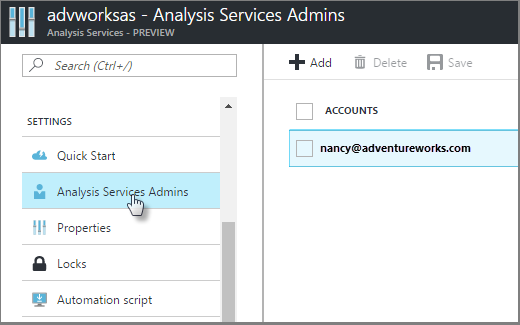
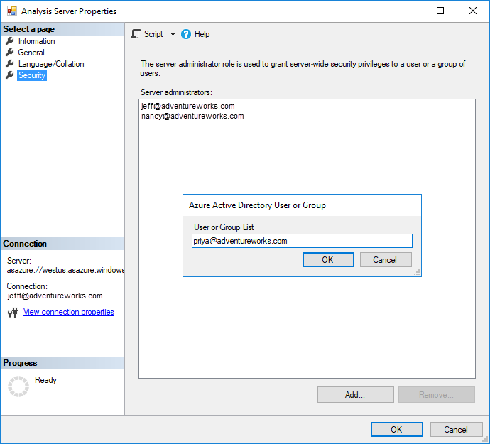

# Manage server administrators

Server administrators must be a valid user, service principal, or security group in the Azure Active Directory (Azure AD) for the tenant in which the server resides. You can use **Analysis Services Admins** for your server in Azure portal, Server Properties in SSMS, PowerShell, or REST API to manage server administrators. 

When adding a **security group**, use `obj:groupid@tenantid`. Service principals are not supported in security groups added to the server administrator role.

To learn more about adding a service principal to the server admin role, see [Add a service principal to the server administrator role](analysis-services-addservprinc-admins.md).

If server firewall is enabled, server administrator client computer IP addresses must be included in a firewall rule. To learn more, see [Configure server firewall](analysis-services-qs-firewall.md).

## To add server administrators by using Azure portal

1. In the portal, for your server, click **Analysis Services Admins**.
2. In **\<servername> - Analysis Services Admins**, click **Add**.
3. In **Add Server Administrators**, select user accounts from your Azure AD or invite external users by email address.

    

## To add server administrators by using SSMS

1. Right-click the server > **Properties**.
2. In **Analysis Server Properties**, click **Security**.
3. Click **Add**, and then enter the email address for a user or group in your Azure AD.
   
    

## PowerShell

[!INCLUDE [updated-for-az](../../includes/updated-for-az.md)]

Use [New-AzAnalysisServicesServer](/powershell/module/az.analysisservices/new-azanalysisservicesserver) cmdlet to specify the Administrator parameter when creating a new server.  
Use [Set-AzAnalysisServicesServer](/powershell/module/az.analysisservices/set-azanalysisservicesserver) cmdlet to modify the Administrator parameter for an existing server.

## REST API

Use [Create](/rest/api/analysisservices/servers/create) to specify the asAdministrator property when creating a new server.  
Use [Update](/rest/api/analysisservices/servers/update) to specify the asAdministrator property when modifying an existing server.  

## Next steps 

[Authentication and user permissions](analysis-services-manage-users.md)  
[Manage database roles and users](analysis-services-database-users.md)  
[Azure role-based access control (Azure RBAC)](../role-based-access-control/overview.md)
