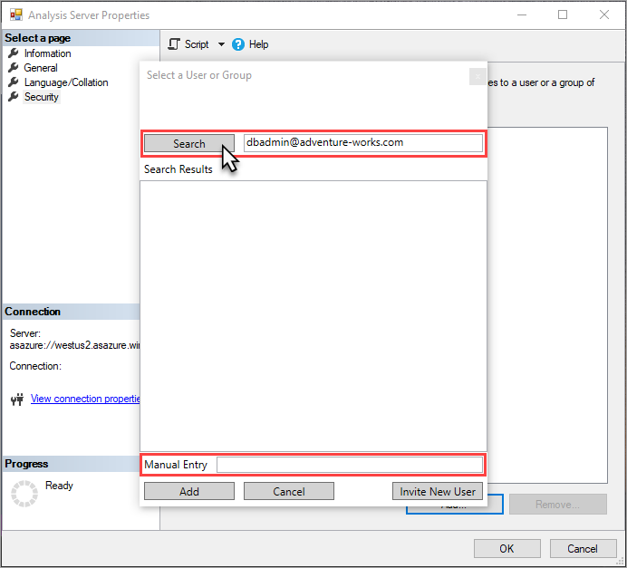

# 2 - Connect with SSMS

Connecting to your server in Azure is just like connecting to a server instance in your own organization. From SSMS, you can perform many of the same tasks such as process data or create a processing script, manage roles, and use PowerShell.
  
> [!div class="checklist"]
> * Get your server name from the portal
> * Connect to your server by using SSMS
> * Add a server administrator
> * Add a model database administrator
> * Add a role and group or user


## Prerequisites

- Have an Azure Analysis Services server in your subscription. See [Create a server - portal](analysis-services-create-server.md).
- The newest version of [SQL Server Management Studio](https://docs.microsoft.com/sql/ssms/download-sql-server-management-studio-ssms) (SSMS).
 - When using SSMS, before connecting to your server the first time, make sure your username is included in the Analysis Services Admins group. To learn more, see [Server administrators](#server-administrators) later in this article.


## Log in to the Azure portal

Log in to the [Azure portal](https://portal.azure.com/).

## Get server name
In order to connect to your Azure AS server, you will need the server name. You can copy the server name from the portal.

1.  In **Azure portal** > server > **Overview** > **Server name**, copy the server name.
   
    

## Connect in SSMS

1. In SSMS > **Object Explorer**, click **Connect** > **Analysis Services**.

    

2. In the **Connect to Server** dialog box, paste in the server name, then in **Authentication**, choose **Active Directory Universal with MFA Support**, then enter you user account and press **Connect**.
   
    

    > [!TIP]
    > It's recommended you chooose Active Directory Universal with MFA Support as the authentication type. This type supports [non-interactive or multi-factor authentication](../sql-database/sql-database-ssms-mfa-authentication.md). 

3. In **Object Explorer**, verify the server name and expand to see server objects. Right click to see server properties.
   
    

## Add a user account to server administrator role

In this step, you add a user account to the server administrator role.

1. In **Object Explorer**, right-click your server name, and then click **Properties**. 
2. In the **Analysis Server Properties** window, click **Security** > **Add**. You may be prompted to sign-in.
3. In **Select a User or Group**, search for or manually enter a user or group account in your Azure AD and then cick **Add**. 
   
     

4. Click **OK** to close **Analysis Server Properties**.

    > [!TIP]
    > You can also add server administrators by using **Analysis Services Admins** in the portal.

## Add a user to the model database administrator role

In this step, you add a user account to the Internet Sales Administrator role that already exists in the model. This role has has Full control (Administrator) permissions for the adventureworks model database.

1. In **Object Explorer**, expand **Databases** > **adventureworks** > **Roles**. 
2. Right-click **Internet Sales Administrator**, then click **Script Role as** > **CREATE OR REPLACE To** > **New Query Editor Window**. You may be prompted to sign-in.

    

3. In **XMLAQuery**, change **"memberName":** to a user account in your Azure AD. By default, the account you're signed in with will be included; however, you do not need to add your own account because you are already a server administrator.

    

4. Press **F5**, to execute the script.


## Add a new model database role and add a group

In this step, you create a TMSL script in the XMLA query window to create a new Internet Sales Global role, specify read permissions for the role, and add a group or user account from your Azure AD.

1. In **Object Explorer**, right-click **adventureworks**, and then click **New Query** > **XMLA**. You may be prompted to sign-in.
2. Enter the following TMSL script into the query editor:

    ```
    {
    "create": {
      "parentObject": {
        "database": "adventureworks",
       },
       "role": {
         "name": "Internet Sales Global",
         "description": "All users can query model data",
         "modelPermission": "read",
         "members": [
           {
             "memberName": "globalsales@adventureworks.com",
             "identityProvider": "AzureAD"
           }
         ]
       }
      }
    }
    ```

3. Change **"memberName":** to a user account in your Azure AD.
4. Press **F5**, to execute the script.

## Verify your changes

1. In **Object Explorer**, click your servername, and then click **Refresh** or press **F5**.
2. Expand **Databases** > **adventureworks** > **Roles**. Verify the user account and new role changes you added in the previous steps appear.

## Clean up resources

When no longer needed, delete the user or group accounts, and roles. To do so, use **Role Properties** > **Membership** to remove user accounts, or right-click a role and then click **Delete**.


## Next steps
In this tutorial, you learned how to connect to your Azure AS server and explore server databases and properties

> [!div class="checklist"]
> * Add 
> 
