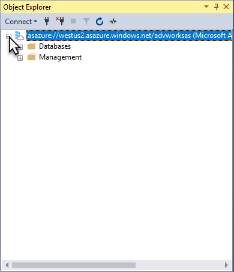

# 2 - Connect and query with SSMS

Connecting to your server in Azure is just like connecting to a server instance in your own organization. From SSMS, you can perform many of the same tasks such as process data or create a processing script, manage roles, and use PowerShell.
  
> [!div class="checklist"]
> * Connect to a server by using SSMS
> * Query the sample database

## Prerequisites

- Have an Azure Analysis Services server in your subscription. See [Create a server - portal](analysis-services-create-server.md).
- The newest version of [SQL Server Management Studio](https://docs.microsoft.com/sql/ssms/download-sql-server-management-studio-ssms) (SSMS).
 - When using SSMS, before connecting to your server the first time, make sure your username is included in the Analysis Services Admins group. To learn more, see [Server administrators](#server-administrators) later in this article.

## Log in to the Azure portal

Log in to the [Azure portal](https://portal.azure.com/).

## Get server name
In order to connect to your Azure AS server, you will need the server name. You can copy the server name from the portal.

1.  In **Azure portal** > server > **Overview** > **Server name**, copy the server name.
   
    

## Connect in SSMS

1. In SSMS > **Object Explorer**, click **Connect** > **Analysis Services**.

    

2. In the **Connect to Server** dialog box, paste in the server name, then in **Authentication**, choose **Active Directory Universal with MFA Support**, then enter you user account and press **Connect**.
   
    

    > [!TIP]
    > It's recommended you chooose Active Directory Universal with MFA Support as the authentication type. This type supports [non-interactive or multi-factor authentication](../sql-database/sql-database-ssms-mfa-authentication.md). 

3. In **Object Explorer**, verify the server name and expand to see server objects. Right click to see server properties.
   
    

## Query sample database
If you added the sample database as described in [2 - Add, you can use SSMS to query it using SQL queries.

1. 

## Next steps
In this tutorial, you learned how to connect to your Azure AS server and explore server databases and properties

> [!div class="checklist"]
> * 
> 
