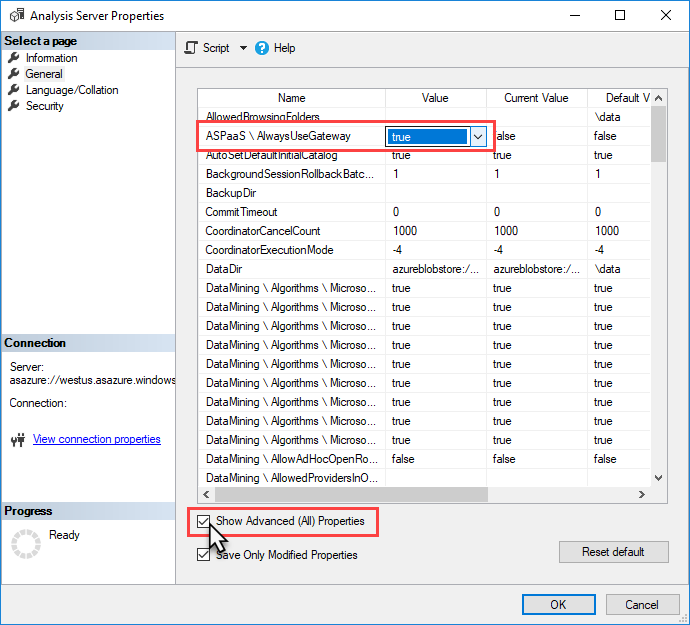

# Use gateway for data sources on an Azure Virtual Network (VNet)

This article describes the Azure Analysis Services **AlwaysUseGateway** server property for use when data sources are on an [Azure Virtual Network (VNet)](../virtual-network/virtual-networks-overview.md).

## Server access to VNet data sources

If your data sources are accessed through a VNet, your Azure Analysis Services server must connect to those data sources as if they are on-premises, in your own environment. You can configure the **AlwaysUseGateway** server property to specify the server to access all data sources through an [On-premises gateway](analysis-services-gateway.md). 

Azure SQL Managed Instance data sources run within Azure VNet with a private IP address. If public endpoint is enabled on the instance, a gateway is not required. If public endpoint is not enabled, an On-premises Data Gateway is required and the AlwaysUseGateway property must be set to true.

> [!NOTE]
> This property is effective only when an [On-premises Data Gateway](analysis-services-gateway.md) is installed and configured. The gateway can be on the VNet.

## Configure AlwaysUseGateway property

1. In SSMS > server > **Properties** > **General**, select **Show Advanced (All) Properties**.
2. In the **ASPaaS\AlwaysUseGateway**, select **true**.

    

## See also
[Connecting to on-premises data sources](analysis-services-gateway.md)   
[Install and configure an on-premises data gateway](analysis-services-gateway-install.md)   
[Azure Virtual Network (VNET)](../virtual-network/virtual-networks-overview.md)   

