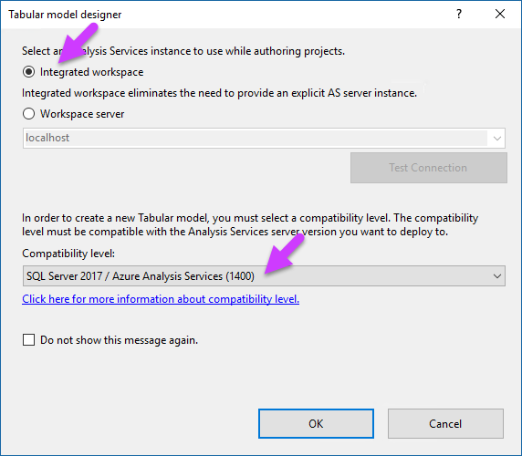
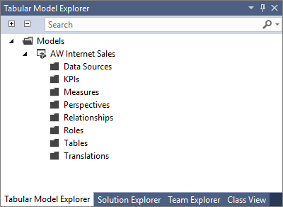
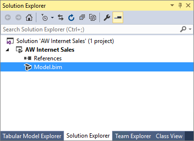
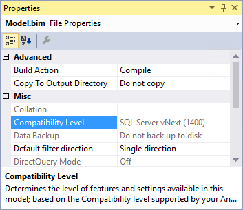

# Create a tabular model project

In this lesson, you use Visual Studio with Analysis Services Projects or SQL Server Data Tools (SSDT) to create a new tabular model project at the 1400 compatibility level. Once your new project is created, you can begin adding data and authoring your model. This lesson also gives you a brief introduction to the tabular model authoring environment in Visual Studio.  
  
Estimated time to complete this lesson: **10 minutes**  
  
## Prerequisites  
This topic is the first lesson in a tabular model authoring tutorial. To complete this lesson, there are several prerequisites you need to have in-place. To learn more, see [Azure Analysis Services - Adventure Works tutorial](../tutorials/aas-adventure-works-tutorial.md).  
  
## Create a new tabular model project  
  
#### To create a new tabular model project  
  
1.  In Visual Studio, on the **File** menu, click **New** > **Project**.  
  
2.  In the **New Project** dialog box, expand **Installed** > **Business Intelligence** > **Analysis Services**, and then click **Analysis Services Tabular Project**.  
  
3.  In  **Name**, type **AW Internet Sales**, and then specify a location for the project files.  
  
    By default, **Solution Name** is the same as the project name; however, you can type a different solution name.  
  
4.  Click **OK**.  
  
5.  In the **Tabular model designer** dialog box, select **Integrated workspace**.  
  
    The workspace hosts a tabular model database with the same name as the project during model authoring. Integrated workspace means Visual Studio uses a built-in instance, eliminating the need to install a separate Analysis Services server instance just for model authoring.
      
6.  In **Compatibility level**, select **SQL Server 2017 / Azure Analysis Services (1400)**.   
 
    
      
    If you don’t see SQL Server 2017 / Azure Analysis Services (1400) in the Compatibility level listbox, you’re not using the latest version of SQL Server Data Tools. To get the latest version, see [Install SQL Server Data tools](https://docs.microsoft.com/sql/ssdt/download-sql-server-data-tools-ssdt).  
      
  
## Understanding the Visual Studio tabular model authoring environment  
Now that you’ve created a new tabular model project, let’s take a moment to explore the tabular model authoring environment in Visual Studio.  
  
After your project is created, it opens in Visual Studio. On the right side, in **Tabular Model Explorer**, you see a tree view of the objects in your model. Since you haven't yet imported data, the folders are empty. You can right-click an object folder to perform actions, similar to the menu bar. As you step through this tutorial, you use the Tabular Model Explorer to navigate different objects in your model project.

Click the **Solution Explorer** tab. Here, you see your **Model.bim** file. If you don’t see the designer window to the left (the empty window with the Model.bim tab), in **Solution Explorer**, under **AW Internet Sales Project**, double-click the **Model.bim** file. The Model.bim file contains the metadata for your model project. 

  
Click **Model.bim**. In the **Properties** window, you see the model properties, most important of which is the **DirectQuery Mode** property. This property specifies if the model is deployed in In-Memory mode (Off) or DirectQuery mode (On). For this tutorial, you author and deploy your model in In-Memory mode.

  
When you create a model project, certain model properties are set automatically according to the Data Modeling settings that can be specified in the **Tools** menu > **Options** dialog box. Data Backup, Workspace Retention, and Workspace Server properties specify how and where the workspace database (your model authoring database) is backed up, retained in-memory, and built. You can change these settings later if necessary, but for now, leave these properties as they are.  

In **Solution Explorer**, right-click **AW Internet Sales** (project), and then click **Properties**. The **AW Internet Sales Property Pages** dialog box appears. You set some of these properties later when you deploy your model.  
  
When you installed Analysis Services projects or SSDT, several new menu items were added to the Visual Studio environment. Click the **Model** menu. From here, you can import data, refresh workspace data, browse your model in Excel, create perspectives and roles, select the model view, and set calculation options. Click the **Table** menu. From here, you can create and manage relationships, specify date table settings, create partitions, and edit table properties. If you click the **Column** menu, you can add and delete columns in a table, freeze columns, and specify sort order. Visual Studio also adds some buttons to the bar. Most useful is the AutoSum feature to create a standard aggregation measure for a selected column. Other toolbar buttons provide quick access to frequently used features and commands.  
  
Explore some of the dialogs and locations for various features specific to authoring tabular models. While some items are not yet active, you can get a good idea of the tabular model authoring environment.  
  

## What's next?
[Lesson 2: Get data](../tutorials/aas-lesson-2-get-data.md).

  
  
  
