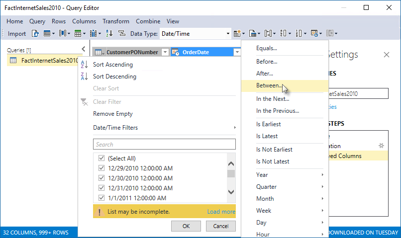
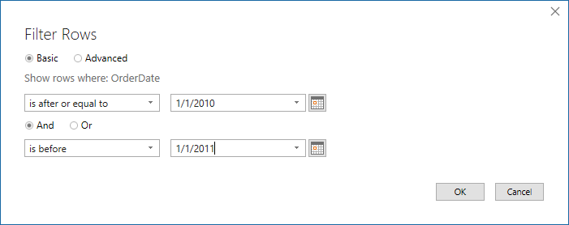
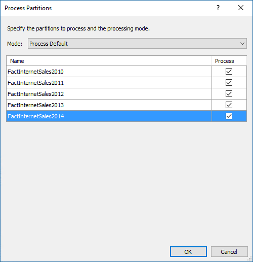
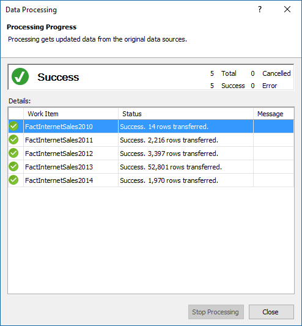

# Lesson 10: Create partitions
In this lesson, you create partitions to divide the FactInternetSales table into smaller logical parts that can be processed (refreshed) independent of other partitions. By default, every table you include in your model has one partition, which includes all of the table’s columns and rows. For the FactInternetSales table, we want to divide the data by year; one partition for each of the table’s five years. Each partition can then be processed independently. To learn more, see [Partitions](https://docs.microsoft.com/sql/analysis-services/tabular-models/partitions-ssas-tabular). 
  
Estimated time to complete this lesson: **15 minutes**  
  
## Prerequisites  
This topic is part of a tabular modeling tutorial, which should be completed in order. Before performing the tasks in this lesson, you should have completed the previous lesson: [Lesson 9: Create Hierarchies](../tutorials/aas-lesson-9-create-hierarchies.md).  
  
## Create partitions  
  
#### To create partitions in the FactInternetSales table  
  
1.  In Tabular Model Explorer, expand **Tables**, and then right-click **FactInternetSales** > **Partitions**.  
  
2.  In Partition Manager, click **Copy**, and then change the name to **FactInternetSales2010**.
  
    Because you want the partition to include only those rows within a certain period, for the year 2010, you must modify the query expression.
  
4.  Click **Design** to open Query Editor, and then click the **FactInternetSales2010** query.

5.  In preview, click the down arrow in the **OrderDate** column heading, and then click **Date/Time Filters** > **Between**.

    

6.  In the Filter Rows dialog box, in **Show rows where: OrderDate**, leave **is after or equal to**, and then in the date field, enter **1/1/2010**. Leave the **And** operator selected, then select **is before**, then in the date field, enter **1/1/2011**, and then click **OK**.

    
    
    Notice in Query Editor, in APPLIED STEPS, you see another step named Filtered Rows; this is the filter you applied to select only order dates from 2010.

8.  Click **Import** to run the query.

    In Partition Manager, notice the query expression now has an additional Filtered Rows clause.

    
  
    This statement specifies this partition should include only the data in those rows where the OrderDate is in the 2010 calendar year as specified in the filtered rows clause.  
  
  
#### To create a partition for the 2011 year  
  
1.  In the partitions list, click the **FactInternetSales2010** partition you created, and then click **Copy**.  Change the partition name to **FactInternetSales2011**. 

    You do not need to use Query Editor to create a new filtered rows clause. Because you created a copy of the query for 2010, all you need to do is make a slight change in the query for 2011.
  
2.  In **Query Expression**, in-order for this partition to include only those rows for the 2011 year, replace the years in the Filtered Rows clause with **2011** and **2012**, respectively, like:  
  
    ```  
    let
        Source = #"SQL/localhost;AdventureWorksDW2014",
        dbo_FactInternetSales = Source{[Schema="dbo",Item="FactInternetSales"]}[Data],
        #"Removed Columns" = Table.RemoveColumns(dbo_FactInternetSales,{"OrderDateKey", "DueDateKey", "ShipDateKey"}),
        #"Filtered Rows" = Table.SelectRows(#"Removed Columns", each [OrderDate] >= #datetime(2011, 1, 1, 0, 0, 0) and [OrderDate] < #datetime(2012, 1, 1, 0, 0, 0))
    in
        #"Filtered Rows"
   
    ```  
  
#### To create partitions for 2012, 2013, and 2014.  
  
- Follow the previous steps, creating partitions for 2012, 2013, and 2014, changing the years in the Filtered Rows clause to include only rows for that year. 
  

## Delete the FactInternetSales partition
Now that you have partitions for each year, you can delete the FactInternetSales partition; preventing overlap when choosing Process all when processing partitions.

#### To delete the FactInternetSales partition
-  Click the FactInternetSales partition, and then click **Delete**.


## Process partitions  
In Partition Manager, notice the **Last Processed** column for each of the new partitions you created shows these partitions have never been processed. When you create partitions, you should run a Process Partitions or Process Table operation to refresh the data in those partitions.  
  
#### To process the FactInternetSales partitions  
  
1.  Click **OK** to close Partition Manager.  
  
2.  Click the **FactInternetSales** table, then click the **Model** menu > **Process** > **Process Partitions**.  
  
3.  In the Process Partitions dialog box, verify **Mode** is set to **Process Default**.  
  
4.  Select the checkbox in the **Process** column for each of the five partitions you created, and then click **OK**.  

    
  
    If you're prompted for Impersonation credentials, enter the Windows user name and password you specified in Lesson 2.  
  
    The **Data Processing** dialog box appears and displays process details for each partition. Notice that a different number of rows for each partition are transferred. This is because each partition includes only those rows for the year specified in the WHERE clause in the SQL Statement. When processing is finished, go ahead and close the Data Processing dialog box.  
  
    
  
 ## What's next?
Go to the next lesson: [Lesson 11: Create Roles](../tutorials/aas-lesson-11-create-roles.md). 
