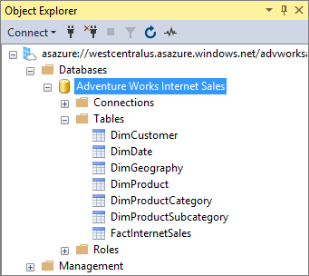

# Lesson 13: Deploy
In this lesson, you configure deployment properties; specifying an Analysis Services server in Azure, or a SQL Server vNext Analysis Services server on-premises, and a name for the model. You then deploy the model to that instance. After your model is deployed, users can connect to it by using a reporting client application. To learn more, see [Deploy to Azure Analysis Services](https://docs.microsoft.com/azure/analysis-services/analysis-services-deploy).  
  
Estimated time to complete this lesson: **5 minutes**  
  
## Prerequisites  
This topic is part of a tabular modeling tutorial, which should be completed in order. Before performing the tasks in this lesson, you should have completed the previous lesson: [Lesson 12: Analyze in Excel](../tutorials/aas-lesson-12-analyze-in-excel.md).  

**Important:** If you installed the AdventureWorksDW2014 sample database on an on-premises SQL Server, and you're deploying your model to an Azure Analysis Services server, an [On-premises data gateway](../analysis-services-gateway.md) is required.
  
## Deploy the model  
  
#### To configure deployment properties  

  
1.  In **Solution Explorer**, right-click the **AW Internet Sales** project, and then click **Properties**.  
  
2.  In the **AW Internet Sales Property Pages** dialog box, under **Deployment Server**, in the **Server** property, enter the name of an Analysis Services server in Azure or on-premises.  

    
 
    > [!IMPORTANT]  
    > You must have Administrator permissions on the remote Analysis Services instance in-order to deploy to it.  
  
3.  In the **Database** property, type **Adventure Works Internet Sales**.  
  
4.  In the **Model Name** property, type **Adventure Works Internet Sales Model**.  
  
5.  Verify your selections and then click **OK**.  
  
#### To deploy the Adventure Works Internet Sales
  
1.  In **Solution Explorer**, right-click the **AW Internet Sales** project > **Build**.  

2.  Right-click the **AW Internet Sales** project > **Deploy**.

    When deploying to Azure Analysis Services, you may be prompted to enter your account. Enter your organizational account and password, for example nancy@adventureworks.com. This account must be in Admins on the server instance.
  
    The Deploy dialog box appears and displays the deployment status of the metadata and each table included in the model.  
    
    
  
3. When deployment successfully completes, go ahead and click **Close**.  
  
## Conclusion  
Congratulations! You're finished authoring and deploying your first Analysis Services Tabular model. This tutorial has helped guide you through completing the most common tasks in creating a tabular model. Now that your Adventure Works Internet Sales model is deployed, you can use SQL Server Management Studio to manage the model; create process scripts and a backup plan. Users can also now connect to the model using a reporting client application such as Microsoft Excel or Power BI.  

  
  
  
## What's next?
*  [Supplemental Lesson - Dynamic security](../tutorials/aas-supplemental-lesson-dynamic-security.md)

*  [Supplemental Lesson - Detail rows](../tutorials/aas-supplemental-lesson-detail-rows.md)

*  [Supplemental Lesson - Ragged hierarchies](../tutorials/aas-supplemental-lesson-ragged-hierarchies.md)
