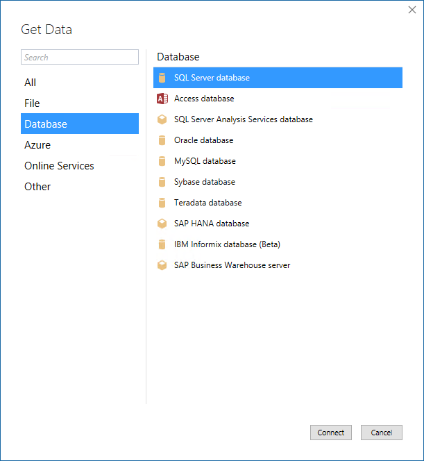
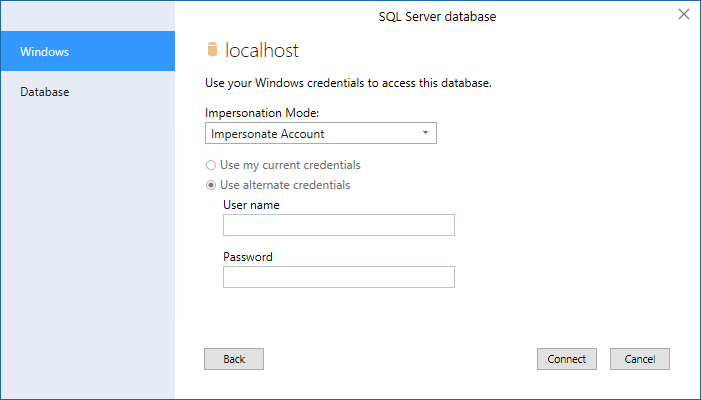
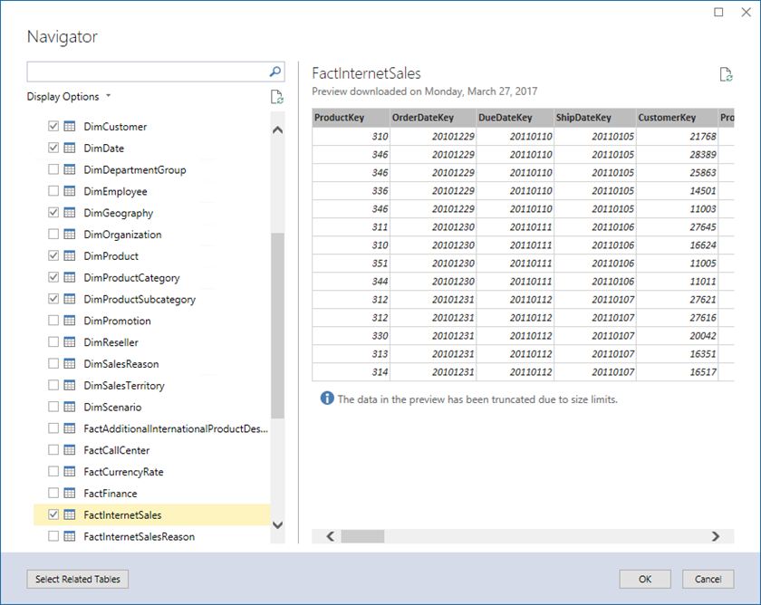
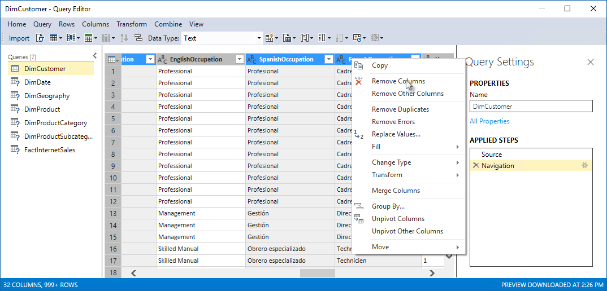
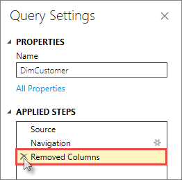
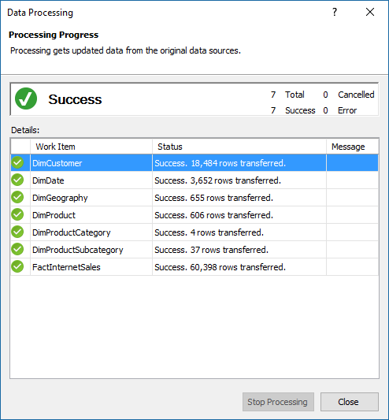

# Get data

In this lesson, you use Get Data in SSDT to connect to the Adventure Works  sample database, select data, preview and filter, and then import into your model workspace.  
  
By using Get Data, you can import data from a wide variety of sources: Azure SQL Database, Oracle, Sybase, OData Feed, Teradata, files and more. Data can also be queried using a Power Query M formula expression.

> [!NOTE]
> Tasks and images in this tutorial show connecting to an AdventureWorksDW2014 database on an on-premises server. In some cases, an Adventure Works database on Azure may be different.
  
Estimated time to complete this lesson: **10 minutes**  
  
## Prerequisites  
This topic is part of a tabular modeling tutorial, which should be completed in order. Before performing the tasks in this lesson, you should have completed the previous lesson: [Lesson 1: Create a new tabular model project](../tutorials/aas-lesson-1-create-a-new-tabular-model-project.md).  
  
## Create a connection  
  
#### To create a connection to the AdventureWorksDW2014 database  
  
1.  In Tabular Model Explorer, right-click **Data Sources** > **Import from Data Source**.  
  
    This launches Get Data, which guides you through connecting to a data source. If you don't see Tabular Model Explorer, in **Solution Explorer**, double-click **Model.bim** to open the model in the designer. 
    
    
  
2.  In Get Data, click **Database** > **SQL Server Database** > **Connect**.  
  
3.  In the **SQL Server Database** dialog, in **Server**, type the name of the server where you installed the AdventureWorksDW2014 database, and then click **Connect**.  

4.  When prompted to enter credentials, you need to specify the credentials Analysis Services uses to connect to the data source when importing and processing data. In **Impersonation Mode**, select **Impersonate Account**, then enter credentials, and then click **Connect**. It's recommended you use an account where the password doesn't expire.

    
  
    > [!NOTE]  
    > Using a Windows user account and password provides the most secure method of connecting to a data source.
  
5.  In Navigator, select the **AdventureWorksDW2014** database, and then click **OK**.This creates the connection to the database. 
  
6.  In Navigator, select the check box for the following tables: **DimCustomer**, **DimDate**, **DimGeography**, **DimProduct**, **DimProductCategory**, **DimProductSubcategory**, and **FactInternetSales**, and then click **Edit**.

    
  
    The Query Editor opens. In the next section, you select only the data you want to import.

  
## Filter the table data  
Tables in the AdventureWorksDW2014 sample database have data that isn't necessary to include in your model. When possible, you want to filter out unnecessary data to save in-memory space used by the model. You filter out some of the columns from tables so they're not imported into the workspace database, or the model database after it has been deployed. 
  
#### To filter the table data before importing  
  
1.  In Query Editor, select the **DimCustomer** table. A view of the DimCustomer table at the datasource (your AdventureWorksDW2014 sample database) appears. 
  
2.  Multi-select (Ctrl + click) **SpanishEducation**, **FrenchEducation**, **SpanishOccupation**, **FrenchOccupation**, then right-click, and then click **Remove Columns**. 

    
  
    Since the values for these columns are not relevant to Internet sales analysis, there is no need to import these columns. Eliminating unnecessary columns makes your model smaller and more efficient.  

    > [!TIP]
    > If you make a mistake, you can backup by deleting a step in **APPLIED STEPS**.   
    
    

  
4.  Filter the remaining tables by removing the following columns in each table:  
    
    **DimDate**
    
      |Column|  
      |--------|  
      |**DateKey**|  
      |**SpanishDayNameOfWeek**|  
      |**FrenchDayNameOfWeek**|  
      |**SpanishMonthName**|  
      |**FrenchMonthName**|  
  
    **DimGeography**
  
      |Column|  
      |-------------|  
      |**SpanishCountryRegionName**|  
      |**FrenchCountryRegionName**|  
      |**IpAddressLocator**|  
  
    **DimProduct**
  
      |Column|  
      |-----------|  
      |**SpanishProductName**|  
      |**FrenchProductName**|  
      |**FrenchDescription**|  
      |**ChineseDescription**|  
      |**ArabicDescription**|  
      |**HebrewDescription**|  
      |**ThaiDescription**|  
      |**GermanDescription**|  
      |**JapaneseDescription**|  
      |**TurkishDescription**|  
  
    **DimProductCategory**
  
      |Column|  
      |--------------------|  
      |**SpanishProductCategoryName**|  
      |**FrenchProductCategoryName**|  
  
    **DimProductSubcategory**
  
      |Column|  
      |-----------------------|  
      |**SpanishProductSubcategoryName**|  
      |**FrenchProductSubcategoryName**|  
  
    **FactInternetSales**
  
      No columns removed.
  
## Import the selected tables and column data  
Now that you've previewed and filtered out unnecessary data, you can import the rest of the data you do want. The wizard imports the table data along with any relationships between tables. New tables and columns are created in the model and data that you filtered out is not be imported.  
  
#### To import the selected tables and column data  
  
1.  Review your selections. If everything looks okay, click **Import**. The Data Processing dialog shows the status of data being imported from your datasource into your workspace database.
  
     
  
2.  Click **Close**.  

  
## Save your model project  
It's important to frequently save your model project.  
  
#### To save the model project  
  
-   Click **File** > **Save All**.  
  
## What's next?
[Lesson 3: Mark as Date Table](../tutorials/aas-lesson-3-mark-as-date-table.md).

  
  
