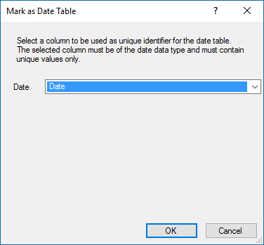

# Lesson 3: Mark as Date Table

[!INCLUDE[analysis-services-appliesto-aas-sql2017-later](../../../includes/analysis-services-appliesto-aas-sql2017-later.md)]

In Lesson 2: Get data, you imported a dimension table named DimDate. While in your model this table is named DimDate, it can also be known as a *Date table*, in that it contains date and time data.  
  
Whenever you use DAX time-intelligence functions, like when you create measures later, you must specify properties which include a *Date table* and a unique identifier *Date column* in that table.
  
In this lesson, you mark the DimDate table as the *Date table* and the Date column (in the Date table) as the *Date column* (unique identifier).  

Before you mark the date table and date column, it's a good time to do a little housekeeping to make your model easier to understand. Notice in the DimDate table a column named **FullDateAlternateKey**. This column contains one row for every day in each calendar year included in the table. You use this column a lot in measure formulas and in reports. But, FullDateAlternateKey isn't really a good identifier for this column. You rename it to **Date**, making it easier to identify and include in formulas. Whenever possible, it's a good idea to rename objects like tables and columns to make them easier to identify in SSDT and client reporting applications like Power BI and Excel. 
  
Estimated time to complete this lesson: **Three minutes**  
  
## Prerequisites  
This topic is part of a tabular modeling tutorial, which should be completed in order. Before performing the tasks in this lesson, you should have completed the previous lesson: [Lesson 2: Get data](../tutorials/aas-lesson-2-get-data.md). 

### To rename the FullDateAlternateKey column

1.  In the model designer, click the **DimDate** table.

2.  Double-click the header for the **FullDateAlternateKey** column, and then rename it to **Date**.

  
### To set Mark as Date Table  
  
1.  Select the **Date** column, and then in the **Properties** window, under **Data Type**, make sure  **Date** is selected.  
  
2.  Click the **Table** menu, then click **Date**, and then click **Mark as Date Table**.  
  
3.  In the **Mark as Date Table** dialog box, in the **Date** listbox, select the **Date** column as the unique identifier. It's usually selected by default. Click **OK**. 

    
  

## What's next?
[Lesson 4: Create relationships](../tutorials/aas-lesson-4-create-relationships.md).
  
