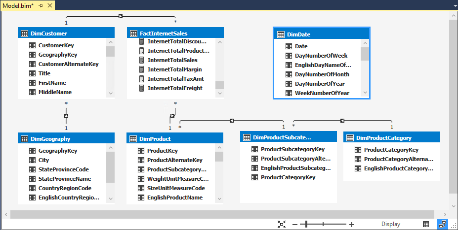
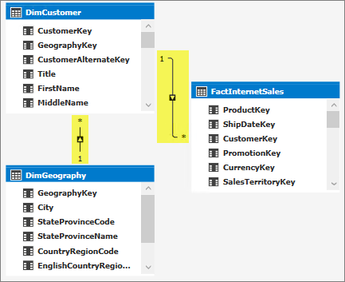
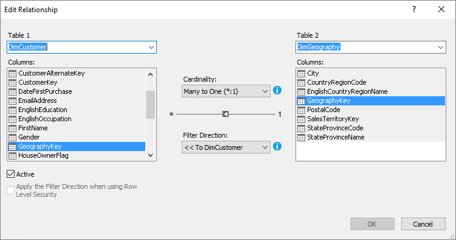
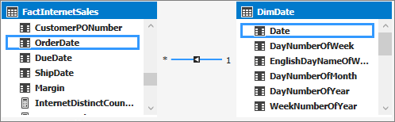
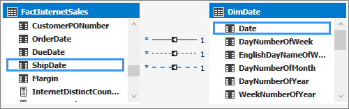

# Lesson 4: Create relationships

[!INCLUDE[analysis-services-appliesto-aas-sql2017-later](../../../includes/analysis-services-appliesto-aas-sql2017-later.md)]

In this lesson, you verify the relationships that were created automatically when you imported data and add new relationships between different tables. A relationship is a connection between two tables that establishes how the data in those tables should be correlated. For example, the DimProduct table and the DimProductSubcategory table have a relationship based on the fact that each product belongs to a subcategory. To learn more, see [Relationships](https://docs.microsoft.com/sql/analysis-services/tabular-models/relationships-ssas-tabular).
  
Estimated time to complete this lesson: **10 minutes**  
  
## Prerequisites  
This topic is part of a tabular modeling tutorial, which should be completed in order. Before performing the tasks in this lesson, you should have completed the previous lesson: [Lesson 3: Mark as Date Table](../tutorials/aas-lesson-3-mark-as-date-table.md). 
  
## Review existing relationships and add new relationships  
When you imported data by using Get Data, you got seven tables from the AdventureWorksDW2014 database. Generally, when you import data from a relational source, existing relationships are automatically imported together with the data. However, before you proceed with authoring your model you should verify those relationships between tables were created properly. For this tutorial, you add three new relationships.  
  
#### To review existing relationships  
  
1.  Click the **Model** menu > **Model View** > **Diagram View**.  

    The model designer now appears in Diagram View, a graphical format displaying all the tables you imported with lines between them. The lines between tables indicate the relationships that were automatically created when you imported the data.
    
    
  
    Include as many of the tables as possible by using minimap controls in the lower-right corner of the model designer. You can also click and drag tables to different locations, bringing tables closer together, or putting them in a particular order. Moving tables does not affect the relationships already between the tables. To view all the columns in a particular table, click and drag on a table edge to expand or make it smaller.  
  
2.  Click the solid line between the **DimCustomer** table and the **DimGeography** table. The solid line between these two tables shows this relationship is active, that is, it is used by default when calculating DAX formulas.  
  
    Notice the **GeographyKey** column in the **DimCustomer** table and the **GeographyKey** column in the **DimGeography** table now both each appear within a box. These columns are used in the relationship. The relationship’s properties now also appear in the **Properties** window.  
  
    > [!TIP]  
    > In addition to using the model designer in diagram view, you can also use the Manage Relationships dialog box to show the relationships between all tables in a table format. In Tabular Model Explorer, right-click **Relationships** > **Manage Relationships**.
  
3.  Verify the following relationships were created when each of the tables were imported from the AdventureWorksDW database:  
  
    |Active|Table|Related Lookup Table|  
    |----------|---------|------------------------|  
    |Yes|**DimCustomer [GeographyKey]**|**DimGeography [GeographyKey]**|  
    |Yes|**DimProduct [ProductSubcategoryKey]**|**DimProductSubcategory [ProductSubcategoryKey]**|  
    |Yes|**DimProductSubcategory [ProductCategoryKey]**|**DimProductCategory [ProductCategoryKey]**|  
    |Yes|**FactInternetSales [CustomerKey]**|**DimCustomer [CustomerKey]**|  
    |Yes|**FactInternetSales [ProductKey]**|**DimProduct [ProductKey]**|  
  
    If any of the relationships are missing, verify that your model includes the following tables: DimCustomer, DimDate, DimGeography, DimProduct, DimProductCategory, DimProductSubcategory, and FactInternetSales. If tables from the same data source connection are imported at separate times, any relationships between those tables are not be created and must be created manually.  

### Take a closer look
In Diagram View, notice an arrow, an asterisk, and a number on the lines that show the relationship between tables.

The arrow shows the filter direction. The asterisk shows this table is the many side in the relationship's cardinality, and the one shows this table is the one side of the relationship. If you need to edit a relationship; for example, change the relationship's filter direction or cardinality, double-click the relationship line to open the Edit Relationship dialog.

These features are meant for advanced data modeling and are outside the scope of this tutorial. To learn more, see [Bi-directional cross filters for tabular models in Analysis Services](https://docs.microsoft.com/sql/analysis-services/tabular-models/bi-directional-cross-filters-tabular-models-analysis-services).

In some cases, you may need to create additional relationships between tables in your model to support certain business logic. For this tutorial, you need to create three additional relationships between the FactInternetSales table and the DimDate table.  
  
#### To add new relationships between tables  
  
1.  In the model designer, in the **FactInternetSales** table, click, and hold on the **OrderDate** column, then drag the cursor to the **Date** column in the **DimDate** table, and then release.  

    A solid line appears showing you have created an active relationship between the **OrderDate** column in the **Internet Sales** table, and the **Date** column in the **Date** table. 
  
       
  
    > [!NOTE]  
    > When creating relationships, the cardinality and filter direction between the primary table and the related lookup table is automatically selected.  
  
2.  In the **FactInternetSales** table, click and hold on the **DueDate** column, then drag the cursor to the **Date** column in the **DimDate** table, and then release.  
  
    A dotted line appears showing you have created an inactive relationship between the **DueDate** column in the **FactInternetSales** table, and the **Date** column in the **DimDate** table. You can have multiple relationships between tables, but only one relationship can be active at a time. Inactive relationships can be made active to perform special aggregations in custom DAX expressions.  
  
3.  Finally, create one more relationship. In the **FactInternetSales** table, click and hold on the **ShipDate** column, then drag the cursor to the **Date** column in the **DimDate** table, and then release.  
    
     
  
## What's next?
[Lesson 5: Create calculated columns](../tutorials/aas-lesson-5-create-calculated-columns.md).
  
  
  
