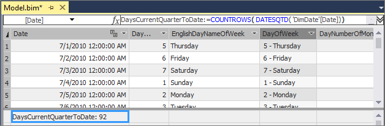
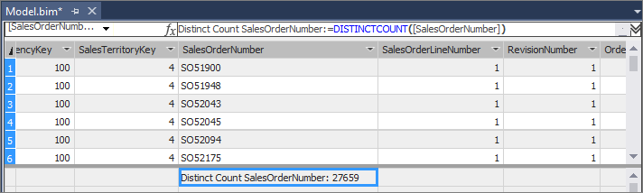

# Lesson 6: Create measures
In this lesson, you create measures to be included in your model. Similar to the calculated columns you created, a measure is a calculation created by using a DAX formula. However, unlike calculated columns, measures are evaluated based on a user selected *filter*; for example, a particular column or slicer added to the Row Labels field in a PivotTable. A value for each cell in the filter is then calculated by the applied measure. Measures are powerful, flexible calculations that you will want to include in almost all tabular models to perform dynamic calculations on numerical data. To learn more, see [Measures](https://docs.microsoft.com/sql/analysis-services/tabular-models/measures-ssas-tabular).
  
To create measures, you use the *Measure Grid*. By default, each table has an empty measure grid; however, you typically will not create measures for every table. The measure grid appears below a table in the model designer when in Data View. To hide or show the measure grid for a table, click the **Table** menu, and then click **Show Measure Grid**.  
  
You can create a measure by clicking on an empty cell in the measure grid, and then typing a DAX formula in the formula bar. When you click ENTER to complete the formula, the measure will then appear in the cell. You can also create measures using a standard aggregation function by clicking on a column, and then clicking on the AutoSum button (**∑**) on the toolbar. Measures created using the AutoSum feature will appear in the measure grid cell directly beneath the column, but can be moved.  
  
In this lesson, you create measures by both entering a DAX formula in the formula bar and by using the AutoSum feature.  
  
Estimated time to complete this lesson: **30 minutes**  
  
## Prerequisites  
This topic is part of a tabular modeling tutorial, which should be completed in order. Before performing the tasks in this lesson, you should have completed the previous lesson: [Lesson 5: Create calculated columns](../tutorials/aas-lesson-5-create-calculated-columns.md).  
  
## Create measures  
  
#### To create a DaysCurrentQuarterToDate measure in the DimDate table  
  
1.  In the model designer, click the **DimDate** table.  
  
2.  In the measure grid, click the top-left empty cell.  
  
3.  In the formula bar, type the following formula:  
  
    ```
    DaysCurrentQuarterToDate:=COUNTROWS( DATESQTD( 'DimDate'[Date])) 
    ```
  
    Notice the top-left cell now contains a measure name, **DaysCurrentQuarterToDate**, followed by the result, **92**.
    
       
    
    Unlike calculated columns, with measure formulas you can type the measure name, followed by a comma, followed by the formula expression.

  
#### To create a DaysInCurrentQuarter measure in the DimDate table  
  
1.  With the **DimDate** table still active in the model designer, in the measure grid, click the empty cell below the measure you just created.  
  
2.  In the formula bar, type the following formula:  
  
    ```
    DaysInCurrentQuarter:=COUNTROWS( DATESBETWEEN( 'DimDate'[Date], STARTOFQUARTER( LASTDATE('DimDate'[Date])), ENDOFQUARTER('DimDate'[Date])))
    ```
  
    When creating a comparison ratio between one incomplete period and the previous period; the formula must take into account the proportion of the period that has elapsed, and compare it to the same proportion in the previous period. In this case, [DaysCurrentQuarterToDate]/[DaysInCurrentQuarter] gives the proportion elapsed in the current period.  
  
#### To create an InternetDistinctCountSalesOrder measure in the FactInternetSales table  
  
1.  Click the **FactInternetSales** table.   
  
2.  Click on the **SalesOrderNumber** column heading.  
  
3.  On the toolbar, click the down-arrow next to the AutoSum (**∑**) button, and then select **DistinctCount**.  
  
    The AutoSum feature automatically creates a measure for the selected column using the DistinctCount standard aggregation formula.  
    
       
  
4.  In the measure grid, click the new measure, and then in the **Properties** window, in **Measure Name**, rename the measure to **InternetDistinctCountSalesOrder**. 
 
  
#### To create additional measures in the FactInternetSales table  
  
1.  By using the AutoSum feature, create and name the following measures:  

    |Column|Measure name|AutoSum (∑)|Formula|  
    |----------------|----------|-----------------|-----------|  
    |SalesOrderLineNumber|InternetOrderLinesCount|Count|=COUNTA([SalesOrderLineNumber])|  
    |OrderQuantity|InternetTotalUnits|Sum|=SUM([OrderQuantity])|  
    |DiscountAmount|InternetTotalDiscountAmount|Sum|=SUM([DiscountAmount])|  
    |TotalProductCost|InternetTotalProductCost|Sum|=SUM([TotalProductCost])|  
    |SalesAmount|InternetTotalSales|Sum|=SUM([SalesAmount])|  
    |Margin|InternetTotalMargin|Sum|=SUM([Margin])|  
    |TaxAmt|InternetTotalTaxAmt|Sum|=SUM([TaxAmt])|  
    |Freight|InternetTotalFreight|Sum|=SUM([Freight])|  
  
2.  By clicking on an empty cell in the measure grid, and by using the formula bar, create and name the following measures in order:  
  
      ```
      InternetPreviousQuarterMargin:=CALCULATE([InternetTotalMargin],PREVIOUSQUARTER('DimDate'[Date]))
      ```
      
      ```
      InternetCurrentQuarterMargin:=TOTALQTD([InternetTotalMargin],'DimDate'[Date])
      ```
  
      ```
      InternetPreviousQuarterMarginProportionToQTD:=[InternetPreviousQuarterMargin]*([DaysCurrentQuarterToDate]/[DaysInCurrentQuarter])
      ```
  
      ```
      InternetPreviousQuarterSales:=CALCULATE([InternetTotalSales],PREVIOUSQUARTER('DimDate'[Date]))
      ```
  
      ```
      InternetCurrentQuarterSales:=TOTALQTD([InternetTotalSales],'DimDate'[Date])
      ```
      
      ```
      InternetPreviousQuarterSalesProportionToQTD:=[InternetPreviousQuarterSales]*([DaysCurrentQuarterToDate]/[DaysInCurrentQuarter])
      ```
  
Measures created for the FactInternetSales table can be used to analyze critical financial data such as sales, costs, and profit margin for items defined by the user selected filter.  
  
## What's next?
[Lesson 7: Create Key Performance Indicators](../tutorials/aas-lesson-7-create-key-performance-indicators.md).  

  
