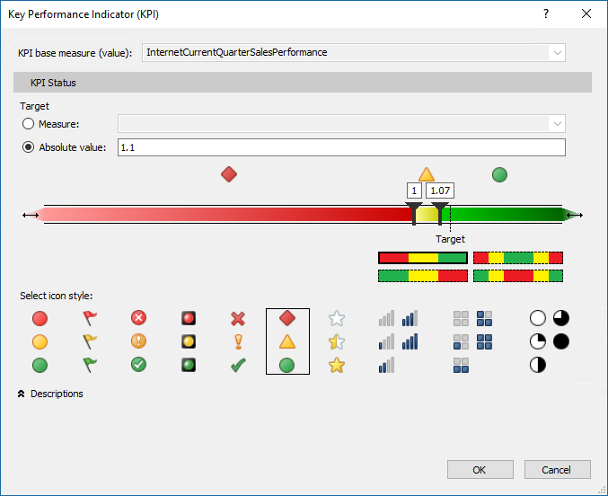

# Lesson 7: Create Key Performance Indicators
In this lesson, you create Key Performance Indicators (KPIs). KPIs are used to gauge performance of a value, defined by a *Base* measure, against a *Target* value, also defined by a measure or by an absolute value. In reporting client applications, KPIs can provide business professionals a quick and easy way to understand a summary of business success or to identify trends. To learn more, see [KPIs](https://docs.microsoft.com/sql/analysis-services/tabular-models/kpis-ssas-tabular)
  
Estimated time to complete this lesson: **15 minutes**  
  
## Prerequisites  
This topic is part of a tabular modeling tutorial, which should be completed in order. Before performing the tasks in this lesson, you should have completed the previous lesson: [Lesson 6: Create measures](../tutorials/aas-lesson-6-create-measures.md).   
  
## Create Key Performance Indicators  
  
#### To create an InternetCurrentQuarterSalesPerformance KPI  
  
1.  In the model designer, click the **FactInternetSales** table.  
  
2.  In the measure grid, click an empty cell.  
  
3.  In the formula bar, above the table, type the following formula: 
 
    ```  
    InternetCurrentQuarterSalesPerformance :=DIVIDE([InternetCurrentQuarterSales]/[InternetPreviousQuarterSalesProportionToQTD],BLANK())  
    ```

    This measure will serve as the Base measure for the KPI.  
  
4.  Right-click **InternetCurrentQuarterSalesPerformance** > **Create KPI**.   
  
5.  In the Key Performance Indicator (KPI) dialog box, in **Target** select **Absolute Value**, and then type **1.1**.  
  
7.  In the left (low) slider field, type **1**, and then in the right (high) slider field, type **1.07**.  
  
8.  In **Select Icon Style**, select the diamond (red), triangle (yellow), circle (green) icon type.
  
    
    
    > [!TIP]  
    > Notice the expandable **Descriptions** label below the available icon styles. Use this to enter descriptions for the various KPI elements to make them more identifiable in client applications.  
  
9. Click **OK** to complete the KPI.  
  
    In the measure grid, notice the icon next to the **InternetCurrentQuarterSalesPerformance** measure. This icon indicates that this measure serves as a Base value for a KPI.  
  
#### To create an InternetCurrentQuarterMarginPerformance KPI  
  
1.  In the measure grid for the **FactInternetSales** table, click an empty cell.  
  
2.  In the formula bar, above the table, type the following formula:  

    ```
    InternetCurrentQuarterMarginPerformance :=IF([InternetPreviousQuarterMarginProportionToQTD]<>0,([InternetCurrentQuarterMargin]-[InternetPreviousQuarterMarginProportionToQTD])/[InternetPreviousQuarterMarginProportionToQTD],BLANK())  
    ```
 
3.  Right-click **InternetCurrentQuarterMarginPerformance** > **Create KPI**.  
  
4.  In the Key Performance Indicator (KPI) dialog box, in **Target** select **Absolute Value**, and then type **1.25**.   
  
5.  In the left (low) slider field, slide until the field displays **0.8**, and then slide the right (high) slider field, until the field displays **1.03**.  
  
6.  In **Select Icon Style**, select the diamond (red), triangle (yellow), circle (green) icon type, and then click **OK**.  
  
## What's next?
[Lesson 8: Create perspectives](../tutorials/aas-lesson-8-create-perspectives.md).
  
  
