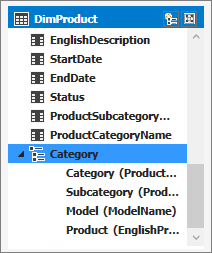

# Lesson 9: Create hierarchies

[!INCLUDE[analysis-services-appliesto-aas-sql2017-later](../../../includes/analysis-services-appliesto-aas-sql2017-later.md)]

In this lesson, you create hierarchies. Hierarchies are groups of columns arranged in levels; for example, a Geography hierarchy might have sublevels for Country, State, County, and City. Hierarchies can appear separate from other columns in a reporting client application field list, making them easier for client users to navigate and include in a report. To learn more, see [Hierarchies](https://docs.microsoft.com/sql/analysis-services/tabular-models/hierarchies-ssas-tabular)
  
To create hierarchies, use the model designer in *Diagram View*. Creating and managing hierarchies is not supported in Data View.  
  
Estimated time to complete this lesson: **20 minutes**  
  
## Prerequisites  
This topic is part of a tabular modeling tutorial, which should be completed in order. Before performing the tasks in this lesson, you should have completed the previous lesson: [Lesson 8: Create perspectives](../tutorials/aas-lesson-8-create-perspectives.md).  
  
## Create hierarchies  
  
#### To create a Category hierarchy in the DimProduct table  
  
1.  In the model designer (diagram view), right-click the **DimProduct** table > **Create Hierarchy**. A new hierarchy appears at the bottom of the table window. Rename the hierarchy **Category**.  
  
2.  Click and drag the **ProductCategoryName** column to the new **Category** hierarchy.  
  
3.  In the **Category** hierarchy, right-click the **ProductCategoryName** > **Rename**, and then type **Category**.  
  
    > [!NOTE]  
    > Renaming a column in a hierarchy does not rename that column in the table. A column in a hierarchy is just a representation of the column in the table.  
  
4.  Click and drag the **ProductSubcategoryName** column to the **Category** hierarchy. Rename it **Subcategory**. 
  
5.  Right-click the **ModelName** column > **Add to hierarchy**, and then select **Category**. Rename it **Model**.

6.  Finally, add **EnglishProductName** to the Category hierarchy. Rename it **Product**.  

    
  
#### To create hierarchies in the DimDate table  
  
1.  In the **DimDate** table, create a hierarchy named **Calendar**.  
  
3.  Add the following columns in-order:

    *  CalendarYear
    *  CalendarSemester
    *  CalendarQuarter
    *  MonthCalendar
    *  DayNumberOfMonth
    
4.  In the **DimDate** table, create a **Fiscal** hierarchy. Include the following columns in-order:  
  
    *  FiscalYear
    *  FiscalSemester
    *  FiscalQuarter
    *  MonthCalendar
    *  DayNumberOfMonth
  
5.  Finally, in the **DimDate** table, create a **ProductionCalendar** hierarchy. Include the following columns in-order:  
    *  CalendarYear
    *  WeekNumberOfYear
    *  DayNumberOfWeek
  
 ## What's next?
[Lesson 10: Create partitions](../tutorials/aas-lesson-10-create-partitions.md). 
  
  
