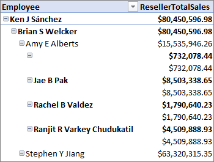
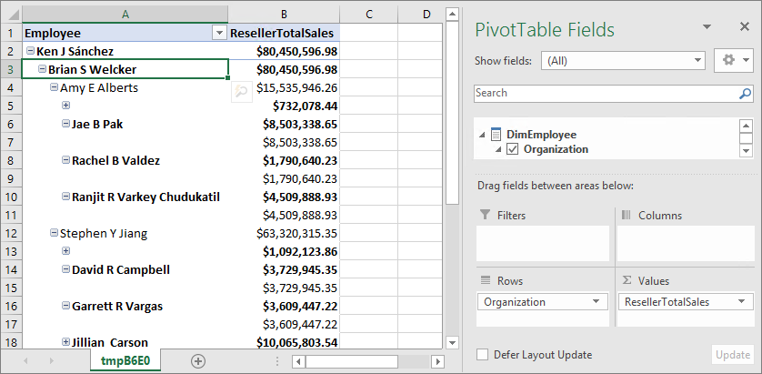
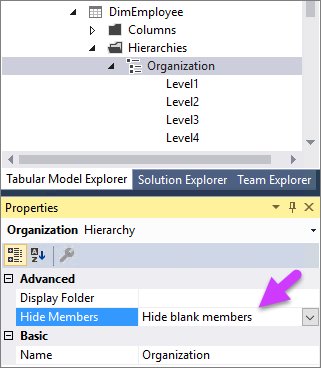
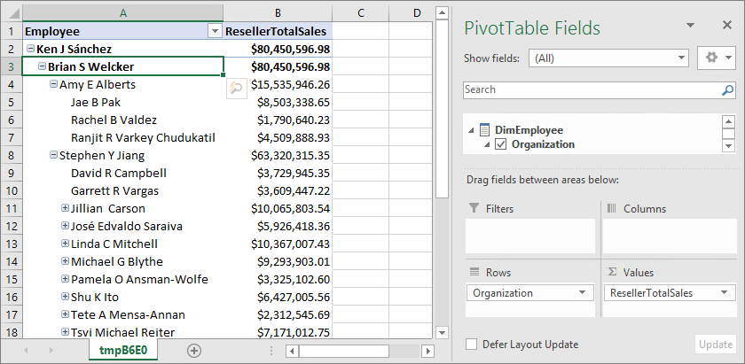

# Supplemental lesson - Ragged hierarchies
In this supplemental lesson, you resolve a common problem when pivoting on hierarchies that contain blank values (members) at different levels. For example, an organization where a high-level manager has both departmental managers and non-managers as direct reports. Or, geographic hierarchies composed of Country-Region-City, where some cities lack a parent State or Province, such as Washington D.C., Vatican City. When a hierarchy has blank members, it often descends to different, or ragged, levels.



Tabular models at the 1400 compatibility level have an additional **Hide Members** property for hierarchies. The **Default** setting assumes there are no blank members at any level. The **Hide blank members** setting excludes blank members from the hierarchy when added to a PivotTable or report.  
  
Estimated time to complete this lesson: **20 minutes**  
  
## Prerequisites  
This supplemental lesson topic is part of a tabular modeling tutorial. Before performing the tasks in this supplemental lesson, you should have completed all previous lessons or have a completed Adventure Works Internet Sales sample model project. 

If you've created the AW Internet Sales project as part of the tutorial, your model does not yet contain any data or hierarchies that are ragged. To complete this supplemental lesson, you first have to create the problem by adding some additional tables, create relationships, calculated columns, a measure, and a new Organization hierarchy. That part takes about 15
 minutes. Then, you get to solve it in just a few minutes.  

## Add tables and objects
  
### To add new tables to your model
  
1.  In Tabular Model Explorer, expand **Data Sources**, then right-click your connection > **Import New Tables**.
  
2.  In Navigator, select **DimEmployee** and **FactResellerSales**, and then click **OK**.

3.  In Query Editor, click **Import**

4.  Create the following [relationships](../tutorials/aas-lesson-4-create-relationships.md):

    | Table 1           | Column       | Filter Direction   | Table 2     | Column      | Active |
    |-------------------|--------------|--------------------|-------------|-------------|--------|
    | FactResellerSales | OrderDateKey | Default            | DimDate     | Date        | Yes    |
    | FactResellerSales | DueDate      | Default            | DimDate     | Date        | No     |
    | FactResellerSales | ShipDateKey  | Default            | DimDate     | Date        | No     |
    | FactResellerSales | ProductKey   | Default            | DimProduct  | ProductKey  | Yes    |
    | FactResellerSales | EmployeeKey  | To Both Tables | DimEmployee | EmployeeKey | Yes    |

5. In the **DimEmployee** table, create the following [calculated columns](../tutorials/aas-lesson-5-create-calculated-columns.md): 

    **Path** 
    ```
    =PATH([EmployeeKey],[ParentEmployeeKey])
    ```

    **FullName** 
    ```
    =[FirstName] & " " & [MiddleName] & " " & [LastName]
    ```

    **Level1** 
    ```
    =LOOKUPVALUE(DimEmployee[FullName],DimEmployee[EmployeeKey],PATHITEM([Path],1,1)) 
    ```

    **Level2** 
    ```
    =LOOKUPVALUE(DimEmployee[FullName],DimEmployee[EmployeeKey],PATHITEM([Path],1,2)) 
    ```

    **Level3** 
    ```
    =LOOKUPVALUE(DimEmployee[FullName],DimEmployee[EmployeeKey],PATHITEM([Path],1,3)) 
    ```

    **Level4** 
    ```
    =LOOKUPVALUE(DimEmployee[FullName],DimEmployee[EmployeeKey],PATHITEM([Path],1,4)) 
    ```

    **Level5** 
    ```
    =LOOKUPVALUE(DimEmployee[FullName],DimEmployee[EmployeeKey],PATHITEM([Path],1,5)) 
    ```

6.  In the **DimEmployee** table, create a [hierarchy](../tutorials/aas-lesson-9-create-hierarchies.md) named **Organization**. Add the following columns in-order: **Level1**, **Level2**, **Level3**, **Level4**, **Level5**.

7.  In the **FactResellerSales** table, create the following [measure](../tutorials/aas-lesson-6-create-measures.md):

    ```
    ResellerTotalSales:=SUM([SalesAmount])
    ```

8.  Use [Analyze in Excel](../tutorials/aas-lesson-12-analyze-in-excel.md) to open Excel and automatically create a PivotTable.

9.  In **PivotTable Fields**, add the **Organization** hierarchy from the **DimEmployee** table to **Rows**, and the **ResellerTotalSales** measure from the **FactResellerSales**  table to **Values**.

    

    As you can see in the PivotTable, the hierarchy displays rows that are ragged. There are many rows where blank members are shown.

## To fix the ragged hierarchy by setting the Hide members property

1.  In **Tabular Model Explorer**, expand **Tables** > **DimEmployee** > **Hierarchies** > **Organization**.

2.  In **Properties** > **Hide Members**, select **Hide blank members**. 

    

3.  Back in Excel, refresh the PivotTable. 

    

    Now that looks a whole lot better!

## See Also   
[Lesson 9: Create hierarchies](../tutorials/aas-lesson-9-create-hierarchies.md)  
[Supplemental Lesson - Dynamic security](../tutorials/aas-supplemental-lesson-dynamic-security.md)  
[Supplemental Lesson - Detail rows](../tutorials/aas-supplemental-lesson-detail-rows.md)  