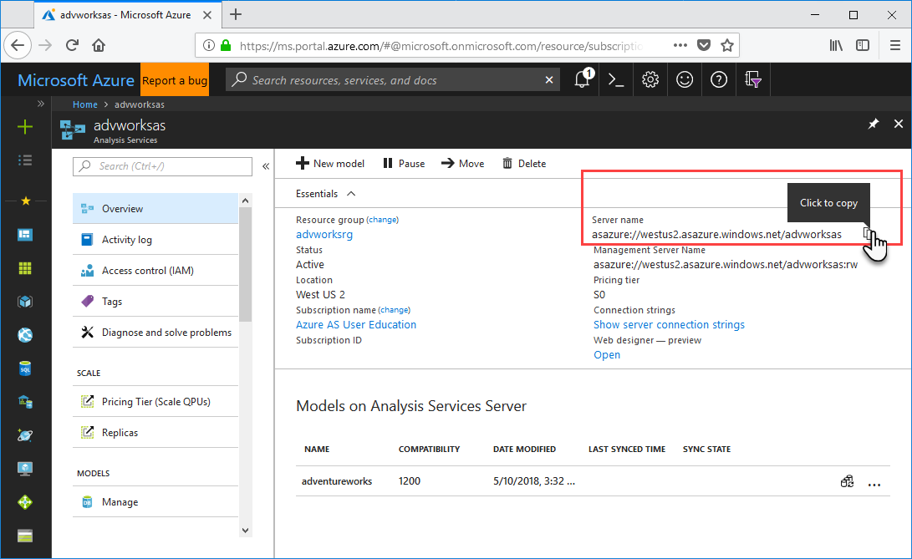
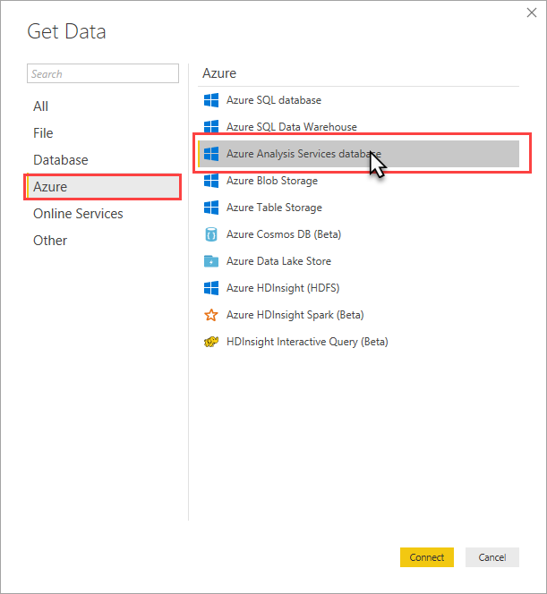
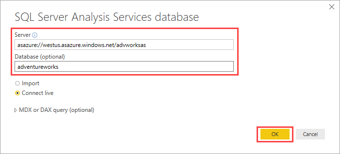
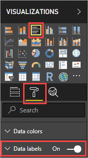
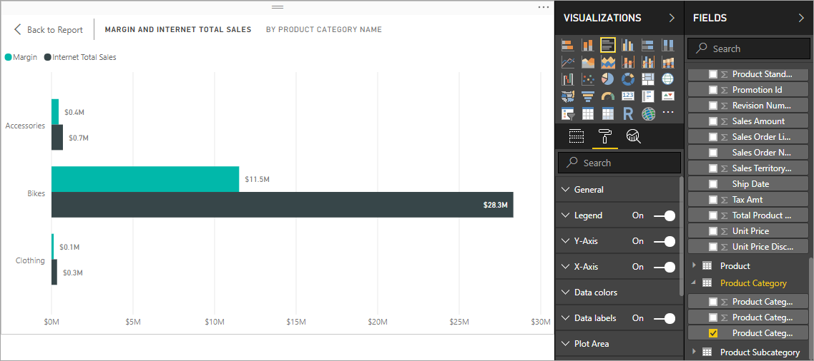

# Tutorial: Connect with Power BI Desktop

In this tutorial, you use Power BI Desktop to connect to the adventureworks sample model database on your server. The tasks you complete simulate a typical user connection to the model and creating a basic report from model data.

> [!div class="checklist"]
> * Get your server name from the portal
> * Connect by using Power BI Desktop
> * Create a basic report

## Prerequisites

- [Add the adventureworks sample model database](../analysis-services-create-sample-model.md) to your server.
- Have [*read*](../analysis-services-server-admins.md) permissions for the adventureworks sample model database.
- [Install the newest Power BI Desktop](https://powerbi.microsoft.com/desktop).

## Sign in to the Azure portal
In this tutorial, you sing in to the portal to get the server name only. Typically, users would get the server name from the server administrator.

Sign in to the [portal](https://portal.azure.com/).

## Get server name
In order to connect to your server from Power BI Desktop, you first need the server name. You can get the server name from the portal.

In **Azure portal** > server > **Overview** > **Server name**, copy the server name.
   
   

## Connect in Power BI Desktop

1. In Power BI Desktop, click **Get Data** > **Azure** > **Azure Analysis Services database**.

   

2. In **Server**, paste the server name, then in **Database**, enter **adventureworks**, and then click **OK**.

   

3. When prompted, enter your credentials. The account you enter must have at least read permissions for the adventureworks sample model database.

    The adventureworks model opens in Power BI Desktop with a blank report in Report view. The **Fields** list displays all non-hidden model objects. Connection status is displayed in the lower-right corner.

4. In **VISUALIZATIONS**, select **Clustered Bar Chart**, then click **Format** (paint roller icon), and then turn on **Data labels**. 

   

5. In **FIELDS** > **Internet Sales** table, select **Internet Sales Total** and **Margin** measures. In **Product Category** table, select **Product Category Name**.

   

    Take a few minutes to explore the adventureworks sample model by creating different visualizations and slicing on data and metrics. When you're happy with your report, be sure to save.

## Clean up resources

If no longer needed, do not save your report or delete the file if you did save.

## Next steps
In this tutorial, you learned how to use Power BI Desktop to connect to a data model on a server and create a basic report. If you're not familiar with how to create a data model, see the [Adventure Works Internet Sales tabular data modeling tutorial](https://docs.microsoft.com/analysis-services/tutorial-tabular-1400/as-adventure-works-tutorial) in the SQL Server Analysis Services docs.