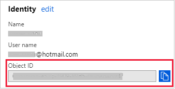

# Tutorial: Configure role-based access control (RBAC) roles in Azure Kubernetes Service (AKS) using Ansible

[!INCLUDE [ansible-28-note.md](../../includes/ansible-28-note.md)]

[!INCLUDE [open-source-devops-intro-aks.md](../../includes/open-source-devops-intro-aks.md)]

AKS can be configured to use [Azure Active Directory (AD)](/azure/active-directory/) for user authentication. Once configured, you use your Azure AD authentication token to sign into the AKS cluster. The RBAC can be based on a user's identity or directory group membership.

[!INCLUDE [ansible-tutorial-goals.md](../../includes/ansible-tutorial-goals.md)]

> [!div class="checklist"]
>
> * Create an Azure AD-enabled AKS cluster
> * Configure an RBAC role in the cluster

## Prerequisites

[!INCLUDE [open-source-devops-prereqs-azure-subscription.md](../../includes/open-source-devops-prereqs-azure-subscription.md)]
[!INCLUDE [open-source-devops-prereqs-create-service-principal.md](../../includes/open-source-devops-prereqs-create-service-principal.md)]
[!INCLUDE [ansible-prereqs-cloudshell-use-or-vm-creation2.md](../../includes/ansible-prereqs-cloudshell-use-or-vm-creation2.md)]
- **Install the RedHat OpenShift library** - `pip install openshift`

## Configure Azure AD for AKS authentication

When configuring Azure AD for AKS authentication, two Azure AD applications are configured. This operation must be completed by an Azure tenant administrator. For more information, see [Integrate Azure Active Directory with AKS](/azure/aks/aad-integration#create-the-server-application). 

From the Azure tenant administrator, get the following values:

- Server app secret
- Server app ID
- Client app ID 
- Tenant ID

These values are needed to run the sample playbook.  

## Create an AKS cluster

In this section, you create an AKS with the [Azure AD application](#configure-azure-ad-for-aks-authentication).

Here are some key notes to consider when working with the sample playbook:

- The playbook loads `ssh_key` from `~/.ssh/id_rsa.pub`. If you modify it, use the single-line format - starting with "ssh-rsa" (without the quotes).
- The `client_id` and `client_secret` values are loaded from `~/.azure/credentials`, which is the default credential file. You can set these values to your service principal or load these values from environment variables:

    ```yml
    client_id: "{{ lookup('env', 'AZURE_CLIENT_ID') }}"
    client_secret: "{{ lookup('env', 'AZURE_SECRET') }}"
    ```

Save the following playbook as `aks-create.yml`:

```yml
- name: Create resource group
  azure_rm_resourcegroup:
      name: "{{ resource_group }}"
      location: "{{ location }}"

- name: List supported kubernetes version from Azure
  azure_rm_aksversion_facts:
      location: "{{ location }}"
  register: versions

- name: Create AKS cluster with RBAC enabled
  azure_rm_aks:
      resource_group: "{{ resource_group }}"
      name: "{{ name }}"
      dns_prefix: "{{ name }}"
      enable_rbac: yes
      kubernetes_version: "{{ versions.azure_aks_versions[-1] }}"
      agent_pool_profiles:
        - count: 3
          name: nodepool1
          vm_size: Standard_D2_v2
      linux_profile:
          admin_username: azureuser
          ssh_key: "{{ lookup('file', '~/.ssh/id_rsa.pub') }}"
      service_principal:
          client_id: "{{ lookup('ini', 'client_id section=default file=~/.azure/credentials') }}"
          client_secret: "{{ lookup('ini', 'secret section=default file=~/.azure/credentials') }}"
      aad_profile:
          client_app_id: "{{ client_app_id }}"
          server_app_id: "{{ server_app_id }}"
          server_app_secret: "{{ server_app_secret }}"
          tenant_id: "{{ app_tenant_id }}"
  register: aks

- name: Save cluster user config
  copy:
      content: "{{ aks.kube_config }}"
      dest: "aks-{{ name }}-kubeconfig-user"

- name: Get admin config of AKS
  azure_rm_aks_facts:
      resource_group: "{{ resource_group }}"
      name: "{{ name }}"
      show_kubeconfig: admin
  register: aks

- name: Save the kubeconfig
  copy:
      content: "{{ aks.aks[0].kube_config }}"
      dest: "aks-{{ name }}-kubeconfig"
```

## Get the Azure AD Object ID

To create an RBAC binding, you first need to get the Azure AD Object ID. 

1. Sign in to the [Azure portal](https://go.microsoft.com/fwlink/p/?LinkID=525040).

1. In the search field at the top of the page, enter `Azure Active Directory`. 

1. Click `Enter`.

1. In the **Manage** menu, select **Users**.

1. In the name field, search for your account.

1. In the **Name** column, select the link to your account.

1. In the **Identity** section, copy the **Object ID**.

    

## Create RBAC binding

In this section, you create a role binding or cluster role binding in AKS. 

Save the following playbook as `kube-role.yml`:

```yml
apiVersion: rbac.authorization.k8s.io/v1
kind: ClusterRoleBinding
metadata:
  name: cluster-admins
roleRef:
  apiGroup: rbac.authorization.k8s.io
  kind: ClusterRole
  name: cluster-admin
subjects:
- apiGroup: rbac.authorization.k8s.io
  kind: User
  name: <your-aad-account>
```

Replace the `&lt;your-aad-account>` placeholder with your Azure AD tenant [Object ID](#get-the-azure-ad-object-id).

Save the following playbook - that deploys your new role to AKS - as `aks-kube-deploy.yml`:

```yml
- name: Apply role to AKS
  k8s:
      src: kube-role.yml
      kubeconfig: "aks-{{ name }}-kubeconfig"
```

## Run the sample playbook

This section lists the complete sample playbook that calls the tasks creating in this article. 

Save the following playbook as `aks-rbac.yml`:

```yml
---
- hosts: localhost
  vars:
      resource_group: aksansibletest
      name: aksansibletest
      location: eastus
  tasks:
     - name: Ensure resource group exist
       azure_rm_resourcegroup:
           name: "{{ resource_group }}"
           location: "{{ location }}"

     - name: Create AKS
       vars:
           client_app_id: <client id>
           server_app_id: <server id>
           server_app_secret: <server secret>
           app_tenant_id: <tenant id>
       include_tasks: aks-create.yml

     - name: Enable RBAC
       include_tasks: aks-kube-deploy.yml
```

In the `vars` section, replace the following placeholders with your Azure AD information:

- `<client id>`
- `<server id>`
- `<server secret>`
- `<tenant id>`

Run the complete playbook using the `ansible-playbook` command:

```bash
ansible-playbook aks-rbac.yml
```

## Verify the results

In this section, you use kubectl list the nodes creating in this article.

Enter the following command at a terminal prompt:

```bash
kubectl --kubeconfig aks-aksansibletest-kubeconfig-user get nodes
```

The command will direct you to an authentication page. Sign in with your Azure account.

Once authenticated, kubectl lists the nodes in similar fashion to the following results:

```txt
To sign in, use a web browser to open the page https://microsoft.com/devicelogin and enter the code XXXXXXXX to authenticate.
NAME                       STATUS   ROLES   AGE   VERSION
aks-nodepool1-33413200-0   Ready    agent   49m   v1.12.6
aks-nodepool1-33413200-1   Ready    agent   49m   v1.12.6
aks-nodepool1-33413200-2   Ready    agent   49m   v1.12.6
```

## Clean up resources

When no longer needed, delete the resources created in this article. 

Save the following code as `cleanup.yml`:

```yml
---
- hosts: localhost
  vars:
      name: aksansibletest
      resource_group: aksansibletest
  tasks:
      - name: Clean up resource group
        azure_rm_resourcegroup:
            name: "{{ resource_group }}"
            state: absent
            force: yes
      - name: Remove kubeconfig
        file:
            state: absent
            path: "aks-{{ name }}-kubeconfig"
```

Run the playbook using the `ansible-playbook` command:

```bash
ansible-playbook cleanup.yml
```

## Next steps

> [!div class="nextstepaction"]
> [Ansible on Azure](/azure/ansible/)
