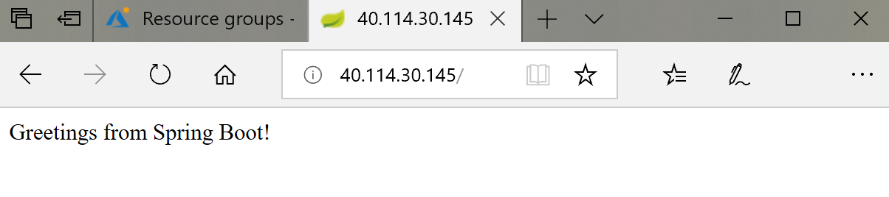

# Deploy applications to virtual machine scale sets in Azure using Ansible
Ansible allows you to automate the deployment and configuration of resources in your environment. You can use Ansible to deploy your applications to Azure. This article shows you how to deploy a Java application to an Azure virtual machine scale set (VMSS).  

## Prerequisites
- **Azure subscription** - If you don't have an Azure subscription, create a [free account](https://azure.microsoft.com/free/?ref=microsoft.com&utm_source=microsoft.com&utm_medium=docs&utm_campaign=visualstudio) before you begin.
- [!INCLUDE [ansible-prereqs-for-cloudshell-use-or-vm-creation1.md](../../includes/ansible-prereqs-for-cloudshell-use-or-vm-creation1.md)] [!INCLUDE [ansible-prereqs-for-cloudshell-use-or-vm-creation2.md](../../includes/ansible-prereqs-for-cloudshell-use-or-vm-creation2.md)]
- **Virtual machine scale set** - If you don't already have a virtual machine scale set, you can [create a virtual machine scale set with Ansible](ansible-create-configure-vmss.md). 
- **git** - [git](https://git-scm.com) is used to download a Java sample used in this tutorial.
- **Java SE Development Kit (JDK)** - The JDK is used to build the sample Java project.
- **Apache Maven build tools** - The [Apache Maven build tools](https://maven.apache.org/download.cgi) are used to build the sample Java project.

> [!Note]
> Ansible 2.6 is required to run the following the sample playbooks in this tutorial. 

## Get host information

This section illustrates how to use Ansible to retrieve host information for a group of Azure virtual machines. Below is a sample Ansible playbook. The code gets the public IP addresses and load balancer within specified resource group, and creates a host group named **scalesethosts** in inventory. 

Save the following sample playbook as `get-hosts-tasks.yml`: 

  ```yaml
  - name: Get facts for all Public IPs within a resource groups
    azure_rm_publicipaddress_facts:
      resource_group: "{{ resource_group }}"
    register: output_ip_address

  - name: Get loadbalancer info
    azure_rm_loadbalancer_facts:
      resource_group: "{{ resource_group }}"
      name: "{{ loadbalancer_name }}"
    register: output

  - name: Add all hosts
    add_host:
      groups: scalesethosts
      hostname: "{{ output_ip_address.ansible_facts.azure_publicipaddresses[0].properties.ipAddress }}_{{ item.properties.frontendPort }}"
      ansible_host: "{{ output_ip_address.ansible_facts.azure_publicipaddresses[0].properties.ipAddress }}"
      ansible_port: "{{ item.properties.frontendPort }}"
      ansible_ssh_user: "{{ admin_username }}"
      ansible_ssh_pass: "{{ admin_password }}"
    with_items:
      - "{{ output.ansible_facts.azure_loadbalancers[0].properties.inboundNatRules }}"
  ```

## Prepare an application for deployment  

In this section, you use git to clone a Java sample project from GitHub and build the project. Save the following playbook as `app.yml`:

  ```yaml
  - hosts: localhost
    vars:
      repo_url: https://github.com/spring-guides/gs-spring-boot.git
      workspace: ~/src/helloworld

    tasks: 
    - name: Git Clone sample app
      git:
        repo: "{{ repo_url }}"
        dest: "{{ workspace }}"

    - name: Build sample app
      shell: mvn package chdir="{{ workspace }}/complete"
  ```

Run the sample Ansible playbook with the following command:

  ```bash
  ansible-playbook app.yml
  ```

The output from the ansible-playbook command displays out similar to the following where you see that it built the sample app cloned from GitHub:

  ```bash
  PLAY [localhost] **********************************************************

  TASK [Gathering Facts] ****************************************************
  ok: [localhost]

  TASK [Git Clone sample app] ***************************************************************************
  changed: [localhost]

  TASK [Build sample app] ***************************************************
  changed: [localhost]

  PLAY RECAP ***************************************************************************
  localhost                  : ok=3    changed=2    unreachable=0    failed=0

  ```

## Deploy the application to VMSS

The following section in an Ansible playbook installs the JRE (Java Runtime Environment) on a host group named **saclesethosts**, and deploys the Java application to a host group named **saclesethosts**: 

(Change the `admin_password` to your own password.)

  ```yaml
  - hosts: localhost
    vars:
      resource_group: myResourceGroup
      scaleset_name: myVMSS
      loadbalancer_name: myVMSSlb
      admin_username: azureuser
      admin_password: "your_password"
    tasks:   
    - include: get-hosts-tasks.yml

  - name: Install JRE on VMSS
    hosts: scalesethosts
    become: yes
    vars:
      workspace: ~/src/helloworld
      admin_username: azureuser

    tasks:
    - name: Install JRE
      apt:
        name: default-jre
        update_cache: yes

    - name: Copy app to Azure VM
      copy:
        src: "{{ workspace }}/complete/target/gs-spring-boot-0.1.0.jar"
        dest: "/home/{{ admin_username }}/helloworld.jar"
        force: yes
        mode: 0755

    - name: Start the application
      shell: java -jar "/home/{{ admin_username }}/helloworld.jar" >/dev/null 2>&1 &
      async: 5000
      poll: 0
  ```

You can save the preceding sample Ansible playbook as `vmss-setup-deploy.yml`, or [download the entire sample playbook](https://github.com/Azure-Samples/ansible-playbooks/blob/master/vmss). 

To use the ssh connection type with passwords, you must install the sshpass program. 
  - For Ubunto 16.04, run the command `apt-get install sshpass`.
  - For CentOS 7.4, run the command `yum install sshpass`.

You may see an error like **Using an SSH password instead of a key is not possible because Host Key checking is enabled and sshpass does not support this. Add this host's fingerprint to your known_hosts file to manage this host.** If you see this error, you can disable host key checking by adding the following line to either the `/etc/ansible/ansible.cfg` file or the `~/.ansible.cfg` file:
  ```bash
  [defaults]
  host_key_checking = False
  ```

Run the playbook with the following command:

  ```bash
  ansible-playbook vmss-setup-deploy.yml
  ```

The output from running the ansible-playbook command indicates that the sample Java application has been installed to the host group of the virtual machine scale set:

  ```bash
  PLAY [localhost] **********************************************************

  TASK [Gathering Facts] ****************************************************
  ok: [localhost]

  TASK [Get facts for all Public IPs within a resource groups] **********************************************
  ok: [localhost]

  TASK [Get loadbalancer info] ****************************************************************************
  ok: [localhost]

  TASK [Add all hosts] *****************************************************************************
  changed: [localhost] ...

  PLAY [Install JRE on VMSS] *****************************************************************************

  TASK [Gathering Facts] *****************************************************************************
  ok: [40.114.30.145_50000]
  ok: [40.114.30.145_50003]

  TASK [Copy app to Azure VM] *****************************************************************************
  changed: [40.114.30.145_50003]
  changed: [40.114.30.145_50000]

  TASK [Start the application] ********************************************************************
  changed: [40.114.30.145_50000]
  changed: [40.114.30.145_50003]

  PLAY RECAP ************************************************************************************************
  40.114.30.145_50000        : ok=4    changed=3    unreachable=0    failed=0
  40.114.30.145_50003        : ok=4    changed=3    unreachable=0    failed=0
  localhost                  : ok=4    changed=1    unreachable=0    failed=0
  ```

Congratulation! Your application is running in Azure now. You can now navigate to the URL of the load balancer for your virtual machine scale set:



## Next steps
> [!div class="nextstepaction"] 
> [Ansible sample playbook for VMSS](https://github.com/Azure-Samples/ansible-playbooks/tree/master/vmss)