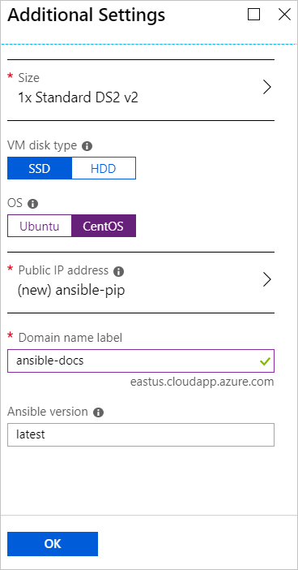

# Install the Ansible solution template for Azure
The Ansible solution template for Azure is designed to configure an Ansible instance with minimal Azure knowledge. Using the Azure portal, you can build out a fully configured Ansible instance in minutes. 

This article walks you through the steps to install the Ansible solution template on a Linux VM along with tools configured to work with Azure. The tools include:

- **Ansible plugin for Azure** - The Ansible plugin for Azure includes a suite of modules that enable you to create and manage your infrastructure on Azure. The latest version is installed by default. However, you can specify a version number that is appropriate for your environment.
- **Azure Command-Line Interface (CLI) 2.0** - The [Azure CLI 2.0](/cli/azure/?view=azure-cli-latest) is a cross-platform command-line experience for managing Azure resources. 
- **managed identities for Azure resources** - The [managed identities for Azure resources](/azure/active-directory/managed-identities-azure-resources/overview) feature addresses the issue of keeping cloud application credentials secure so that they never appear on developer workstations and are never checked into source control.
- **apt-transport-https transport** - The apt-transport-https is an APT transport that enables the use of repositories accessed via the HTTP Secure protocol (HTTPS).

## Prerequisites
- **Azure subscription** - If you don't have an Azure subscription, create a [free account](https://azure.microsoft.com/free/?ref=microsoft.com&utm_source=microsoft.com&utm_medium=docs&utm_campaign=visualstudio) before you begin.

## Install the Ansible solution template from the Azure Marketplace

1. Browse to the [Ansible solution template in the Azure Marketplace](https://azuremarketplace.microsoft.com/en-%20%20us/marketplace/apps/azure-oss.ansible?tab=Overview).

1. Select **GET IT NOW**.

1. A window appears that details the Terms of Use, Privacy Policy, and Use of Azure Marketplace Terms. Select **Continue**.

1. The Azure portal appears and displays the Ansible page that describes the solution template. Select **Create**.

    

1. In the **Create Ansible** page, you see several tabs. On the **Basics** tab, enter the required information:

    - **Name** - Specify the name your Ansible instance. For demo purposes, the name `ansiblehost` is used.
    - **User name:** - Specify the user name that will have access to the Ansible instance. For demo purposes, the name `ansibleuser` is used.
    - **Authentication type:** - Select either **Password** or **SSH public key**. For demo purposes, **SSH public key** is selected.
    - **Password** and **Confirm password** - If you select **Password** for **Authentication type**, enter the desired password for these values.
    - **SSH public key** - If you select **SSH public key** for **Authentication type**, enter your RSA public key in the single-line format - starting with `ssh-rsa`.
    - **Subscription** - Select the desired Azure subscription from the dropdown list.
    - **Resource group** - Select an existing resource group from the dropdown list, or select **Create new** and specify a name for a new resource group. For demo purposes, a new resource group named `ansiblerg` is used.
    - **Location** - Select the location from the dropdown list that is appropriate for your scenario.

    

1. Select **OK**.

1. In the **Additional Settings** tab, enter the required information:

    - **Size** - The Azure portal defaults to a standard size. To specify a different size that accommodates your specific scenario, select the arrow and select the desired size.
    - **VM disk size** - Select either **SSD** (Premium Solid-State Drive) or **HDD** (Hard Disk Drive). For demo purposes, **SSD** is chosen due to its performance benefits. For more information on each these types of disk storage, see the following articles:
        - [High-performance Premium Storage and managed disks for VMs](/azure/virtual-machines/windows/premium-storage)
        - [Standard SSD Managed Disks for Azure Virtual machine workloads](/azure/virtual-machines/windows/disks-standard-ssd)
    - **OS** - Select **CentOS**.
    - **Public IP Address** - Specify this setting if you want to communicate with the virtual machine from outside the virtual machine. The default is a new public IP address that has the name `ansible-pip`. To specify a different IP address, select the arrow specify the attributes - such as name, SKU, and Assignment, of that IP address. 
    - **Domain name label** - Enter the public-facing domain name of the virtual machine. The name must be unique and meet naming requirements. For more information about specifying a name for the virtual machine, see [Naming conventions for Azure resources](/azure/architecture/best-practices/naming-conventions).
    - **Ansible version** - Specify either a version number or the value `latest` to install the latest version. Moving your mouse over or selecting the information icon next to **Ansible version** gives more information on available versions and appropriate syntax for specifying which version(s) you want to install.

    

