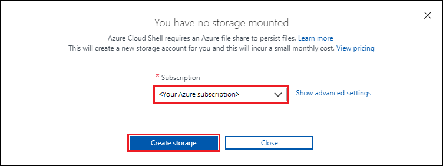
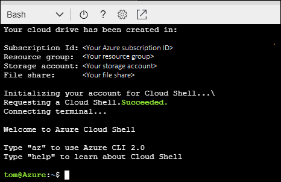

# Using Ansible in the Azure Cloud Shell

In this tutorial, you learn how to perform various Ansible tasks in the Azure Cloud Shell. These tasks include connecting to a virtual machine, and creating Ansible playbooks to create and delete an Azure resource group.

## Prerequisites

- **Azure subscription** - To learn about Azure purchase options, see [How to buy Azure](https://azure.microsoft.com/pricing/purchase-options/) or [Free one-month trial](https://azure.microsoft.com/pricing/free-trial/).

## Configure Cloud Shell

If you have never used Cloud Shell, the following steps guides you through setting it up the first time you use it:

1. Sign in to the [Azure portal](http://go.microsoft.com/fwlink/p/?LinkID=525040).

1. Select the Cloud Shell icon from the top navigation of the Azure portal.

  

1. Select the **Bash** option.

  

1. Select a subscription to create a storage account and Microsoft Azure Files share, and select **Create Storage**.

  

1. You should now see results similar to the following output:

  

> [!NOTE]
> By default, Ansible is installed in the Bash environment of Cloud Shell. As using Azure Resource Manager modules requires authenticating with the Azure API, Cloud Shell automatically authenticates the active Azure subscription to deploy resources through the Ansible Azure modules.
>
>

## Use Ansible to connect to your Azure virtual machine
Ansible has created a Python script called [azure_rm.py](https://github.com/ansible/ansible/blob/devel/contrib/inventory/azure_rm.py) that generates a dynamic inventory of your Azure resources by making API requests to the Azure Resource Manager. The following steps walk you through using the `azure_rm.py` script to connect to an Azure virtual machine:

1. Open the Azure Cloud Shell.

1. If you do not have a virtual machine to use, enter the following commands into the Cloud Shell to create a virtual machine with which to test:

  ```cli
  az group create --resource-group ansible-test-rg --location eastus

  az vm create --resource-group ansible-test-rg --name ansible-test-vm --image UbuntuLTS --generate-ssh-keys
  ```

1. Use the GNU `wget` command to retrieve the `azure_rm.py` script:

  ```cli
  wget https://raw.githubusercontent.com/ansible/ansible/devel/contrib/inventory/azure_rm.py
  ```

1. Use the `chmod` command to change the access permissions to the `azure_rm.py` script. The following uses the `+x` parameter to allow for execution (running) of the specified file (`azure_rm.py`):

  ```cli
  chmod +x azure_rm.py
  ```

1. Use the [ansible command](https://docs.ansible.com/ansible/2.4/ansible.html) to connect to your virtual machine: 

  ```cli
  ansible -i azure_rm.py ansible-test-vm -m ping
  ```

  Once connected, you should see results similar to the output:

  ```Output
  The authenticity of host 'nn.nnn.nn.nn (nn.nnn.nn.nn)' can't be established.
  ECDSA key fingerprint is SHA256:<some value>.
  Are you sure you want to continue connecting (yes/no)? yes
  test-ansible-vm | SUCCESS => {
      "changed": false,
      "failed": false,
      "ping": "pong"
  }
  ```

## Run an Ansible playbook in CloudShell
In this section, you learn how to create and run an Ansible playbook that creates an Azure resource group.

1. Create a file named `rg.yml` as follows:

  ```bash
  vi rg.yml
  ```

1. Copy the following contents into the Cloud Shell window (now hosting an instance of the VI editor):

  ```yml
  - name: My first Ansible Playbook
    hosts: localhost
    connection: local
    tasks:
    - name: Create a resource group
      azure_rm_resourcegroup:
          name: demoresourcegroup
          location: eastus
  ```

1. Save and exit the VI editor by entering `:wq` and pressing &lt;Enter>.

1. Use the `ansible-playbook` command to run the `rg.yml` playbook:

  ```cli
  ansible-playbook rg.yml
  ```

1. You should see results similar to the following output:

  ```Output
  PLAY [My first Ansible Playbook] **********

  TASK [Gathering Facts] **********
  ok: [localhost]

  TASK [Create a resource group] **********
  changed: [localhost]

  PLAY RECAP **********
  localhost : ok=2 changed=1 unreachable=0 failed=0
  ```

1. Verify the deployment:

  ```cli
  az group show -n demoresourcegroup
  ```

1. Now that you've created the resource group, create a second Ansible playbook to delete the resource group:

  ```bash
  vi rg2.yml
  ```

1. Copy the following contents into the Cloud Shell window (now hosting an instance of the VI editor):

  ```yml
  - name: My second Ansible Playbook
    hosts: localhost
    connection: local
    tasks:
    - name: Delete a resource group
      azure_rm_resourcegroup:
          name: demoresourcegroup
          state: absent
  ```

1. Use the `ansible-playbook` command to run the `rg2.yml` playbook:

  ```cli
  ansible-playbook rg.yml
  ```

1. You should see results similar to the following output:

  ```Output
  The output is as following. 
  PLAY [My second Ansible Playbook] **********

  TASK [Gathering Facts] **********
  ok: [localhost]

  TASK [Delete a resource group] **********
  changed: [localhost]

  PLAY RECAP **********
  localhost : ok=2 changed=1 unreachable=0 failed=0
  ```

## Next steps

> [!div class="nextstepaction"] 
> [Create a Linux VM](/azure/virtual-machines/linux/ansible-create-vm)