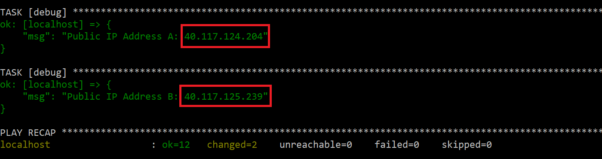
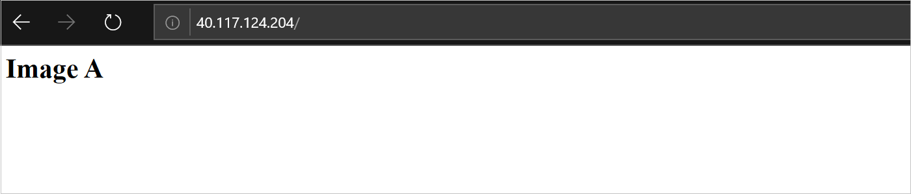
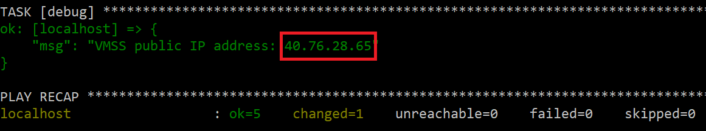
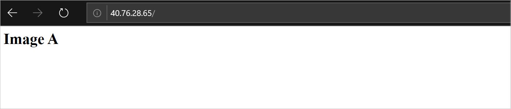
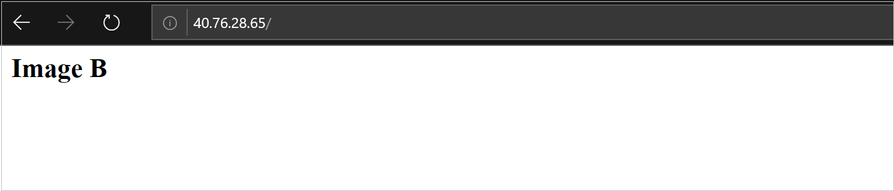

# Tutorial: Update the custom image of Azure virtual machine scale sets using Ansible

[!INCLUDE [ansible-27-note.md](../../includes/ansible-28-note.md)]

[!INCLUDE [open-source-devops-intro-vmss.md](../../includes/open-source-devops-intro-vmss.md)]

After a VM is deployed, you configure the VM with the software your app needs. Instead of doing this configuration task for each VM, you can create a custom image. A custom image is a snapshot of an existing VM that includes any installed software. When you [configure a scale set](./ansible-create-configure-vmss.md), you specify the image to use for that scale set's VMs. By using a custom image, each VM instance is identically configured for your app. Sometimes, you may need to update your scale set's custom image. That task is the focus of this tutorial.

[!INCLUDE [ansible-tutorial-goals.md](../../includes/ansible-tutorial-goals.md)]

> [!div class="checklist"]
>
> * Configure two VMs with HTTPD
> * Create a custom image from an existing VM
> * Create a scale set from an image
> * Update the custom image

## Prerequisites

[!INCLUDE [open-source-devops-prereqs-azure-subscription.md](../../includes/open-source-devops-prereqs-azure-subscription.md)]
[!INCLUDE [ansible-prereqs-cloudshell-use-or-vm-creation2.md](../../includes/ansible-prereqs-cloudshell-use-or-vm-creation2.md)]

## Configure two VMs

The playbook code in this section creates two virtual machines with HTTPD installed on both. 

The `index.html` page for each VM displays a test string:

* First VM displays the value `Image A`
* Second VM displays the value `Image B`

This string is meant to mimic configuring each VM with different software.

There are two ways to get the sample playbook:

* [Download the playbook](https://github.com/Azure-Samples/ansible-playbooks/blob/master/vmss_images/01-create-vms.yml) and save it to `create_vms.yml`.
* Create a new file named `create_vms.yml` and copy into it the following contents:

```yml
- name: Create two VMs (A and B) with HTTPS
  hosts: localhost
  connection: local
  vars:
    vm_name: vmforimage
    admin_username: testuser
    admin_password: Pass123$$$abx!
    location: eastus
  tasks:
  - name: Create a resource group
    azure_rm_resourcegroup:
      name: "{{ resource_group }}"
      location: "{{ location }}"

  - name: Create virtual network
    azure_rm_virtualnetwork:
      resource_group: "{{ resource_group }}"
      name: "{{ vm_name }}"
      address_prefixes: "10.0.0.0/16"

  - name: Create subnets for VM A and B
    azure_rm_subnet:
      resource_group: "{{ resource_group }}"
      virtual_network: "{{ vm_name }}"
      name: "{{ vm_name }}"
      address_prefix: "10.0.1.0/24"

  - name: Create Network Security Group that allows HTTP
    azure_rm_securitygroup:
      resource_group: "{{ resource_group }}"
      name: "{{ vm_name }}"
      rules:
        - name: HTTP
          protocol: Tcp
          destination_port_range: 80
          access: Allow
          priority: 1002
          direction: Inbound

  - name: Create public IP addresses for VM A and B
    azure_rm_publicipaddress:
      resource_group: "{{ resource_group }}"
      allocation_method: Static
      name: "{{ vm_name }}_{{ item }}"
    loop:
      - A
      - B
    register: pip_output

  - name: Create virtual network inteface cards for VM A and B
    azure_rm_networkinterface:
      resource_group: "{{ resource_group }}"
      name: "{{ vm_name }}_{{ item }}"
      virtual_network: "{{ vm_name }}"
      subnet: "{{ vm_name }}"
      public_ip_name: "{{ vm_name }}_{{ item }}"
      security_group: "{{ vm_name }}"
    loop:
      - A
      - B

  - name: Create VM A and B
    azure_rm_virtualmachine:
      resource_group: "{{ resource_group }}"
      name: "{{ vm_name }}{{ item }}"
      admin_username: "{{ admin_username }}"
      admin_password: "{{ admin_password }}"
      vm_size: Standard_B1ms
      network_interfaces: "{{ vm_name }}_{{ item }}"
      image:
        offer: UbuntuServer
        publisher: Canonical
        sku: 16.04-LTS
        version: latest
    loop:
      - A
      - B

  - name: Create VM Extension
    azure_rm_virtualmachineextension:
      resource_group: "{{ resource_group }}"
      name: testVMExtension
      virtual_machine_name: "{{ vm_name }}{{ item }}"
      publisher: Microsoft.Azure.Extensions
      virtual_machine_extension_type: CustomScript
      type_handler_version: 2.0
      auto_upgrade_minor_version: true
      settings: {"commandToExecute": "sudo apt-get -y install apache2"}
    loop:
      - A
      - B

  - name: Create VM Extension
    azure_rm_virtualmachineextension:
      resource_group: "{{ resource_group }}"
      name: testVMExtension
      virtual_machine_name: "{{ vm_name }}{{ item }}"
      publisher: Microsoft.Azure.Extensions
      virtual_machine_extension_type: CustomScript
      type_handler_version: 2.0
      auto_upgrade_minor_version: true
      settings: {"commandToExecute": "printf '<html><body><h1>Image {{ item }}</h1></body></html>' >> index.html; sudo cp index.html /var/www/html/"}
    loop:
      - A
      - B

  - debug:
      msg: "Public IP Address A: {{ pip_output.results[0].state.ip_address }}"

  - debug:
      msg: "Public IP Address B: {{ pip_output.results[1].state.ip_address }}"
```

Run the playbook using the `ansible-playbook` command, replacing `myrg` with your resource group name:

```bash
ansible-playbook create-vms.yml --extra-vars "resource_group=myrg"
```

Because of the `debug` sections of the playbook, the `ansible-playbook` command will print the IP address of each VM. Copy these IP addresses for later use.



## Connect to the two VMs

In this section, you connect to each VM. As mentioned in the previous section, the strings `Image A` and `Image B` mimic having two distinct VMs with different configurations.

Using the IP addresses from the previous section, connect to both VMs:




## Create images from each VM

At this point, you have two VMs with slightly different configurations (their `index.html` files).

The playbook code in this section creates a custom image for each VM:

* `image_vmforimageA` - Custom image created for the VM that displays `Image A` on its home page.
* `image_vmforimageB` - Custom image created for the VM that displays `Image B` on its home page.

There are two ways to get the sample playbook:

* [Download the playbook](https://github.com/Azure-Samples/ansible-playbooks/blob/master/vmss_images/02-capture-images.yml) and save it to `capture-images.yml`.
* Create a new file named `capture-images.yml` and copy into it the following contents:

```yml
- name: Capture VM Images
  hosts: localhost
  connection: local
  vars:
    vm_name: vmforimage
  tasks:

  - name: Stop and generalize VMs
    azure_rm_virtualmachine:
      resource_group: "{{ resource_group }}"
      name: "{{ vm_name }}{{ item }}"
      generalized: yes
    loop:
      - A
      - B

  - name: Create an images from a VMs
    azure_rm_image:
      resource_group: "{{ resource_group }}"
      name: "image_{{ vm_name }}{{ item }}"
      source: "{{ vm_name }}{{ item }}"
    loop:
      - A
      - B
```

Run the playbook using the `ansible-playbook` command, replacing `myrg` with your resource group name:

```bash
ansible-playbook capture-images.yml --extra-vars "resource_group=myrg"
```

## Create scale set using Image A

In this section, a playbook is used to configure the following Azure resources:

* Public IP address
* Load balancer
* Scale set that references `image_vmforimageA`

There are two ways to get the sample playbook:

* [Download the playbook](https://github.com/Azure-Samples/ansible-playbooks/blob/master/vmss_images/03-create-vmss.yml) and save it to `create-vmss.yml`.
* Create a new file named `create-vmss.yml` and copy into it the following contents:"

```yml
---
- hosts: localhost
  vars:
    vmss_name: vmsstest
    location: eastus
    admin_username: vmssadmin
    admin_password: User123!!!abc
    vm_name: vmforimage
    image_name: "image_vmforimageA"

  tasks:

    - name: Create public IP address
      azure_rm_publicipaddress:
        resource_group: "{{ resource_group }}"
        allocation_method: Static
        name: "{{ vmss_name }}"
      register: pip_output

    - name: Create a load balancer
      azure_rm_loadbalancer:
        name: "{{ vmss_name }}lb"
        location: "{{ location }}"
        resource_group: "{{ resource_group }}"
        public_ip: "{{ vmss_name }}"
        probe_protocol: Tcp
        probe_port: 80
        probe_interval: 10
        probe_fail_count: 3
        protocol: Tcp
        load_distribution: Default
        frontend_port: 80
        backend_port: 80
        idle_timeout: 4
        natpool_frontend_port_start: 50000
        natpool_frontend_port_end: 50040
        natpool_backend_port: 22
        natpool_protocol: Tcp

    - name: Create a scale set
      azure_rm_virtualmachinescaleset:
        resource_group: "{{ resource_group }}"
        name: "{{ vmss_name }}"
        vm_size: Standard_DS1_v2
        admin_username: "{{ admin_username }}"
        admin_password: "{{ admin_password }}"
        ssh_password_enabled: true
        capacity: 2
        virtual_network_name: "{{ vm_name }}"
        subnet_name: "{{ vm_name }}"
        upgrade_policy: Manual
        tier: Standard
        managed_disk_type: Standard_LRS
        os_disk_caching: ReadWrite
        image:
          name: "{{ image_name }}"
          resource_group: "{{ resource_group }}"
        load_balancer: "{{ vmss_name }}lb"

    - debug:
        msg: "Scale set public IP address: {{ pip_output.state.ip_address }}"
```

Run the playbook using the `ansible-playbook` command, replacing `myrg` with your resource group name:

```bash
ansible-playbook create-vmss.yml --extra-vars "resource_group=myrg"
```

Because of the `debug` section of the playbook, the `ansible-playbook` command will print the IP address of the scale set. Copy this IP address for later use.



## Connect to the scale set

In this section, you connect to the scale set. 

Using the IP address from the previous section, connect to the scale set.

As mentioned in the previous section, the strings `Image A` and `Image B` mimic having two distinct VMs with different configurations.

The scale set references the custom image named `image_vmforimageA`. Custom image `image_vmforimageA` was created from the VM whose home page displays `Image A`.

As a result, you see a home page displaying `Image A`:



Leave your browser window open as you continue to the next section.

## Change custom image in scale set and upgrade instances

The playbook code in this section changes the scale set's image - from `image_vmforimageA` to `image_vmforimageB`. Also, all current virtual machines deployed by the scale set are updated.

There are two ways to get the sample playbook:

* [Download the playbook](https://github.com/Azure-Samples/ansible-playbooks/blob/master/vmss_images/04-update-vmss-image.yml) and save it to `update-vmss-image.yml`.
* Create a new file named `update-vmss-image.yml` and copy into it the following contents:

```yml
- name: Update scale set image reference
  hosts: localhost
  connection: local
  vars:
    vmss_name: vmsstest
    image_name: image_vmforimageB
    admin_username: vmssadmin
    admin_password: User123!!!abc
  tasks:

  - name: Update scale set - second image
    azure_rm_virtualmachinescaleset:
      resource_group: "{{ resource_group }}"
      name: "{{ vmss_name }}"
      vm_size: Standard_DS1_v2
      admin_username: "{{ admin_username }}"
      admin_password: "{{ admin_password }}"
      ssh_password_enabled: true
      capacity: 3
      virtual_network_name: "{{ vmss_name }}"
      subnet_name: "{{ vmss_name }}"
      upgrade_policy: Manual
      tier: Standard
      managed_disk_type: Standard_LRS
      os_disk_caching: ReadWrite
      image:
        name: "{{ image_name }}"
        resource_group: "{{ resource_group }}"
      load_balancer: "{{ vmss_name }}lb"

  - name: List all of the instances
    azure_rm_virtualmachinescalesetinstance_facts:
      resource_group: "{{ resource_group }}"
      vmss_name: "{{ vmss_name }}"
    register: instances

  - debug:
      var: instances

  - name: manually upgrade all the instances 
    azure_rm_virtualmachinescalesetinstance:
      resource_group: "{{ resource_group }}"
      vmss_name: "{{ vmss_name }}"
      instance_id: "{{ item.instance_id }}"
      latest_model: yes
    with_items: "{{ instances.instances }}"
```

Run the playbook using the `ansible-playbook` command, replacing `myrg` with your resource group name:

```bash
ansible-playbook update-vmss-image.yml --extra-vars "resource_group=myrg"
```

Return to the browser and refresh the page. 

You see that virtual machine's underlying custom image is updated.



## Clean up resources

When no longer needed, delete the resources created in this article. 

Save the following code as `cleanup.yml`:

```yml
- hosts: localhost
  vars:
    resource_group: myrg
  tasks:
    - name: Delete a resource group
      azure_rm_resourcegroup:
        name: "{{ resource_group }}"
        force_delete_nonempty: yes
        state: absent
```

Run the playbook using the `ansible-playbook` command:

```bash
ansible-playbook cleanup.yml
```

## Next steps

> [!div class="nextstepaction"] 
> [Ansible on Azure](/azure/ansible)