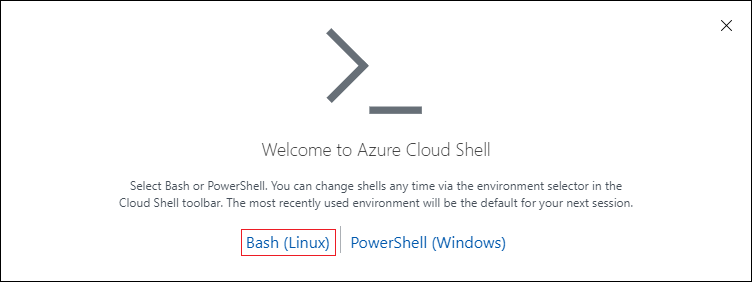

# Run Ansible playbook in CloudShell

In this quickstart, you learn how to run an Ansible playbook in the Azure Cloud Shell.

## Prerequisites

- **Azure subscription** - To learn about Azure purchase options, see [How to buy Azure](https://azure.microsoft.com/pricing/purchase-options/) or [Free one-month trial](https://azure.microsoft.com/pricing/free-trial/).

## Configure Cloud Shell

1. Sign in to the [Azure portal](http://go.microsoft.com/fwlink/p/?LinkID=525040).

1. Select the Cloud Shell icon from the top navigation of the Azure portal.

  

1. (First time use only) This step is only applicable if this is the first time you're running Cloud Shell. Otherwise, skip to the next step.

  1. Select the **Bash** option.

    

  1. Select a subscription to create a storage account and Microsoft Azure Files share, and select **Create Storage**.

    

  1. You should now see results similar to the following:

    

## Set up authentication with Azure
By default, Ansible is installed in Bash in Cloud Shell. As using Azure Resource Manager modules requires authenticating with the Azure API, Cloud Shell automatically authenticates your default Azure subscription to deploy resources through the Ansible Azure modules. If you want to change the subscription being used when you run Ansible commands in Cloud Shell, enter the following in the Cloud Shell prompt (replacing the &lt;YourAzureSubscription> placeholder with the name of your Azure subscription):

```cli
az account set --subscription <YourAzureSubscriptionName>
```

## Launch Bash in Cloud Shell

1.	Launch Cloud Shell from your preferred location
2.	Verify your preferred subscription is set
azcliinteractive Copy It 
az account show

## Use Ansible connect to your Azure VM
If you don’t have any Azure VM, you could create one through below commands or follow https://docs.microsoft.com/en-us/azure/virtual-machines/linux/ansible-create-complete-vm to use Ansible creating one VM. 
azcliinteractive Copy 
az group create --resource-group myresourcegroup --location eastus
az vm create --resource-group myresourcegroup --name myfirstVM --image UbuntuLTS --generate-ssh-keys

Here we will use Azure resource manager inventory script named azure_rm.py to identify your host. More information, you could refer to our new doc Use Ansible manage your Azure dynamic inventories.docx.
azcliinteractive Copy 
wget https://raw.githubusercontent.com/ansible/ansible/devel/contrib/inventory/azure_rm.py
chmod +x azure_rm.py
ansible -i azure_rm.py myfirstVM -m ping

The output is as following. 
The authenticity of host '52.168.52.51 (52.168.52.51)' can't be established.
ECDSA key fingerprint is SHA256:8694cdz+AX2IVa4zmjD6RuKlL6m8qt6v0QvIzVaDnJ8.
Are you sure you want to continue connecting (yes/no)? yes
myfirstVM | SUCCESS => {
    "changed": false,
    "failed": false,
    "ping": "pong"
}

The other example is as following. 
azcliinteractive Copy 
ansible -i azure_rm.py myfirstVM -m shell -a 'hostname'

Run Ansible playbook in CloudShell
Create a Resource Group
Below is an example of an Ansible Playbook to create a resource group. You could run below command to create a rg.yml and copy below example to rg.yml. 
azcliinteractive Copy 
vi rg.yml
- name: My first Ansible Playbook
  hosts: localhost
  connection: local
  tasks:
  - name: Create a resource group
    azure_rm_resourcegroup:
        name: demoresourcegroup
        location: eastus

Run above playbook through the command ansible-playbook as following.
azcliinteractive Copy 
ansible-playbook rg.yml

 The output is as following. 
PLAY [My first Ansible Playbook] *************************************************************************************************

TASK [Gathering Facts] ***********************************************************************************************************
ok: [localhost]

TASK [Create a resource group] ***************************************************************************************************
changed: [localhost]

PLAY RECAP ***********************************************************************************************************************
localhost                  : ok=2    changed=1    unreachable=0    failed=0
Verify deployment with Azure CLI 2.0
Run below command to verify the resource has succeeded provisioning. 
azcliinteractive Copy 
az group show -n demoresourcegroup

Delete the resource group
Let us use a playbook to delete created resource group. You could run below command to create a rg2.yml and copy below example to rg2.yml. 
azcliinteractive Copy 
vi rg2.yml

- name: My second Ansible Playbook
  hosts: localhost
  connection: local
  tasks:
  - name: Delete a resource group
    azure_rm_resourcegroup:
        name: demoresourcegroup
        state: absent

Run above playbook through the command ansible-playbook as following.
azcliinteractive Copy 
ansible-playbook rg2.yml

The output is as following. 
PLAY [My second Ansible Playbook] **************************************************************************************************************************

TASK [Gathering Facts] *************************************************************************************************************************************
ok: [localhost]

TASK [Delete a resource group] *****************************************************************************************************************************
changed: [localhost]

PLAY RECAP *************************************************************************************************************************************************
localhost                  : ok=2    changed=1    unreachable=0    failed=0


## Next steps
