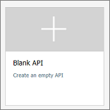

# Add an API manually

The steps in this article show how to use the Azure portal to add an API manually to the API Management (APIM) instance. A common scenario when you would want to create a blank API and define it manually is when you want to mock the API. For details about mocking an API, see [Mock API responses](mock-api-responses.md).

If you want to import an existing API, see [related topics](#related-topics) section.

In this article, we create a blank API and specify [httpbin.org](https://httpbin.org) (a public testing service) as a back-end API.

## Prerequisites

Complete the following quickstart: [Create an Azure API Management instance](get-started-create-service-instance.md)

[!INCLUDE [api-management-navigate-to-instance.md](../../includes/api-management-navigate-to-instance.md)]

## Create an API

1. Navigate to your API Management service in the Azure portal and select **APIs** from the menu.
2. From the left menu, select **+ Add API**.
3. Select **Blank API** from the list.  
      
4. Enter settings for the API. The settings are explained in the [Import and publish your first API](import-and-publish.md#-import-and-publish-a-backend-api) tutorial.
5. Select **Create**.

At this point, you have no operations in API Management that map to the operations in your back-end API. If you call an operation that is exposed through the back end but not through the API Management, you get a **404**.

>[!NOTE] 
> By default, when you add an API, even if it is connected to some back-end service, APIM will not expose any operations until you whitelist them. To whitelist an operation of your back-end service, create an APIM operation that maps to the back-end operation.

## Add and test an operation

This section shows how to add a "/get" operation in order to map it to the back end "http://httpbin.org/get" operation.

### Add an operation

1. Select the API you created in the previous step.
2. Click **+ Add Operation**.
3. In the **URL**, select **GET** and enter "*/get*" in the resource.
4. Enter "*FetchData*" for **Display name**.
5. Select **Save**.

### Test an operation

Test the operation in the Azure portal. Alternatively, you can test it in the **Developer portal**.

1. Select the **Test** tab.
2. Select **FetchData**.
3. Press **Send**.

The response that the "http://httpbin.org/get" operation generates appears. If you want to transform your operations, see [Transform and protect your API](transform-api.md).

## Add and test a parameterized operation

This section shows how to add an operation that takes a parameter. In this case, we map the operation to "http://httpbin.org/status/200".

### Add the operation

1. Select the API you created in the previous step.
2. Click **+ Add Operation**.
3. In the **URL**, select **GET** and enter "*/status/{code}*" in the resource. Optionally, you can provide some information associated with this parameter. For example, enter "*Number*" for **TYPE**, "*200*" (default) for **VALUES**.
4. Enter "GetStatus" for **Display name**.
5. Select **Save**.

### Test the operation 

Test the operation in the Azure portal.  Alternatively, you can test it in the **Developer portal**.

1. Select the **Test** tab.
2. Select **GetStatus**. By default the code value is set to "*200*". You can change it to test other values. For example, type "*418*".
3. Press **Send**.

    The response that the "http://httpbin.org/status/200" operation generates appears. If you want to transform your operations, see [Transform and protect your API](transform-api.md).

[!INCLUDE [api-management-navigate-to-instance.md](../../includes/api-management-append-apis.md)]

[!INCLUDE [api-management-define-api-topics.md](../../includes/api-management-define-api-topics.md)]

## Next steps

> [!div class="nextstepaction"]
> [Transform and protect a published API](transform-api.md)
