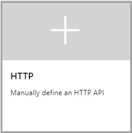

# Add an API manually

This article shows steps to add an API manually to the API Management instance. When you want to mock the API, you can create a blank API or define it manually. For details about mocking an API, see [Mock API responses](mock-api-responses.md).

If you want to import an existing API, see [related topics](#related-topics) section.

In this article, we create a blank API and specify [httpbin.org](https://httpbin.org) (a public testing service) as a backend API.

## Prerequisites

Complete the following quickstart: [Create an Azure API Management instance](get-started-create-service-instance.md)

[!INCLUDE [api-management-navigate-to-instance.md](../../includes/api-management-navigate-to-instance.md)]

## Create an API

1. Navigate to your API Management service in the Azure portal and select **APIs** from the menu.
2. From the left menu, select **+ Add API**.
3. Select **HTTP** from the list.  
      
4. Enter the backend **Web service URL** (for example, `https://httpbin.org`) and other settings for the API. The settings are explained in the [Import and publish your first API](import-and-publish.md#import-and-publish-a-backend-api) tutorial.
5. Select **Create**.

At this point, you have no operations in API Management that map to the operations in your backend API. If you call an operation that is exposed through the back end but not through the API Management, you get a **404**.

>[!NOTE]
> By default, when you add an API, even if it's connected to some backend service, API Management won't expose any operations until you allow them. To allow an operation of your backend service, create an API Management operation that maps to the backend operation.

## Add and test an operation

This section shows how to add a "/get" operation to map it to the back end "http://httpbin.org/get" operation.

### Add an operation

1. Select the API you created in the previous step.
2. Select **+ Add Operation**.
3. In the **URL**, select **GET** and enter `/get` in the resource.
4. Enter "*FetchData*" for **Display name**.
5. Select **Save**.

### Test an operation

Test the operation in the Azure portal. You can also test it in the **Developer portal**.

1. Select the **Test** tab.
2. Select **FetchData**.
3. Press **Send**.

The response that the "http://httpbin.org/get" operation generates appears. If you want to transform your operations, see [Transform and protect your API](transform-api.md).

## Add and test a parameterized operation

This section shows how to add an operation that takes a parameter. In this case, we map the operation to "http://httpbin.org/status/200".

### Add the operation

1. Select the API you created in the previous step.
2. Select **+ Add Operation**.
3. In the **URL**, select **GET** and enter `/status/{code}` in the resource. Optionally, you can provide some information associated with this parameter. For example, enter "*Number*" for **TYPE**, "*200*" (default) for **VALUES**.
4. Enter "GetStatus" for **Display name**.
5. Select **Save**.

### Test the operation

Test the operation in the Azure portal. You can also test it in the **Developer portal**.

1. Select the **Test** tab.
2. Select **GetStatus**. By default the code value is set to "*200*". You can change it to test other values. For example, type "*418*".
3. Press **Send**.

    The response that the "http://httpbin.org/status/200" operation generates appears. If you want to transform your operations, see [Transform and protect your API](transform-api.md).

## Add and test a wildcard operation

This section shows how to add a wildcard operation. A wildcard operation lets you pass an arbitrary value with an API request. Instead of creating separate GET operations as shown in the previous sections, you could create a wildcard GET operation.

> [!CAUTION]
> Use care when configuring a wildcard operation. This configuration may make an API more vulnerable to certain [API security threats](mitigate-owasp-api-threats.md#improper-assets-management).

### Add the operation

1. Select the API you created in the previous step.
2. Select **+ Add Operation**.
3. In the **URL**, select **GET** and enter `/*` in the resource.
4. Enter "*WildcardGet*" for **Display name**.
5. Select **Save**.

### Test the operation 

Test the operation in the Azure portal. You can also test it in the **Developer portal**.

1. Select the **Test** tab.
2. Select **WildcardGet**. Try the GET operations that you tested in previous sections, or try a different supported GET operation.

    For example, in **Template parameters**, update the value next to the wildcard (*) name to `headers`. The operation returns the incoming request's HTTP headers.
1. Press **Send**.

    The response that the "http://httpbin.org/headers" operation generates appears. If you want to transform your operations, see [Transform and protect your API](transform-api.md).
  
>[!NOTE]
> It can be important to understand how the host for the backend API you're integrating with handles trailing slashes on an operation URL. For more information, see this [API Management FAQ](./api-management-faq.yml#how-does-api-management-handle-trailing-slashes-when-calling-backend-services-).

[!INCLUDE [api-management-navigate-to-instance.md](../../includes/api-management-append-apis.md)]

[!INCLUDE [api-management-define-api-topics.md](../../includes/api-management-define-api-topics.md)]

## Next steps

> [!div class="nextstepaction"]
> [Transform and protect a published API](transform-api.md)
