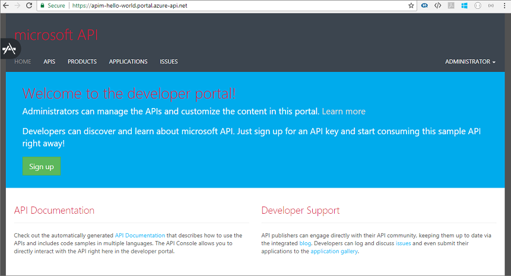
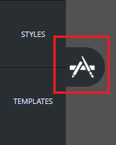
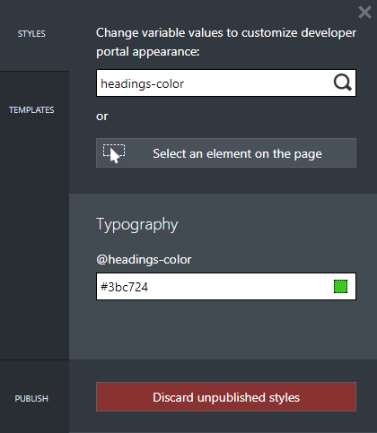

# Customize the style of the Developer portal pages

There are three most common ways to customize the Developer portal in Azure API Management:
 
* [Edit the contents of static pages and page layout elements](api-management-modify-content-layout.md)
* Update the styles used for page elements across the developer portal (explained in this guide)
* [Modify the templates used for pages generated by the portal](api-management-developer-portal-templates.md) (for example, API docs, products, user authentication)

In this tutorial, you learn how to:

> [!div class="checklist"]
> * Customize the style of elements on pages of the **Developer** portal
> * View your change

## Prerequisites

+ Learn the [Azure API Management terminology](api-management-terminology.md).
+ Complete the following quickstart: [Create an Azure API Management instance](get-started-create-service-instance.md).
+ Also, complete the following tutorial: [Import and publish your first API](import-and-publish.md).

[!INCLUDE [premium-dev-standard-basic.md](../../includes/api-management-availability-premium-dev-standard-basic.md)]

## Customize the Developer portal

1. Select **Overview**.
2. Click the **Developer portal** button on the top of the **Overview** window. Alternatively, you can click the **Developer portal URL** link.
3. On the upper left side of the screen, you see an icon comprised of two paint brushes. Hover over this icon to open the portal customization menu.

    
4. Select **Styles** from the menu to open the styling customization pane.

    All elements that you can customize using **Styles** appear on the page
5. Enter "headings-color" in the **Change variable values to customize developer portal appearance:** field.

    The **\@headings-color** element appears on the page. This variable controls the color of the text.

    
    
6. Click on the field for the **\@headings-color** variable. 
    
    Color picker drop-down opens.
7. From the color pickers drop-down select a new color.

    > [!TIP]
    > Real-time preview is available for all changes. A progress indicator appears at the top of the customization pane. After a couple seconds the header text changes in color to the newly selected.

8. Select **Publish** from the lower left on the customization pane menu.
9. Select **Publish customizations** to make the changes publicly available.

## View your change

1. Navigate to the Developer portal.
2. You can see the change that you made.

## Next steps

In this tutorial, you learned how to:

> [!div class="checklist"]
> * Customize the style of elements on pages of the **Developer** portal
> * View your change

You might also be interested in learning [how to customize the Azure API Management developer portal using templates](api-management-developer-portal-templates.md).