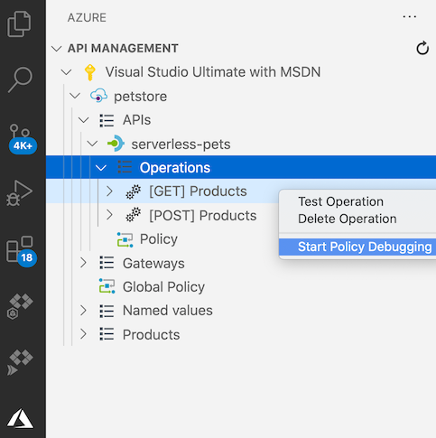
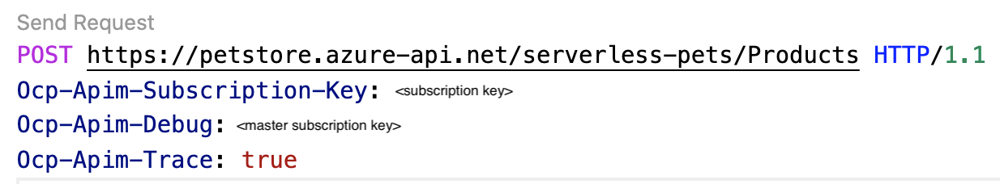
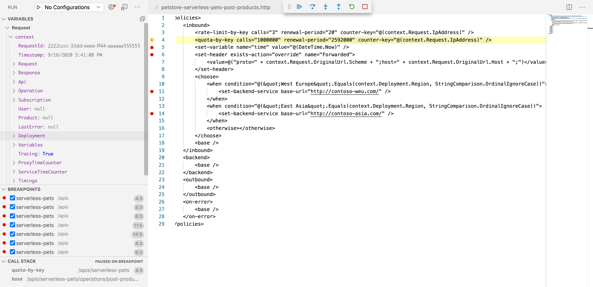
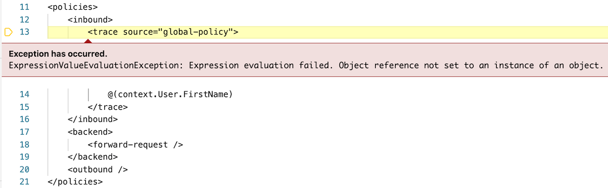

# Debug Azure API Management policies in Visual Studio Code

[Policies](api-management-policies.md) in Azure API Management provide powerful capabilities that help API publishers address cross-cutting concerns such as authentication, authorization, throttling, caching, and transformation. Policies are a collection of statements that are executed sequentially on the request or response of an API. 

This article describes how to debug API Management policies using the [Azure API Management Extension for Visual Studio Code](https://marketplace.visualstudio.com/items?itemName=ms-azuretools.vscode-apimanagement). 

## Prerequisites

* Create an API Management Developer-tier instance by following this [quickstart](get-started-create-service-instance.md) first.

* Install [Visual Studio Code](https://code.visualstudio.com/) and the latest version of [Azure API Management Extension for Visual Studio Code](https://marketplace.visualstudio.com/items?itemName=ms-azuretools.vscode-apimanagement). 

* Import an API to your API Management instance. For example steps, see [Tutorial: Use the API Management Extension for Visual Studio Code to import and manage APIs](visual-studio-code-tutorial.md).

## Restrictions and limitations

* This feature is only available in the **Developer** tier of API Management. Each API Management instance supports only one concurrent debugging session.

* This feature uses the built-in (service-level) all-access subscription (display name "Built-in all-access subscription") for debugging. The [**Allow tracing**](api-management-howto-api-inspector.md#verify-allow-tracing-setting) setting must be enabled in this subscription.

[!INCLUDE [api-management-tracing-alert](../../includes/api-management-tracing-alert.md)]

## Initiate a debugging session

1. Launch Visual Studio Code
2. Navigate to the API Management extension under Azure extensions
3. Find the API Management instance to debug
4. Find the API and operation to debug
5. Right click on the operation and select **Start policy debugging**

At this point, the extension will try to initiate and establish a debugging session with the API Management gateway.

## Send a test request
When the debugging session is established, the extension will open a new editor that allows us to create and send a test HTTP request to this operation leveraging the [REST Client extension](https://marketplace.visualstudio.com/items?itemName=humao.rest-client).

You will notice the **Ocp-Apim-Debug** header has already been added to the request. This header is required and the value must be set to the service-level, all-access subscription key to trigger the debugging functionality in the API Management gateway.

Modify the HTTP request in the editor according to your test scenario. Then click **send request** to send the test request to the API Management gateway.

## Debug policies
After the test HTTP request is sent, the extension will open the debugging window showing the effective policies of this operation and stop at the first effective policy. 

To follow the policy pipeline, you can single-step through individual policies or set a breakpoint at a policy and step directly to that policy. 

In the **Variables** panel, you can inspect values of system-created and user-created variables. In the **Breakpoints** panel, you can see the list of all breakpoints that have been set. In the **Call Stack** panel, you can see the current effective policy scope. 

If there is an error during policy execution, you will see the details of the error at the policy where it happened. 

> [!TIP]
> Remember to exit the debug session by clicking the **Stop** button when you are finished.

## Next steps

+ Learn more about the [API Management extension for Visual Studio Code](https://marketplace.visualstudio.com/items?itemName=ms-azuretools.vscode-apimanagement). 
+ Report issues in the [GitHub repository](https://github.com/Microsoft/vscode-apimanagement)

