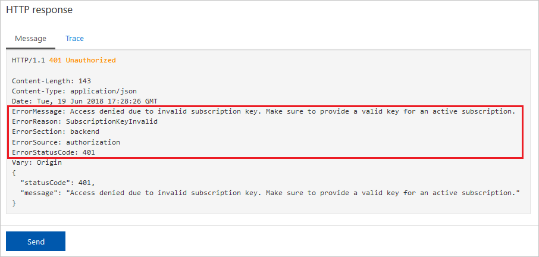

# Error handling in API Management policies

By providing a `ProxyError` object, Azure API Management allows publishers to respond to error conditions, which may occur during processing of requests. The `ProxyError` object is accessed through the [context.LastError](api-management-policy-expressions.md#ContextVariables) property and can be used by policies in the `on-error` policy section. This article provides a reference for the error handling capabilities in Azure API Management.

## Error handling in API Management

Policies in Azure API Management are divided into `inbound`, `backend`, `outbound`, and `on-error` sections as shown in the following example.

```xml
<policies>
    <inbound>
        <!-- statements to be applied to the request go here -->
    </inbound>
    <backend>
        <!-- statements to be applied before the request is
             forwarded to the backend service go here -->
    </backend>
    <outbound>
        <!-- statements to be applied to the response go here -->
    </outbound>
    <on-error>
        <!-- statements to be applied if there is an error
             condition go here -->
    </on-error>
</policies>
```

During the processing of a request, built-in steps are executed along with any policies, which are in scope for the request. If an error occurs, processing immediately jumps to the `on-error` policy section.
The `on-error` policy section can be used at any scope. API publishers can configure custom behavior such as logging the error to event hubs or creating a new response to return to the caller.

> [!NOTE]
> The `on-error` section is not present in policies by default. To add the `on-error` section to a policy, browse to the desired policy in the policy editor and add it. For more information about configuring policies, see [Policies in API Management](./api-management-howto-policies.md).
>
> If there is no `on-error` section, callers will receive 400 or 500 HTTP response messages if an error condition occurs.

### Policies allowed in on-error

The following policies can be used in the `on-error` policy section.

-   [choose](choose-policy.md)
-   [set-variable](set-variable-policy.md)
-   [find-and-replace](find-and-replace-policy.md)
-   [return-response](return-response-policy.md)
-   [set-header](set-header-policy.md)
-   [set-method](set-method-policy.md)
-   [set-status](set-status-policy.md)
-   [send-request](send-request-policy.md)
-   [send-one-way-request](send-one-way-request-policy.md)
-   [log-to-eventhub](log-to-eventhub-policy.md)
-   [json-to-xml](json-to-xml-policy.md)
-   [xml-to-json](xml-to-json-policy.md)
-   [limit-concurrency](limit-concurrency-policy.md)
-   [mock-response](mock-response-policy.md)
-   [retry](retry-policy.md)
-   [trace](trace-policy.md)

## LastError

When an error occurs and control jumps to the `on-error` policy section, the error is stored in [context.LastError](api-management-policy-expressions.md#ContextVariables) property, which can be accessed by policies in the `on-error` section. LastError has the following properties.

| Name       | Type   | Description                                                                                               | Required |
| ---------- | ------ | --------------------------------------------------------------------------------------------------------- | -------- |
| `Source`   | string | Names the element where the error occurred. Could be either policy or a built-in pipeline step name.      | Yes      |
| `Reason`   | string | Machine-friendly error code, which could be used in error handling.                                       | No       |
| `Message`  | string | Human-readable error description.                                                                         | Yes      |
| `Scope`    | string | Name of the scope where the error occurred and could be one of "global", "product", "api", or "operation" | No       |
| `Section`  | string | Section name where error occurred. Possible values: "inbound", "backend", "outbound", or "on-error".      | No       |
| `Path`     | string | Specifies nested policy, for example "choose[3]/when[2]".                                                 | No       |
| `PolicyId` | string | Value of the `id` attribute, if specified by the customer, on the policy where error occurred             | No       |

> [!TIP]
> You can access the status code through context.Response.StatusCode.

> [!NOTE]
> All policies have an optional `id` attribute that can be added to the root element of the policy. If this attribute is present in a policy when an error condition occurs, the value of the attribute can be retrieved using the `context.LastError.PolicyId` property.

## Predefined errors for built-in steps

The following errors are predefined for error conditions that can occur during the evaluation of built-in processing steps.

| Source        | Condition                                 | Reason                  | Message                                                                                                                |
| ------------- | ----------------------------------------- | ----------------------- | ---------------------------------------------------------------------------------------------------------------------- |
| configuration | Uri doesn't match to any API or Operation | OperationNotFound       | Unable to match incoming request to an operation.                                                                      |
| authorization | Subscription key not supplied             | SubscriptionKeyNotFound | Access denied due to missing subscription key. Make sure to include subscription key when making requests to this API. |
| authorization | Subscription key value is invalid         | SubscriptionKeyInvalid  | Access denied due to invalid subscription key. Make sure to provide a valid key for an active subscription.            |
| multiple | Downstream connection (from a client to an API Management gateway) was aborted by the client while request was pending | ClientConnectionFailure | multiple |
| multiple | Upstream connection (from an API Management gateway to a backend service) was not established or was aborted by the backend | BackendConnectionFailure | multiple |
| multiple | Runtime exception had occurred during evaluation of a particular expression | ExpressionValueEvaluationFailure | multiple |

## Predefined errors for policies

The following errors are predefined for error conditions that can occur during policy evaluation.

| Source       | Condition                                                       | Reason                    | Message                                                                                                                              |
| ------------ | --------------------------------------------------------------- | ------------------------- | ------------------------------------------------------------------------------------------------------------------------------------ |
| rate-limit   | Rate limit exceeded                                             | RateLimitExceeded         | Rate limit is exceeded                                                                                                               |
| quota        | Quota exceeded                                                  | QuotaExceeded             | Out of call volume quota. Quota will be replenished in xx:xx:xx. -or- Out of bandwidth quota. Quota will be replenished in xx:xx:xx. |
| jsonp        | Callback parameter value is invalid (contains wrong characters) | CallbackParameterInvalid  | Value of callback parameter {callback-parameter-name} is not a valid JavaScript identifier.                                          |
| ip-filter    | Failed to parse caller IP from request                          | FailedToParseCallerIP     | Failed to establish IP address for the caller. Access denied.                                                                        |
| ip-filter    | Caller IP is not in allowed list                                | CallerIpNotAllowed        | Caller IP address {ip-address} is not allowed. Access denied.                                                                        |
| ip-filter    | Caller IP is in blocked list                                    | CallerIpBlocked           | Caller IP address is blocked. Access denied.                                                                                         |
| check-header | Required header not presented or value is missing               | HeaderNotFound            | Header {header-name} was not found in the request. Access denied.                                                                    |
| check-header | Required header not presented or value is missing               | HeaderValueNotAllowed     | Header {header-name} value of {header-value} is not allowed. Access denied.                                                          |
| validate-jwt | Jwt token is missing in request                                 | TokenNotPresent             | JWT not present.                                                                                         |
| validate-jwt | Signature validation failed                                     | TokenSignatureInvalid     | <message from jwt library\>. Access denied.                                                                                          |
| validate-jwt | Invalid audience                                                | TokenAudienceNotAllowed   | <message from jwt library\>. Access denied.                                                                                          |
| validate-jwt | Invalid issuer                                                  | TokenIssuerNotAllowed     | <message from jwt library\>. Access denied.                                                                                          |
| validate-jwt | Token expired                                                   | TokenExpired              | <message from jwt library\>. Access denied.                                                                                          |
| validate-jwt | Signature key was not resolved by ID                            | TokenSignatureKeyNotFound | <message from jwt library\>. Access denied.                                                                                          |
| validate-jwt | Required claims are missing from token                          | TokenClaimNotFound        | JWT token is missing the following claims: <c1\>, <c2\>, … Access denied.                                                            |
| validate-jwt | Claim values mismatch                                           | TokenClaimValueNotAllowed | Claim {claim-name} value of {claim-value} is not allowed. Access denied.                                                             |
| validate-jwt | Other validation failures                                       | JwtInvalid                | <message from jwt library\>                                                                                                          |
| forward-request or send-request | HTTP response status code and headers were not received from the backend within the configured timeout | Timeout | multiple |

## Example

Setting an API policy to:

```xml
<policies>
    <inbound>
        <base />
    </inbound>
    <backend>
        <base />
    </backend>
    <outbound>
        <base />
    </outbound>
    <on-error>
        <set-header name="ErrorSource" exists-action="override">
            <value>@(context.LastError.Source)</value>
        </set-header>
        <set-header name="ErrorReason" exists-action="override">
            <value>@(context.LastError.Reason)</value>
        </set-header>
        <set-header name="ErrorMessage" exists-action="override">
            <value>@(context.LastError.Message)</value>
        </set-header>
        <set-header name="ErrorScope" exists-action="override">
            <value>@(context.LastError.Scope)</value>
        </set-header>
        <set-header name="ErrorSection" exists-action="override">
            <value>@(context.LastError.Section)</value>
        </set-header>
        <set-header name="ErrorPath" exists-action="override">
            <value>@(context.LastError.Path)</value>
        </set-header>
        <set-header name="ErrorPolicyId" exists-action="override">
            <value>@(context.LastError.PolicyId)</value>
        </set-header>
        <set-header name="ErrorStatusCode" exists-action="override">
            <value>@(context.Response.StatusCode.ToString())</value>
        </set-header>
        <base />
    </on-error>
</policies>
```

and sending an unauthorized request will result in the following response:



## Next steps

For more information working with policies, see:

-   [Policies in API Management](api-management-howto-policies.md)
-   [Transform APIs](transform-api.md)
-   [Policy Reference](./api-management-policies.md) for a full list of policy statements and their settings
-   [Policy samples](./policy-reference.md)
