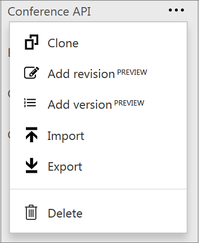
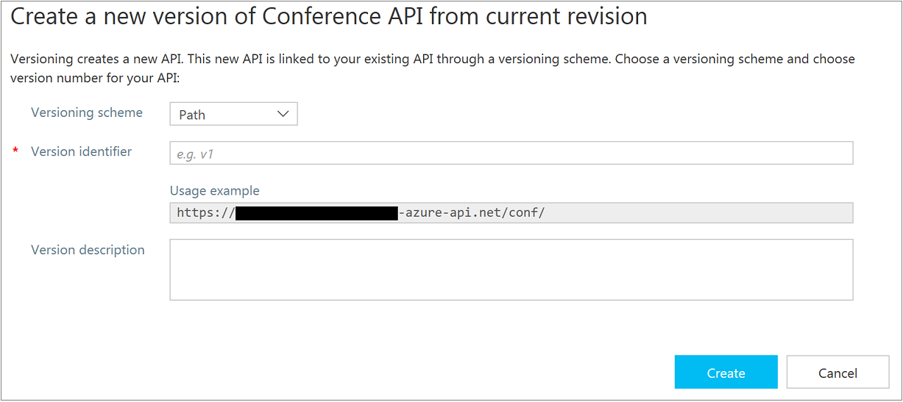
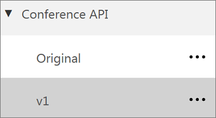
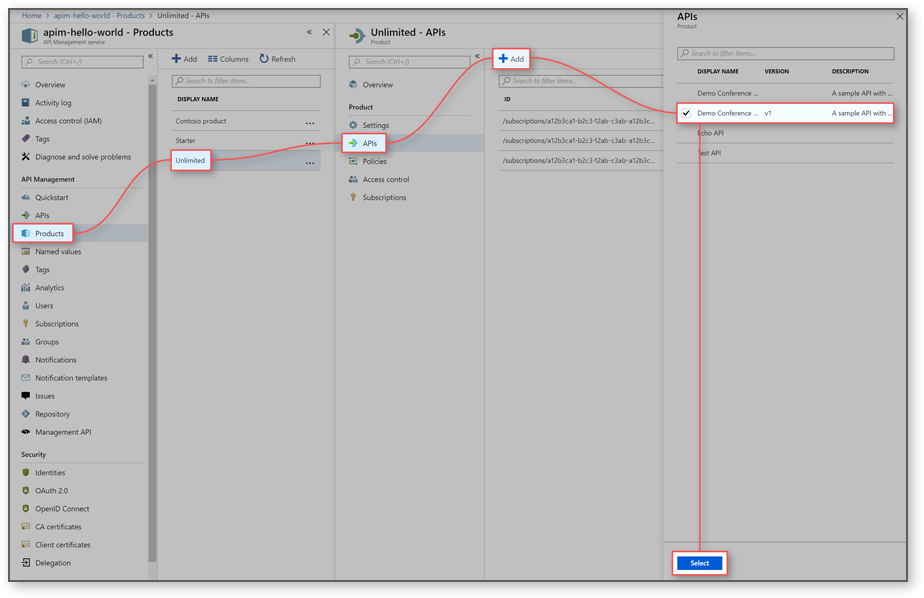
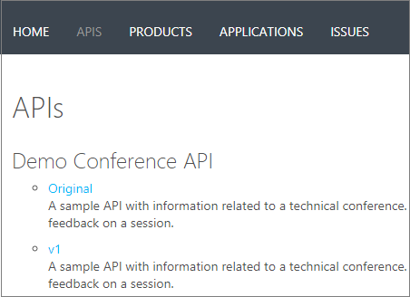

# Publish multiple versions of your API 

There are times when it is impractical to have all callers to your API use exactly the same version. When callers want to upgrade to a later version, they want to be able to do this using an easy to understand approach. It is possible to do this using **versions** in Azure API Management. For more information, see [Versions & revisions](https://blogs.msdn.microsoft.com/apimanagement/2017/09/14/versions-revisions/).

In this tutorial, you learn how to:

> [!div class="checklist"]
> * Add a new version to an existing API
> * Choose a version scheme
> * Add the version to a product
> * Browse the developer portal to see the version

## Prerequisites

+ Learn the [Azure API Management terminology](api-management-terminology.md).
+ Complete the following quickstart: [Create an Azure API Management instance](get-started-create-service-instance.md).
+ Also, complete the following tutorial: [Import and publish your first API](import-and-publish.md).

## Add a new version

1. Select **Demo Conference API** from the API list.
2. Select the context menu (**...**) next to it.
3. Select **+ Add Version**.

> [!TIP]
> Versions can also be enabled when you first create a new API - select **Version this API?** on the **Add API** screen.

## Choose a versioning scheme

Azure API Management allows you to choose the way in which you allow callers to specify which version of your API they want. You specify which API version to use by selecting a **versioning scheme**. This scheme can be either **path, header or query string**. In the following example, path is used to select the versioning scheme.

1. Leave **path** selected as your **versioning scheme**.
2. Type **demo-conference-api-v1** in the **Name** field.

    > [!NOTE]
    > Version is in fact a new API based off an API's revision. **Name** is the new API's name and it must be unique across API Management instance.

3. Type **v1** in the **Version identifier** field.

    > [!TIP]
    > If you select **header** or **query string** as a versioning scheme, you need to provide an additional value - the name of the header or query string parameter.

4. Select **Create** to set up your new version.
5. Underneath **Demo Conference API** in the API List, you now see two distinct APIs - **Original**, and **v1**.

    

    > [!Note]
    > If you add a version to a non-versioned API, an **Original** will be automatically created - responding on the default URL. This ensures that any existing callers are not broken by the process of adding a version. If you create a new API with versions enabled at the start, an Original is not created.

6. You can now edit and configure **v1** as an API that is separate to **Original**. Changes to one version do not affect another.

## Add the version to a product

In order for callers to see the new version, it must be added to a **product**.

1. Select **Products** from the classic deployment model page.
2. Select **Unlimited**.
3. Select **APIs**.
4. Select **Add**.
5. Select **Demo Conference API, Version v1**.
6. Click **Select**.

## Browse the developer portal to see the version

1. Select **Developer Portal** from the top menu.
2. Select **APIs**, notice that **Demo Conference API** shows **Original** and **v1** versions.
3. Select **v1**.
4. Notice the **Request URL** of the first operation in the list. It shows that the API URL path includes **v1**.

    

## Next steps

In this tutorial, you learn how to:

> [!div class="checklist"]
> * Add a new version to an existing API
> * Choose a version scheme 
> * Add the version to a product
> * Browse the developer portal to see the version

Advance to the next tutorial:

> [!div class="nextstepaction"]
> [Customize the style of the Developer portal pages](api-management-customize-styles.md)