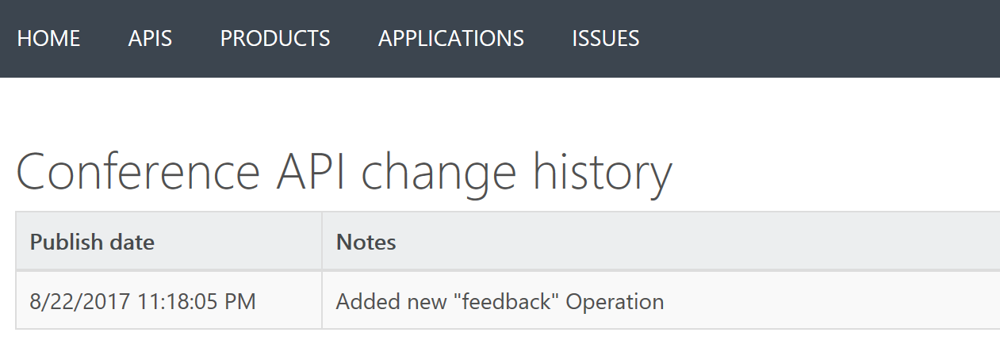

# Make non-breaking changes safely using revisions
This tutorial describes how to make changes to your API safely, and communicate the change to your developers.

## Prerequisites
To complete this tutorial, you need to create an API Management Service, and have an existing API you can alter (in place of Conference API).

## About revisions
When your API is ready to go and starts to be used by developers, you usually need to take care in making changes to that API - so as not to disrupt callers of your API. It's also useful to let developers know about the changes you made. We can do this in Azure API Management using **revisions**.

## Walkthrough
In this walkthrough we add a new revision, add an operation to it, then make that revision current - creating a change log entry when we do.

## Add a new revision
1. Browse to the **APIs** page within your API Management service in the Azure portal.
2. Select **Conference API** from the API list, then select the **Revisions** tab from the menu near the top of the page.
3. Select **+ Add Revision**

    > [!TIP]
    > You can also choose **Add Revision** in the context menu (**...**) on the API.

4. Provide a description for your new revision, to help remember what it will be used for.
5. Select **Create**
6. Your new revision is now created.

    > [!NOTE]
    > You original API remains in **Revision 1**. This is the revision your users will continue to call, until you choose to make a different revision current.

## Make non-breaking changes to your revision
1. Select the **Design** tab near the top of the screen.
2. Notice that the **revision selector** (directly above the design tab) shows your current revision as **Revision 2**.

    > [!TIP]
    > Use the revision selector to switch between revisions that you wish to work on.

3. Select **+ Add Operation**.
4. Set your new operation to be **POST**, and the Name & Display Name of the operation as **Feedback**
5. **Save** your new operation.
6. We have now made a change to **Revision 2**. Use the **Revision Selector** near the top of the page to switch back to **Revision 1**.
7. Notice that your new operation does not appear in **Revision 1**. 

## Make your revision current and add a change log entry
1. Select the **Revisions** tab from the menu near the top of the page.

2. Open the context menu (**...**) for **Revision 2**.
3. Select **Make Current**.

4. Select **Post to Public Change Log for this API**
5. Provide a description for your change that developers see, for example **"Added new Feedback operation."**
6. **Revision 2** is now current.

## Browse the developer portal to see changes and change log
1. Select **Developer Portal** from the top menu.
2. Select **APIs**, and then select **Conference API**.
3. Notice your new **Feedback** operation is now available.
4. Select **API Change History** from below the API name.
5. Notice that your change log entry appears in this list.

## Next steps
[Publish API Versions with Azure API Management](#api-management-getstarted-publish-versions.md)