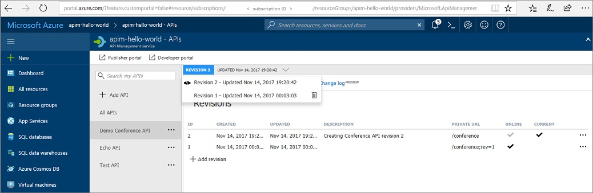
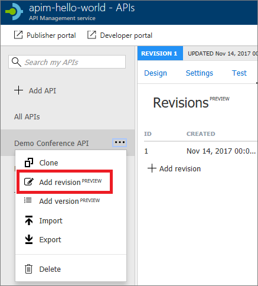

# Use revisions to make non-breaking changes safely
When your API is ready to go and starts to be used by developers, you eventually need to make changes to that API and at the same time not disrupt callers of your API. It's also useful to let developers know about the changes you made. We can do this in Azure API Management using **revisions**. For more information, see [Versions & revisions](https://blogs.msdn.microsoft.com/apimanagement/2017/09/14/versions-revisions/) and [API Versioning with Azure API Management](https://blogs.msdn.microsoft.com/apimanagement/2017/09/13/api-versioning-with-azure-api-management/).

In this tutorial, you learn how to:

> [!div class="checklist"]
> * Add a new revision
> * Make non-breaking changes to your revision
> * Make your revision current and add a change log entry
> * Browse the developer portal to see changes and change log

## Prerequisites

+ Complete the following quickstart: [Create an Azure API Management instance](get-started-create-service-instance.md).
+ Also, complete the following tutorial: [Import and publish your first API](import-and-publish.md).

## Add a new revision

1. Select **APIs** page.
2. Select **Demo Conference API** from the API list (or other API to which you want to add revisions).
3. Click the **Revisions** tab from the menu near the top of the page.
4. Select **+ Add Revision**

    > [!TIP]
    > You can also choose **Add Revision** in the context menu (**...**) of the API.
    
    

5. Provide a description for your new revision, to help remember what it will be used for.
6. Select **Create**
7. Your new revision is now created.

    > [!NOTE]
    > Your original API remains in **Revision 1**. This is the revision your users continue to call, until you choose to make a different revision current.

## Make non-breaking changes to your revision

1. Select **Demo Conference API** from the API list.
2. Select the **Design** tab near the top of the screen.
3. Notice that the **revision selector** (directly above the design tab) shows **Revision 2** as currently selected.

    > [!TIP]
    > Use the revision selector to switch between revisions that you wish to work on.

4. Select **+ Add Operation**.
5. Set your new operation to be **POST**, and the Name, Display Name and URL of the operation as **test**.
6. **Save** your new operation.
7. We have now made a change to **Revision 2**. Use the **Revision Selector** near the top of the page to switch back to **Revision 1**.
8. Notice that your new operation does not appear in **Revision 1**. 

## Make your revision current and add a change log entry

1. Select the **Revisions** tab from the menu near the top of the page.

    
2. Open the context menu (**...**) for **Revision 2**.
3. Select **Make Current**.
4. Check **Post to Public Change log for this API**, if you want to post notes about this change. Provide a description for your change that developers see, for example: **Testing revisions. Added new "test" operation.**
5. **Revision 2** is now current.

## Browse the developer portal to see changes and change log

1. In the Azure portal, select **APIs**.
2. Select **Developer Portal** from the top menu.
3. Select **APIs**, and then select **Demo Conference API**.
4. Notice your new **test** operation is now available.
5. Select **API Change History** from below the API name.
6. Notice that your change log entry appears in this list.

    

## Next steps

In this tutorial, you learned how to:

> [!div class="checklist"]
> * Add a new revision
> * Make non-breaking changes to your revision
> * Make your revision current and add a change log entry
> * Browse the developer portal to see changes and change log

Advance to the next tutorial:

> [!div class="nextstepaction"]
> [Publish multiple versions of your API](api-management-get-started-publish-versions.md)
