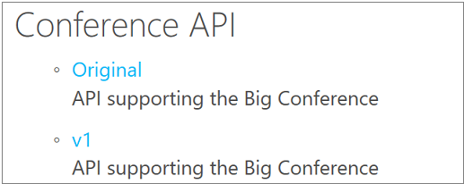

---
# Mandatory fields. See more on aka.ms/skyeye/meta.
title: Publish versions of your API using Azure API Management | Microsoft Docs
description: Follow the steps of this tutorial to learn how to publish multiple versions in API Management.
services: api-management
documentationcenter: ''
author: mattfarm
manager: anneta
editor: ''

ms.service: api-management
ms.workload: integration
ms.topic: article
ms.date: 08/18/2017
ms.author: apimpm
---

# Publish multiple versions of your API in a predictable way
This tutorial describes how to set up versions of your API, and choose the way they are called by API developers.

## Prerequisites
To complete this tutorial, you need to create an API Management Service, and have an existing API you can alter (in place of Conference API).

## About versions
Sometimes it is impractical to have all callers to your API use exactly the same version. Sometimes you want to publish new or different API features to some users, while others want to stick with the API that currently works for them. When callers want to upgrade to a later version, they want to be able to do this using an easy to understand approach.  We can do this using **versions** in Azure API Management.

## Walkthrough
In this walkthrough we add a new version to an existing API, choosing a versioning scheme and version identifier.

## Add a new version

1. Browse to the **APIs** page within your API Management service in the Azure portal.
2. Select **Conference API** from the API list, then select the context menu (**...**) next to it.
3. Select **+ Add Version**.

    > [!TIP]
    > Versions can also be enabled when you first create a new API - select **Version this API?** on the **Add API** screen.

## Choose a versioning scheme
Azure API Management allows you to choose the way in which you allow callers to specify which version of your API they want. You do this by choosing a **versioning scheme**. This scheme can be either **path, header or query string**. In our example, we use path.

1. Leave **path** selected as your **versioning scheme**.
2. Add **v1** as your **version identifier**.

    > [!TIP]
    > If you select **header** or **query string** as a versioning scheme, you will need to provide an additional value - the name of the header or query string parameter.

3. Provide a description if you wish.
4. Select **Create** to set up your new version.
5. Underneath **Big Conference API** in the API List, you now see two distinct APIs - **Original**, and **v1**.

    > [!Note]
    > If you add a version to a non-versioned API, we always create an **Original** for you - responding on the default URL. This ensures that any existing callers are not broken by the process of adding a version. If you create a new API with versions enabled at the start, an Original is not created.

6. You can now edit and configure **v1** as an API that is completely separate to **Original**. Changes to one version do not affect another.

## Add the version to a product
For callers to see your new version, it must be added to a **product** (products are not inherited from parent versions).

1. Select **Products** from the service management page.
2. Select **Unlimited**.
3. Select **APIs**.
4. Select **Add**.
5. Select **Conference API, Version v1**.
6. Return to the service management page and select **APIs**.

## Browse the developer portal to see the version
1. Select **Developer Portal** from the top menu.
2. Select **APIs**, notice that **Conference API** shows **Original** and **v1** versions.
3. Select **v1**.
4. Notice the **Request URL** of the first operation in the list. It shows that the API URL path includes **v1**.

