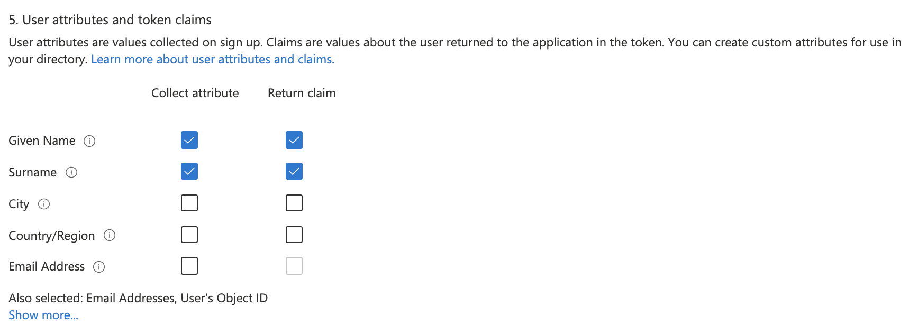

# How to authorize developer accounts by using Azure Active Directory B2C in Azure API Management

Azure Active Directory B2C is a cloud identity management solution for consumer-facing web and mobile applications. You can use it to manage access to your API Management developer portal. 

This guide shows you the configuration that's required in your API Management service to integrate with Azure Active Directory B2C. If you are using the deprecated legacy developer portal, some steps differ, as noted in this article.

For information about enabling access to the developer portal by using classic Azure Active Directory, see [How to authorize developer accounts using Azure Active Directory](api-management-howto-aad.md).

## Prerequisites

* An Azure Active Directory B2C tenant to create an application in. For more information, see [Azure Active Directory B2C overview](../active-directory-b2c/overview.md).
* If you don't already have an API Management service, complete the following quickstart: [Create an Azure API Management instance](get-started-create-service-instance.md)

[!INCLUDE [premium-dev-standard.md](../../includes/api-management-availability-premium-dev-standard.md)]

## Configure sign up and sign in user flow

In this section, create a user flow in your Azure Active Directory B2C tenant containing both sign up and sign in policies. For detailed steps, see [Create user flows and custom policies in Azure Active Directory B2C](../active-directory-b2c/tutorial-create-user-flows.md?pivots=b2c-us).

1. In the [Azure portal](https://portal.azure.com), access your Azure Active Directory B2C tenant.
1. Under **Policies**, select **User flows** > **+ New user flow**.
1. On the **Create a user flow** page, select the **Sign up and sign in** user flow.
1. Provide the following information:
    1. Enter a unique name for the user flow.
    1. In **Identity providers**, select **Email signup**.
    1. In **User attributes and token claims**, select the attributes and claims needed for the API Management developer portal (not needed for the legacy developer portal).
         
        * **Attributes**: Given Name, Surname
        * **Claims**: Email Addresses, Given Name, Surname, User’s ObjectID
1. Select **Create**.

## Configure identity provider for developer portal

1. In a separate [Azure portal](https://portal.azure.com) tab, navigate to your API Management instance.
1. Under **Developer portal**, select **Identities** > **+ Add**.
1. In the **Add identity provider** page, select **Azure Active Directory B2C**.
1. In the **Add identity provider** window, copy the **Redirect URL**.

    :::image type="content" source="media/api-management-howto-aad-b2c/b2c-identity-provider-redirect-url.png" alt-text="Copy redirect URL":::    

1. Return to the browser tab for your Azure Active Directory B2C tenant in the Azure portal. Select **App registrations** >  **+ New registration**.
1. In the **Register an application** page, enter your application's registration information.
    * In the **Name** section, enter an application name of your choosing.
    * In the **Supported account types** section, choose the type of accounts that are appropriate for your scenario. To target a wide set of customers, select **Accounts in any identity provider or organizational directory (for authenticating users with user flows)**. For more information, see [Register an application](../active-directory/develop/quickstart-register-app.md#register-an-application).
    * In **Redirect URI**, enter the Redirect URL your copied from your API Management instance.
    * In **Permissions**, select **Grant admin consent to openid and offline_access permissions.**
    * Select **Register** to create the application.

    :::image type="content" source="media/api-management-howto-aad-b2c/b2c-app-registration.png" alt-text="Register a new application":::

1. On the app **Overview** page, find the **Application (client) ID** and copy the value to the clipboard.

    :::image type="content" source="media/api-management-howto-aad-b2c/b2c-app-id.png" alt-text="Application ID":::
1. Switch back to the API Management **Add identity provider** page and paste the ID into the **Client Id** text box.
1. Switch back to the B2C app registration. Select **Certificates & secrets** > **+ New client secret**. 
    :::image type="content" source="media/api-management-howto-aad-b2c/generate-app-key.png" alt-text="Create client secret"::: 
   * In the **Add a client secret** page, enter a **Description** and select **Add**.
   * Record the key in a safe location. This secret value is never displayed again after you leave this page.
1. Switch back to the API Management **Add identity provider** page, and paste the key into the **Client secret** text box.
1. Switch back to the B2C app registration. In the left menu, under **Manage**, select **Authentication**.
    * Under **Implicit grant**, select the **Access tokens** check box.
    * Select **Save**.
1. Switch back in the API Management **Add identity provider** page.
    * In **Signin tenant**, specify the domain name of the Azure Active Directory B2C tenant.
    * The **Authority** field lets you control the Azure AD B2C login URL to use. Set the value to **<your_b2c_tenant_name>.b2clogin.com**.
    * Specify the **Signup Policy** and **Signin Policy** from the B2C tenant policies.
    * Optionally provide the **Profile Editing Policy** and **Password Reset Policy**.

         :::image type="content" source="media/api-management-howto-aad-b2c/add-identity-provider.png" alt-text="Active Directory B2c identity provider configuration":::
1. After you've specified the desired configuration, select **Add**.

After the changes are saved, developers will be able to create new accounts and sign in to the developer portal by using Azure Active Directory B2C.

## Developer portal - add Azure AD B2C account authentication

> [!IMPORTANT]
> You need to [republish the developer portal](api-management-howto-developer-portal-customize.md#publish) when you create or update Azure Active Directory B2C configuration settings for the changes to take effect.

In the developer portal, sign-in with Azure AD B2C is possible with the **Sign-in button: OAuth** widget. The widget is already included on the sign-in page of the default developer portal content.

1. To sign in by using Azure Active Directory B2C, open a new browser window and go to the developer portal. Select **Sign in**.

1. On the **Sign in** page, select **Azure Active Directory B2C**.

    :::image type="content" source="media/api-management-howto-aad-b2c/developer-portal-sign-in.png" alt-text="Sign in to developer portal":::
1. You're redirected to the signup policy that you configured in the previous section. Choose to sign up by using your email address in the Active Directory B2C tenant

When the signup is complete, you're redirected back to the developer portal. You're now signed in to the developer portal for your API Management service instance.

:::image type="content" source="media/api-management-howto-aad-b2c/developer-portal-home.png" alt-text="Sign in to developer portal complete":::

Although a new account is automatically created whenever a new user signs in with Azure AD B2C, you may consider adding the same widget to the sign-up page.

The **Sign-up form: OAuth** widget represents a form used for signing up with OAuth.

## Legacy developer portal - how to sign up with Azure AD B2C

[!INCLUDE [api-management-portal-legacy.md](../../includes/api-management-portal-legacy.md)]

1. To sign up for a developer account by using Azure AD B2C, open a new browser window and go to the legacy developer portal. Click the **Sign up** button.

    :::image type="content" source="media/api-management-howto-aad-b2c/b2c-dev-portal.png" alt-text="Sign up in legacy developer portal":::
1. Choose to sign up with **Azure Active Directory B2C**.

    :::image type="content" source="media/api-management-howto-aad-b2c/b2c-dev-portal-b2c-button.png" alt-text="Sign up  with Azure Active Directory B2C":::

3. You're redirected to the signup policy that you configured in the previous section. Choose to sign up by using your email address or one of your existing social accounts.

   > [!NOTE]
   > If Azure Active Directory B2C is the only option that's enabled on the **Identities** tab in the publisher portal, you'll be redirected to the signup policy directly.

   :::image type="content" source="media/api-management-howto-aad-b2c/b2c-dev-portal-b2c-options.png" alt-text="Sign up options in legacy developer portal":::

   When the signup is complete, you're redirected back to the developer portal. You're now signed in to the developer portal for your API Management service instance.

## Next steps

*  [Azure Active Directory B2C overview]
*  [Azure Active Directory B2C: Extensible policy framework]
*  [Use a Microsoft account as an identity provider in Azure Active Directory B2C]
*  [Use a Google account as an identity provider in Azure Active Directory B2C]
*  [Use a LinkedIn account as an identity provider in Azure Active Directory B2C]
*  [Use a Facebook account as an identity provider in Azure Active Directory B2C]

[How to add operations to an API]: ./mock-api-responses.md
[How to add and publish a product]: api-management-howto-add-products.md
[Monitoring and analytics]: api-management-monitoring.md
[Add APIs to a product]: api-management-howto-add-products.md#add-apis
[Publish a product]: api-management-howto-add-products.md#publish-product
[Get started with Azure API Management]: get-started-create-service-instance.md
[API Management policy reference]: ./api-management-policies.md
[Caching policies]: ./api-management-policies.md#caching-policies
[Create an API Management service instance]: get-started-create-service-instance.md

[https://oauth.net/2/]: https://oauth.net/2/
[WebApp-GraphAPI-DotNet]: https://github.com/AzureADSamples/WebApp-GraphAPI-DotNet
[Azure Active Directory B2C overview]: ../active-directory-b2c/overview.md
[How to authorize developer accounts using Azure Active Directory]: ./api-management-howto-aad.md
[Azure Active Directory B2C: Extensible policy framework]: ../active-directory-b2c/user-flow-overview.md
[Use a Microsoft account as an identity provider in Azure Active Directory B2C]: ../active-directory-b2c/identity-provider-microsoft-account.md
[Use a Google account as an identity provider in Azure Active Directory B2C]: ../active-directory-b2c/identity-provider-google.md
[Use a Facebook account as an identity provider in Azure Active Directory B2C]: ../active-directory-b2c/identity-provider-facebook.md
[Use a LinkedIn account as an identity provider in Azure Active Directory B2C]: ../active-directory-b2c/identity-provider-linkedin.md

[Prerequisites]: #prerequisites
[Configure an OAuth 2.0 authorization server in API Management]: #step1
[Configure an API to use OAuth 2.0 user authorization]: #step2
[Test the OAuth 2.0 user authorization in the Developer Portal]: #step3
[Next steps]: #next-steps

[Log in to the Developer portal using an Azure Active Directory account]: #Log-in-to-the-Developer-portal-using-an-Azure-Active-Directory-account
