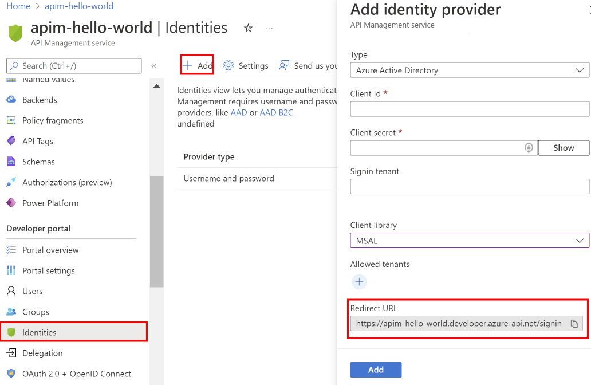

# Authorize developer accounts by using Azure Active Directory in Azure API Management

This article shows you how to enable access to the developer portal for users from Azure Active Directory (Azure AD). This guide also shows you how to manage groups of Azure AD users by adding external groups that contain the users.

## Prerequisites

- Complete the following quickstart: [Create an Azure API Management instance](get-started-create-service-instance.md).
- Import and publish an Azure API Management instance. For more information, see [Import and publish](import-and-publish.md).

[!INCLUDE [premium-dev-standard.md](../../includes/api-management-availability-premium-dev-standard.md)]

## Authorize developer accounts by using Azure AD

1. Sign in to the [Azure portal](https://portal.azure.com). 
2. Select .
3. Type **api** in the search box.
4. Select **API Management services**.
5. Select your API Management service instance.
6. Under **Security**, select **Identities**.
7. Select **+Add** from the top.

    The **Add identity provider** pane appears on the right.
8. Under **Provider type**, select **Azure Active Directory**.

    Controls that enable you to enter other necessary information appear in the pane. The controls include **Client ID** and **Client secret**. (You get information about these controls later in the article.)
9. Make a note of the content of **Redirect URL**.
    
     
10. In your browser, open a different tab. 
11. Navigate to the [Azure portal - App registrations](https://go.microsoft.com/fwlink/?linkid=2083908) to register an app in Active Directory.
12. Under **Manage**, select **App registrations**.
13. Select **New registration**. On the **Register an application** page, set the values as follows:
    
* Set **Name** to a meaningful name. e.g., *developer-portal*
* Set **Supported account types** to **Accounts in this organizational directory only**. 
* Set **Redirect URI** to the value you got from step 9. 
* Choose **Register**. 

14.  After the application is registered, copy the **Application (client) ID** from the **Overview** page. 
15. Go back to your API Management instance. In the **Add identity provider** window, paste the **Application (client) ID** value into the **Client ID** box.
16. Switch back to the Azure AD configuration, Select **Certificates & secrets** under **Manage**. Select the **New client secret** button. Enter a value in **Description**, select any option for **Expires** and choose **Add**. Copy the client secret value before leaving the page. You will need it in the next step. 
17. Under **Manage**, select **Authentication** and then select **ID tokens** under **Implicit Grant**
18. Go back to your API Management instance, paste the secret into the **Client secret** box.

    > [!IMPORTANT]
    > Please make sure to update the **Client secret** before the key expires. 
    >  
    >

19. The **Add identity provider** window also contains the **Allowed Tenants** text box. There, specify the domains of the Azure AD instances to which you want to grant access to the APIs of the API Management service instance. You can separate multiple domains with newlines, spaces, or commas.

> [!NOTE]
> You can specify multiple domains in the **Allowed Tenants** section. Before any user can sign in from a different domain than the original domain where the application was registered, a global administrator of the different domain must grant permission for the application to access directory data. To grant permission, the global administrator should:
> a. Go to `https://<URL of your developer portal>/aadadminconsent` (for example, https://contoso.portal.azure-api.net/aadadminconsent).
> b. Type in the domain name of the Azure AD tenant that they want to give access to.
> c. Select **Submit**. 

20.  After you specify the desired configuration, select **Add**.

After the changes are saved, users in the specified Azure AD instance can sign in to the developer portal by following the steps in [Sign in to the developer portal by using an Azure AD account](#log_in_to_dev_portal).

## Add an external Azure AD group

After you enable access for users in an Azure AD instance, you can add Azure AD groups in API Management. Then, you can more easily manage the association of the developers in the group with the desired products.

 > [!IMPORTANT]
 > To add an external Azure AD group, you must first configure the Azure AD instance on the **Identities** tab by following the procedure in the previous section. Additionally, the application must be granted access to Azure AD Graph API with `Directory.Read.All` permission. 

You add external Azure AD groups from the **Groups** tab of your API Management instance.

1. Select the **Groups** tab.
2. Select the **Add AAD group** button.
   
3. Select the group that you want to add.
4. Press the **Select** button.

After you add an external Azure AD group, you can review and configure its properties. Select the name of the group from the **Groups** tab. From here, you can edit **Name** and **Description** information for the group.
 
Users from the configured Azure AD instance can now sign in to the developer portal. They can view and subscribe to any groups for which they have visibility.

## <a id="log_in_to_dev_portal"/>Sign in to the developer portal by using an Azure AD account

To sign in to the developer portal by using an Azure AD account that you configured in the previous sections:

1. Open a new browser window by using the sign-in URL from the Active Directory application configuration, and select **Azure Active Directory**.

   ![Sign-in page][api-management-dev-portal-signin]

1. Enter the credentials of one of the users in Azure AD, and select **Sign in**.

   ![Signing in with username and password][api-management-aad-signin]

1. You might be prompted with a registration form if any additional information is required. Complete the registration form, and select **Sign up**.

   !["Sign up" button on registration form][api-management-complete-registration]

Your user is now signed in to the developer portal for your API Management service instance.

![Developer portal after registration is complete][api-management-registration-complete]

[api-management-dev-portal-signin]: ./media/api-management-howto-aad/api-management-dev-portal-signin.png
[api-management-aad-signin]: ./media/api-management-howto-aad/api-management-aad-signin.png
[api-management-complete-registration]: ./media/api-management-howto-aad/api-management-complete-registration.png
[api-management-registration-complete]: ./media/api-management-howto-aad/api-management-registration-complete.png

[How to add operations to an API]: api-management-howto-add-operations.md
[How to add and publish a product]: api-management-howto-add-products.md
[Monitoring and analytics]: api-management-monitoring.md
[Add APIs to a product]: api-management-howto-add-products.md#add-apis
[Publish a product]: api-management-howto-add-products.md#publish-product
[Get started with Azure API Management]: get-started-create-service-instance.md
[API Management policy reference]: api-management-policy-reference.md
[Caching policies]: api-management-policy-reference.md#caching-policies
[Create an API Management service instance]: get-started-create-service-instance.md

[https://oauth.net/2/]: https://oauth.net/2/
[WebApp-GraphAPI-DotNet]: https://github.com/AzureADSamples/WebApp-GraphAPI-DotNet
[Accessing the Graph API]: https://msdn.microsoft.com/library/azure/dn132599.aspx#BKMK_Graph

[Prerequisites]: #prerequisites
[Configure an OAuth 2.0 authorization server in API Management]: #step1
[Configure an API to use OAuth 2.0 user authorization]: #step2
[Test the OAuth 2.0 user authorization in the Developer Portal]: #step3
[Next steps]: #next-steps

[Sign in to the developer portal by using an Azure AD account]: #Sign-in-to-the-developer-portal-by-using-an-Azure-AD-account
