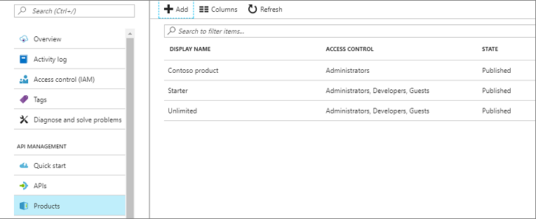
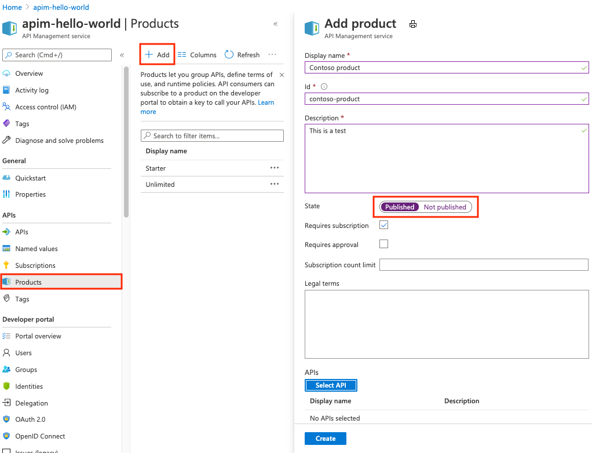
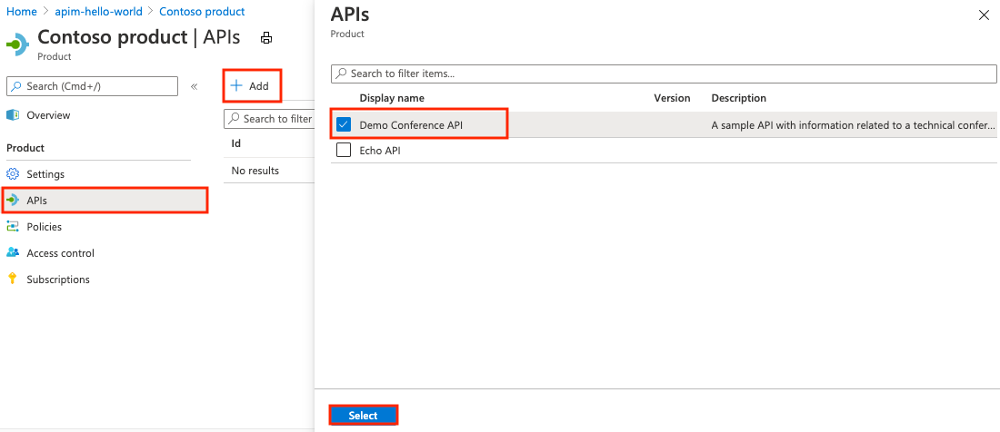

# Create and publish a product  

In Azure API Management, a product contains one or more APIs as well as a usage quota and the terms of use. Once a product is published, developers can subscribe to the product and begin to use the product's APIs.  

In this tutorial, you learn how to:

> [!div class="checklist"]
> * Create and publish a product
> * Add an API to the product

## Prerequisites

+ Learn the [Azure API Management terminology](api-management-terminology.md).
+ Complete the following quickstart: [Create an Azure API Management instance](get-started-create-service-instance.md).
+ Also, complete the following tutorial: [Import and publish your first API](import-and-publish.md).

## Create and publish a product

1. Click on **Products** in the menu on the left to display the **Products** page.
2. Click **+ Add**.

    When you add a product, you need to supply the following information: 

    | Name                     | Description                                                                                                                                                                                                                                                                                                             |
    |--------------------------|-------------------------------------------------------------------------------------------------------------------------------------------------------------------------------------------------------------------------------------------------------------------------------------------------------------------------|
    | Display name             | The name as you want it to be shown in the **Developer portal**.                                                                                                                                                                                                                                                        |
    | Name                     | A descriptive name of the product.                                                                                                                                                                                                                                                                                      |
    | Description              | The **Description** field allows you to provide detailed information about the product such as its purpose, the APIs it provides access to, and other useful information.                                                                                                                                               |
    | State                    | Press **Published** if you want to publish the product. Before the APIs in a product can be called, the product must be published. By default new products are unpublished, and are visible only to the  **Administrators** group.                                                                                      |
    | Requires subscription    | Check **Require subscription** if a user is required to subscribe to use the product.                                                                                                                                                                                                                                   |
    | Requires approval        | Check **Require approval** if you want an administrator to review and accept or reject subscription attempts to this product. If the box is unchecked, subscription attempts are auto-approved.                                                                                                                         |
    | Subscription count limit | To limit the count of multiple simultaneous subscriptions, enter the subscription limit.                                                                                                                                                                                                                                |
    | Legal terms              | You can include the terms of use for the product which subscribers must accept in order to use the product.                                                                                                                                                                                                             |
    | APIs                     | Products are associations of one or more APIs. You can include a number of APIs and offer them to developers through the developer portal.   You can add an existing API during the product creation. You can add an API to the product later, either from the Products **Settings** page or while creating an API. |

3. Click **Create** to create the new product.

### Add more configurations

You can continue configuring the product after saving it by choosing the **Settings** tab. 

View/add subscribers to the product from the **Subscriptions** tab.

Set visibility of a product for developers or guest from the **Access control** tab.

## Add APIs to a product

Products are associations of one or more APIs. You can include a number of APIs and offer them to developers through the developer portal. You can add an existing API during the product creation. You can add an API to the product later, either from the Products **Settings** page or while creating an API.

Developers must first subscribe to a product to get access to the API. When they subscribe, they get a subscription key that is good for any API in that product. If you created the APIM instance, you are an administrator already, so you are subscribed to every product by default.

### Add an API to an existing product

1. From the **Products** tab, select a product.
2. Navigate to the **APIs** tab.
3. Click **+ Add**.
4. Choose an API and click **Select**.

> [!TIP]
> You can create or update user's subscription to a *Product* with custom subscription keys [through REST API](https://docs.microsoft.com/rest/api/apimanagement/2019-01-01/subscription/createorupdate) or PowerShell command.

## Next steps

In this tutorial, you learned how to:

> [!div class="checklist"]
> * Create and publish a product
> * Add an API to the product

Advance to the next tutorial:

> [!div class="nextstepaction"]
> [Create blank API and mock API responses](mock-api-responses.md)
