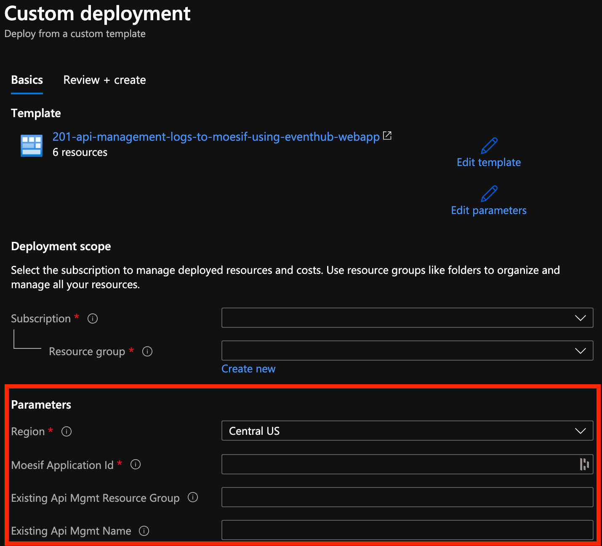
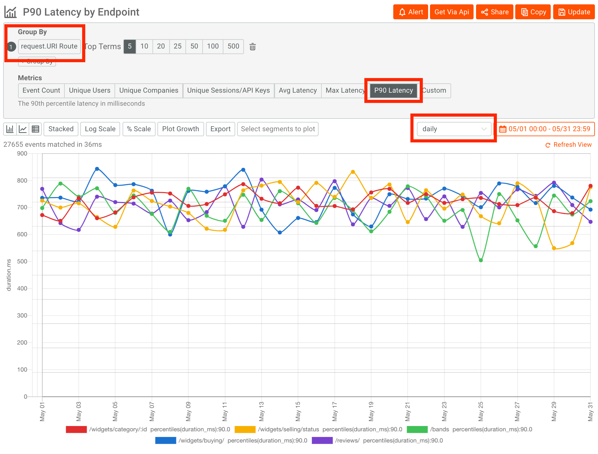

# Analyze API logs using Moesif

This tutorial describes how to log API calls from Azure API Management to [Moesif API Analytics](https://www.moesif.com/?language=azure-api-management) using Azure Event Hub. Then, the tutorial describes how to create a report in Moesif showing customer API usage. For more information on how this integration works, see [Monitor APIs with Azure API Management, Event Hubs, and Moesif](api-management-log-to-eventhub-sample.md).

In this tutorial, you learn how to:

> [!div class="checklist"]
> * Set up logging API calls to Moesif
> * Create a report on API usage

## Prerequisites

+ Learn the [Azure API Management terminology](api-management-terminology.md).
+ Complete the following quickstart: [Create an Azure API Management instance](get-started-create-service-instance.md).
+ Also, complete the following tutorial: [Import and publish your first API](import-and-publish.md).

## Overview

Moesif is a third-party service that provides reporting on customer API usage and monitoring for API issues. An [integration](https://www.moesif.com/implementation/log-http-calls-from-azure-api-management?platform=azure-management) is available that logs API traffic from your Azure API Management services. 

The integration is deployed using an Azure Resource Template. It configures your APIM service to log API calls to an Azure Event Hub and an Azure WebJob 
to send data from the Event Hub to Moesif.

## Set up logging API calls to Moesif

### Start Azure Resource Deployment

Click the below button to start a Custom deployment with the Moesif Azure Resource Template.

[](https://portal.azure.com/#create/Microsoft.Template/uri/https%3A%2F%2Fraw.githubusercontent.com%2FMoesif%2Fazure-quickstart-templates%2Fmaster%2F201-api-management-logs-to-moesif-using-eventhub-webapp%2Fazuredeploy.json)

### Configure Parameters

Within the Azure Custom Deployment, set the following properties:



* Set Moesif Application Id to the one displayed after logging into Moesif. You can get a free one on [Moesif's website](https://www.moesif.com/?language=azure-api-management)
* Set _Existing Apim Resource Group_ to the resource group containing your Azure APIM.
* Set _Existing Apim Name_ to the name of your Azure APIM instance.

Then, click _Review+create_ and create the template to start the deployment. 

### Add XML Policy

Within the Azure portal, go to your existing Azure API Management instance.
Add the below XML policy to all products or APIs that you want logged to Moesif. 

For more information, see [How to set or edit policies](set-edit-policies.md).

```xml
<policies>
  <inbound>
      <set-variable name="message-id" value="@(Guid.NewGuid())" />
      <log-to-eventhub logger-id="moesif-log-to-event-hub" partition-id="0">
      @{
          var requestLine = string.Format("{0} {1} HTTP/1.1\r\n",
                                                      context.Request.Method,
                                                      context.Request.Url.Path + context.Request.Url.QueryString);

          var body = context.Request.Body?.As<string>(true);
          if (body != null && body.Length > 1024)
          {
              body = body.Substring(0, 1024);
          }

          var headers = context.Request.Headers
                               .Select(h => string.Format("{0}: {1}", h.Key, String.Join(", ", h.Value)))
                               .ToArray<string>();

          var headerString = (headers.Any()) ? string.Join("\r\n", headers) + "\r\n" : string.Empty;

          return "request:"   + context.Variables["message-id"] + "\n"
                              + requestLine + headerString + "\r\n" + body;
      }
  </log-to-eventhub>
  </inbound>
  <backend>
      <forward-request follow-redirects="true" />
  </backend>
  <outbound>
      <log-to-eventhub logger-id="moesif-log-to-event-hub" partition-id="1">
      @{
          var statusLine = string.Format("HTTP/1.1 {0} {1}\r\n",
                                              context.Response.StatusCode,
                                              context.Response.StatusReason);

          var body = context.Response.Body?.As<string>(true);
          if (body != null && body.Length > 1024)
          {
              body = body.Substring(0, 1024);
          }

          var headers = context.Response.Headers
                                          .Select(h => string.Format("{0}: {1}", h.Key, String.Join(", ", h.Value)))
                                          .ToArray<string>();

          var headerString = (headers.Any()) ? string.Join("\r\n", headers) + "\r\n" : string.Empty;

          return "response:"  + context.Variables["message-id"] + "\n"
                              + statusLine + headerString + "\r\n" + body;
     }
  </log-to-eventhub>
  </outbound>
</policies>
```
### Verify integration

Once done, go to _Events_ and then _Live Event Log_ from the top menu. 
You should start seeing API logs show up after a few minutes like the below picture. 


## Create a report on API usage

Now that you have set up API logging, let’s pull up a report showing 90th percentile latency broken down by API. Within Moesif, go to _Events_ from the top menu and select _Time Series_. Add a _Group By_ on the field Request.Route. This will break down our metric by the API route. It’ll automatically consolidate URI identifiers like `/items/1` and `/items/2` to a more analytics friendly `/items/:id`.



## Next steps

In this tutorial, you learned how to:

> [!div class="checklist"]
> * Set up logging API calls to Moesif
> * Create a report on API usage