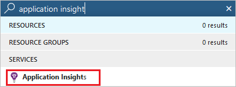
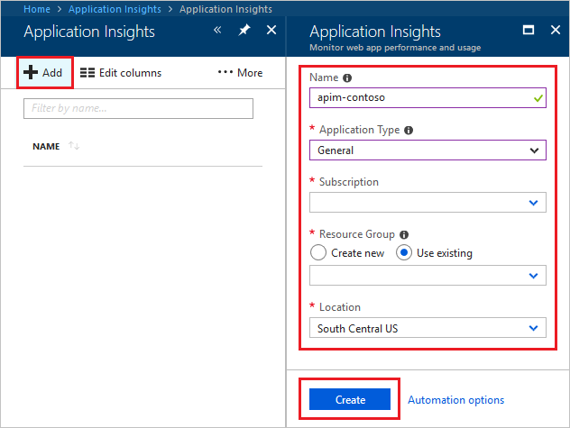
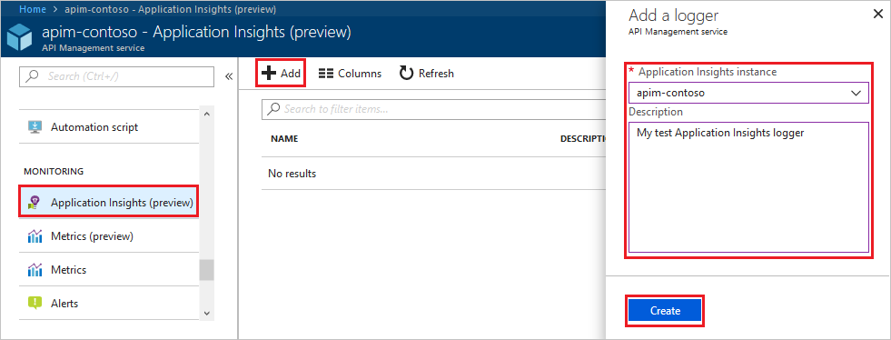
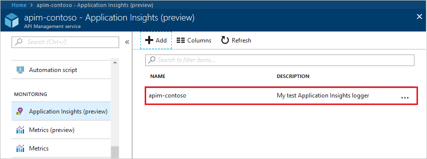
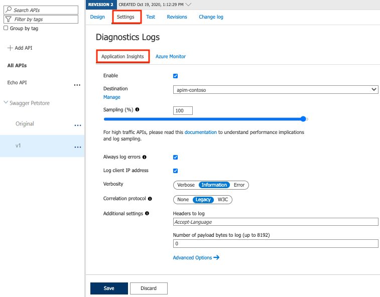

# How to integrate Azure API Management with Azure Application Insights

Azure API Management allows for easy integration with Azure Application Insights - an extensible service for web developers building and managing apps on multiple platforms. This guide walks through every step of such integration and describes strategies for reducing performance impact on your API Management service instance.

## Prerequisites

To follow this guide, you need to have an Azure API Management instance. If you don't have one, complete the [tutorial](get-started-create-service-instance.md) first.

## Create an Azure Application Insights instance

Before you can use Azure Application Insights, you first need to create an instance of the service.

1. Open the **Azure portal** and navigate to **Application Insights**.  
      
2. Click **+ Add**.  
      
3. Fill the form. Select **General** as the **Application Type**.
4. Click **Create**.

## Create a connection between Azure Application Insights and Azure API Management service instance

1. Navigate to your **Azure API Management service instance** in the **Azure portal**.
2. Select **Application Insights** from the menu on the left.
3. Click **+ Add**.  
      
4. Select the previously created **Application Insights** instance and provide a short description.
5. Click **Create**.
6. You have just created an Azure Application Insights logger with an instrumentation key. It should now appear in the list.  
      

> [!NOTE]
> Behind the scene, a [Logger](https://docs.microsoft.com/rest/api/apimanagement/2019-01-01/logger/createorupdate) entity is created in your API Management instance, containing the Instrumentation Key of the Application Insights instance.

## Enable Application Insights logging for your API

1. Navigate to your **Azure API Management service instance** in the **Azure portal**.
2. Select **APIs** from the menu on the left.
3. Click on your API, in this case **Demo Conference API**.
4. Go to the **Settings** tab from the top bar.
5. Scroll down to the **Diagnostics Logs** section.  
      
6. Check the **Enable** box.
7. Select your attached logger in the **Destination** dropdown.
8. Input **100** as **Sampling (%)** and tick the **Always log errors** checkbox.
9. Click **Save**.

> [!WARNING]
> Overriding the default value **0** in the **First bytes of body** field may significantly decrease the performance of your APIs.

> [!NOTE]
> Behind the scene, a [Diagnostic](https://docs.microsoft.com/rest/api/apimanagement/2019-01-01/diagnostic/createorupdate) entity named 'applicationinsights' is created at the API level.

| Setting name                        | Value type                        | Description                                                                                                                                                                                                                                                                                                                                      |
|-------------------------------------|-----------------------------------|--------------------------------------------------------------------------------------------------------------------------------------------------------------------------------------------------------------------------------------------------------------------------------------------------------------------------------------------------|
| Enable                              | boolean                           | Specifies whether logging of this API is enabled.                                                                                                                                                                                                                                                                                                |
| Destination                         | Azure Application Insights logger | Specifies Azure Application Insights logger to be used                                                                                                                                                                                                                                                                                           |
| Sampling (%)                        | decimal                           | Values from 0 to 100 (percent).   Specifies what percentage of requests will be logged to Azure Application Insights. 0% sampling means zero requests logged, while 100% sampling means all requests logged.   This setting is used for reducing performance implications of logging requests to Azure Application Insights (see the section below). |
| Always log errors                   | boolean                           | If this setting is selected, all failures will be logged to Azure Application Insights, regardless of the **Sampling** setting.                                                                                                                                                                                                                  |
| Basic Options: Headers              | list                              | Specifies the headers that will be logged to Azure Application Insights for requests and responses.  Default: no headers are logged.                                                                                                                                                                                                             |
| Basic Options: First bytes of body  | integer                           | Specifies how many first bytes of the body are logged to Azure Application Insights for requests and responses.  Default: body is not logged.                                                                                                                                                                                              |
| Advanced Options: Frontend Request  |                                   | Specifies whether and how *frontend requests* will be logged to Azure Application Insights. *Frontend request* is a request incoming to the Azure API Management service.                                                                                                                                                                        |
| Advanced Options: Frontend Response |                                   | Specifies whether and how *frontend responses* will be logged to Azure Application Insights. *Frontend response* is a response outgoing from the Azure API Management service.                                                                                                                                                                   |
| Advanced Options: Backend Request   |                                   | Specifies whether and how *backend requests* will be logged to Azure Application Insights. *Backend request* is a request outgoing from the Azure API Management service.                                                                                                                                                                        |
| Advanced Options: Backend Response  |                                   | Specifies whether and how *backend responses* will be logged to Azure Application Insights. *Backend response* is a response incoming to the Azure API Management service.                                                                                                                                                                       |

> [!NOTE]
> You can specify loggers on different levels - single API logger or a logger for all APIs.
>  
> If you specify both:
> + if they are different loggers, then both of them will be used (multiplexing logs),
> + if they are the same loggers but have different settings, then the one for single API (more granular level) will override the one for all APIs.

## What data is added to Azure Application Insights

Azure Application Insights receives:

+ *Request* telemetry item, for every incoming request (*frontend request*, *frontend response*),
+ *Dependency* telemetry item, for every request forwarded to a backend service (*backend request*, *backend response*),
+ *Exception* telemetry item, for every failed request.

A failed request is a request, which:

+ failed because of a closed client connection, or
+ triggered an *on-error* section of the API policies, or
+ has a response HTTP status code matching 4xx or 5xx.

## Performance implications and log sampling

> [!WARNING]
> Logging all events may have serious performance implications, depending on incoming requests rate.

Based on internal load tests, enabling this feature caused a 40%-50% reduction in throughput when request rate exceeded 1,000 requests per second. Azure Application Insights is designed to use statistical analysis for assessing application performances. It is not intended to be an audit system and is not suited for logging each individual request for high-volume APIs.

You can manipulate the number of requests being logged by adjusting the **Sampling** setting (see the steps above). Value 100% means all requests are logged, while 0% reflects no logging at all. **Sampling** helps to reduce volume of telemetry, effectively preventing from significant performance degradation, while still carrying the benefits of logging.

Skipping logging of headers and body of requests and responses will also have positive impact on alleviating performance issues.

## Video

> [!VIDEO https://www.microsoft.com/en-us/videoplayer/embed/RE2pkXv]
>
>

## Next steps

+ Learn more about [Azure Application Insights](https://docs.microsoft.com/azure/application-insights/).
+ Consider [logging with Azure Event Hubs](api-management-howto-log-event-hubs.md).
