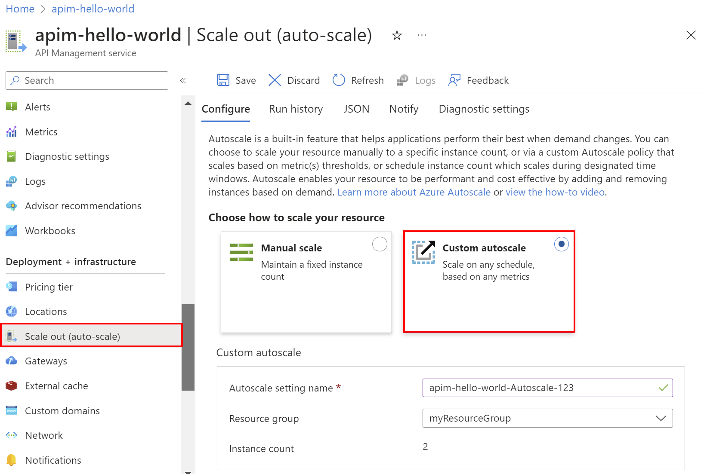
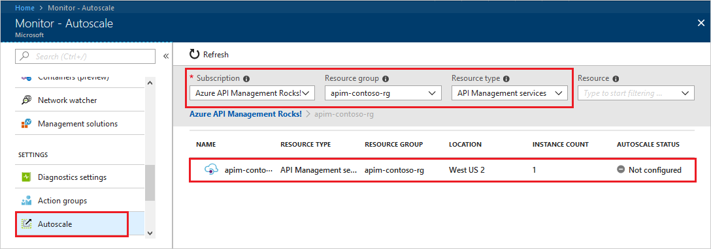
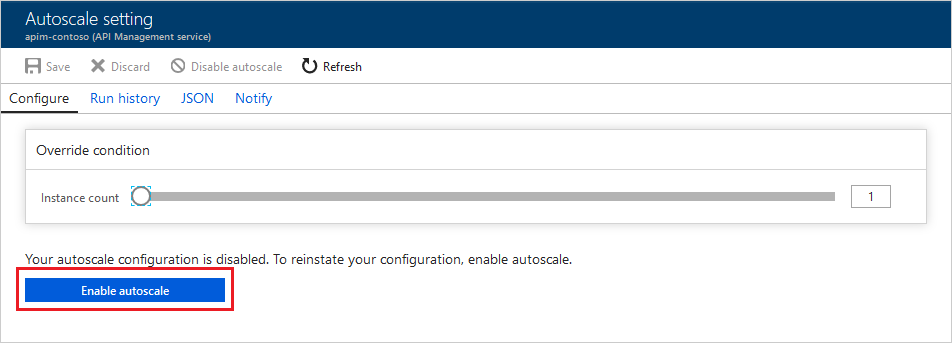
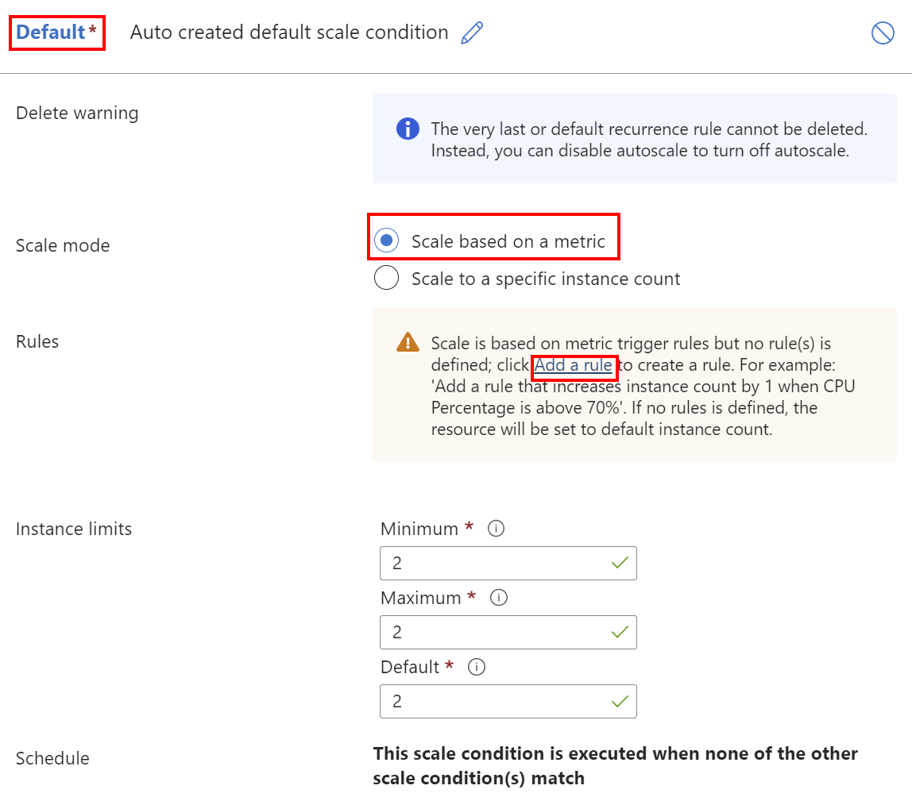
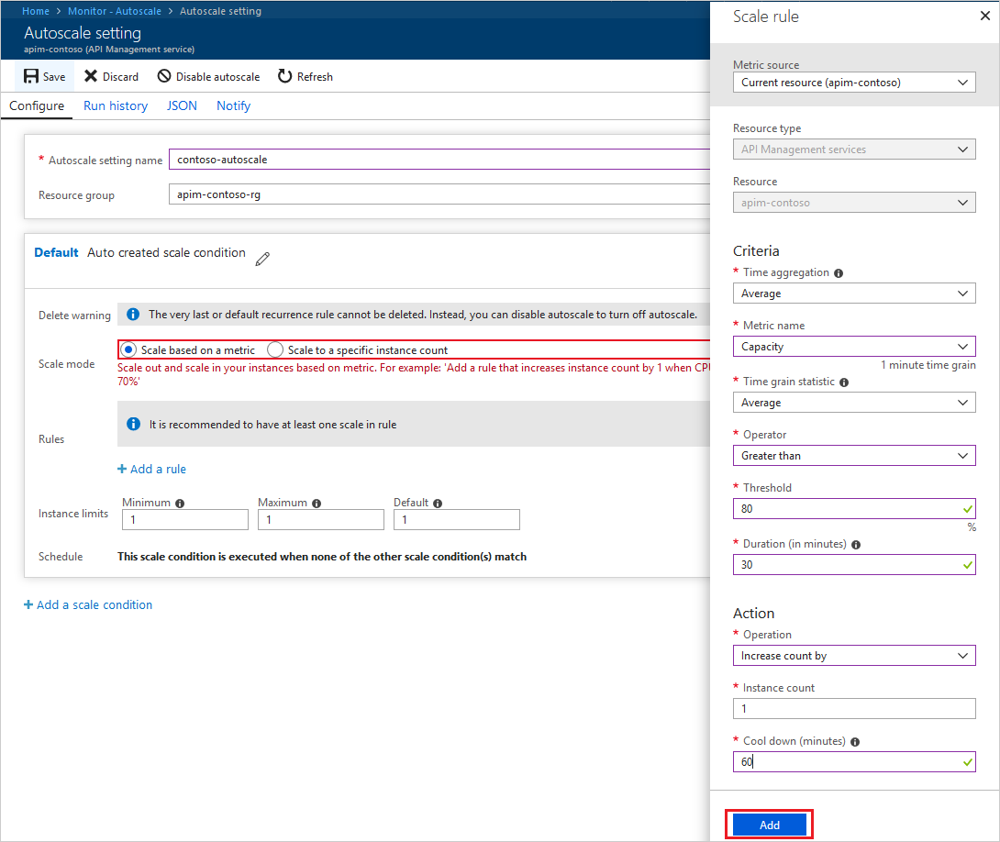
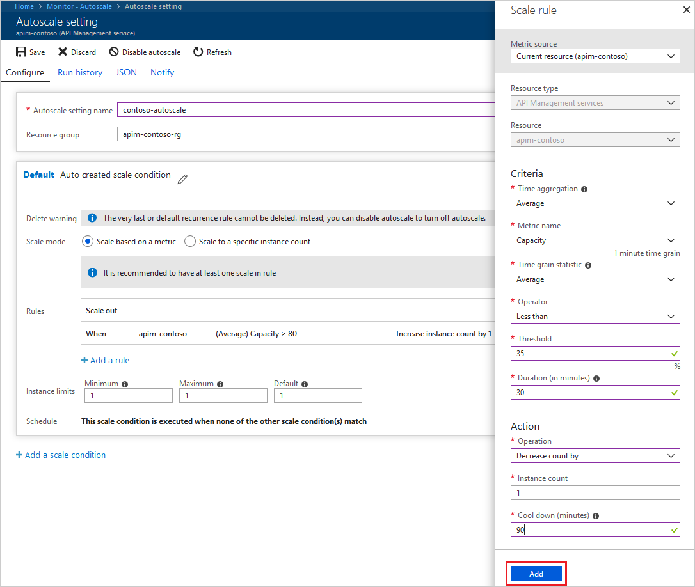
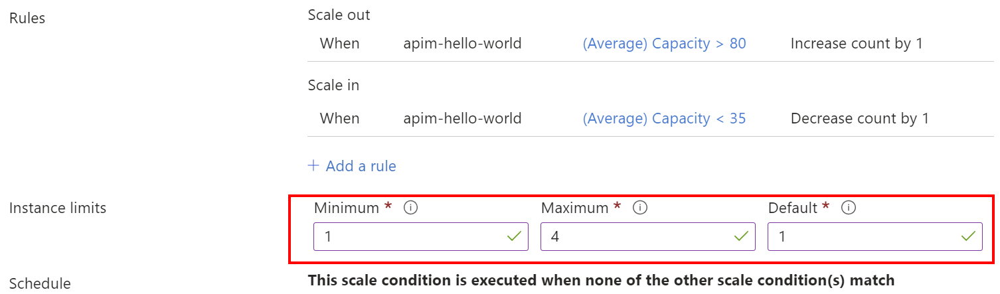

---
# Mandatory fields. See more on aka.ms/skyeye/meta.
title: Configure autoscale of an Azure API Management instance | Microsoft Docs
description: This topic describes how to set up autoscale behavior for an Azure API Management instance.
services: api-management
documentationcenter: ''
author: mikebudzynski
manager: anneta
editor: ''

ms.service: api-management
ms.workload: integration
ms.topic: article
ms.date: 06/20/2018
ms.author: apimpm
---

# Automatically scale an Azure API Management instance  

Azure API Management service instance can scale automatically based on a set of rules. This behavior can be enabled and configured through Azure Monitor and is supported only in **Standard** and **Premium** tiers of the Azure API Management service.

The article walks through the process of configuring autoscale and suggests optimal configuration of autoscale rules.

## Prerequisites

To follow the steps from this article, you must:

+ Have an active Azure subscription.
+ Have an Azure API Management instance. For more information, see [Create an Azure API Management instance](get-started-create-service-instance.md).
+ Understand the concept of [Capacity of an Azure API Management instance](api-management-capacity.md).
+ Understand [manual scaling process of an Azure API Management instance](upgrade-and-scale.md), including cost consequences.

## Azure API Management autoscale limitations

Certain limitations and consequences of scaling decisions need to be considered before configuring autoscale behavior.

+ Autoscale can be enabled only for **Standard** and **Premium** tiers of Azure API Management service.
+ Pricing tiers also specify the maximum number of units for a service instance.
+ Scaling process will take at least 20 minutes.
+ If the service is locked by another operation, scaling request will fail and retry automatically.
+ In case of a service with multi-regional deployments, only units in the **Primary location** can be scaled. Units in other locations can't be scaled.

## Enable and configure autoscale for Azure API Management service

Follow the steps below to configure autoscale for an Azure API Management service:

1. Navigate to **Monitor** instance in the Azure portal.

    

2. Select **Autoscale** from the menu on the left.

    

3. Locate your Azure API Management service based on the filters in dropdown menus.
4. Select the desired Azure API Management service instance.
5. In the newly opened section, click the **Enable autoscale** button.

    

6. In the **Rules** section, click **+ Add a rule**.

    

7. Define a new scale out rule.

   For example, a scale out rule could trigger an addition of an Azure API Management unit, when the average capacity metric over the last 30 minutes exceeds 80%. The table below provides configuration for such a rule.

    | Parameter             | Value             | Notes                                                                                                                                                                                                                                                                           |
    |-----------------------|-------------------|---------------------------------------------------------------------------------------------------------------------------------------------------------------------------------------------------------------------------------------------------------------------------------|
    | Metric source         | Current resource  | Define the rule based on the current Azure API Management resource metrics.                                                                                                                                                                                                     |
    | *Criteria*            |                   |                                                                                                                                                                                                                                                                                 |
    | Time aggregation      | Average           |                                                                                                                                                                                                                                                                                 |
    | Metric name           | Capacity          | Capacity metric is an Azure API Management metric reflecting usage of resources of an Azure API Management instance.                                                                                                                                                            |
    | Time grain statistic  | Average           |                                                                                                                                                                                                                                                                                 |
    | Operator              | Greater than      |                                                                                                                                                                                                                                                                                 |
    | Threshold             | 80%               | The threshold for the averaged capacity metric.                                                                                                                                                                                                                                 |
    | Duration (in minutes) | 30                | The timespan to average the capacity metric over is specific to usage patterns. The longer the time period is, the smoother the reaction will be - intermittent spikes will have less effect on the scale-out decision. However, it will also delay the scale-out trigger. |
    | *Action*              |                   |                                                                                                                                                                                                                                                                                 |
    | Operation             | Increase count by |                                                                                                                                                                                                                                                                                 |
    | Instance count        | 1                 | Scale out the Azure API Management instance by 1 unit.                                                                                                                                                                                                                          |
    | Cool down (minutes)   | 60                | It takes at least 20 minutes for the Azure API Management service to scale out. In most cases, the cool down period of 60 minutes prevents from triggering many scale-outs.                                                                                                  |

8. Click **Add** to save the rule.

    

9. Click again on **+ Add a rule**.

    This time, a scale in rule needs to be defined. It will ensure resources are not being wasted, when the usage of APIs decreases.

10. Define a new scale in rule.

    For example, a scale in rule could trigger a removal of an Azure API Management unit, when the average capacity metric over the last 30 minutes has been lower than 35%. The table below provides configuration for such a rule.

    | Parameter             | Value             | Notes                                                                                                                                                                                                                                                                                                                                                                                                                                                                                               |
    |-----------------------|-------------------|-----------------------------------------------------------------------------------------------------------------------------------------------------------------------------------------------------------------------------------------------------------------------------------------------------------------------------------------------------------------------------------------------------------------------------------------------------------------------------------------------------|
    | Metric source         | Current resource  | Define the rule based on the current Azure API Management resource metrics.                                                                                                                                                                                                                                                                                                                                                                                                                         |
    | *Criteria*            |                   |                                                                                                                                                                                                                                                                                                                                                                                                                                                                                                     |
    | Time aggregation      | Average           |                                                                                                                                                                                                                                                                                                                                                                                                                                                                                                     |
    | Metric name           | Capacity          | Same metric as the one used for the scale out rule.                                                                                                                                                                                                                                                                                                                                                                                                                                                 |
    | Time grain statistic  | Average           |                                                                                                                                                                                                                                                                                                                                                                                                                                                                                                     |
    | Operator              | Less than         |                                                                                                                                                                                                                                                                                                                                                                                                                                                                                                     |
    | Threshold             | 35%               | Similarly to the scale out rule, this value heavily depends on the usage patterns of the Azure API Management. |
    | Duration (in minutes) | 30                | Same value as the one used for the scale out rule.                                                                                                                                                                                                                                                                                                                                                                                                                                                  |
    | *Action*              |                   |                                                                                                                                                                                                                                                                                                                                                                                                                                                                                                     |
    | Operation             | Decrease count by | Opposite to what was used for the scale out rule.                                                                                                                                                                                                                                                                                                                                                                                                                                                   |
    | Instance count        | 1                 | Same value as the one used for the scale out rule.                                                                                                                                                                                                                                                                                                                                                                                                                                                  |
    | Cool down (minutes)   | 90                | Scale in should be more conservative than a scale out, so the cool down period should be longer.                                                                                                                                                                                                                                                                                                                                                                                                    |

11. Click **Add** to save the rule.

    

12. Set the **maximum** number of Azure API Management units.

    > [!NOTE]
    > Azure API Management has a limit of units an instance can scale out to. The limit depends on a service tier.

    

13. Click **Save**. Your autoscale has been configured.

## Next steps

+ [How to deploy an Azure API Management service instance to multiple Azure regions](api-management-howto-deploy-multi-region.md)
