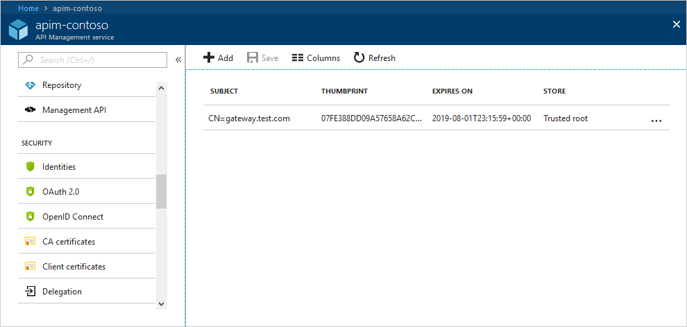
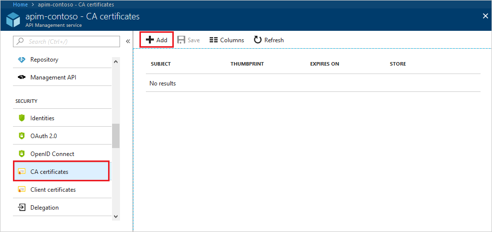
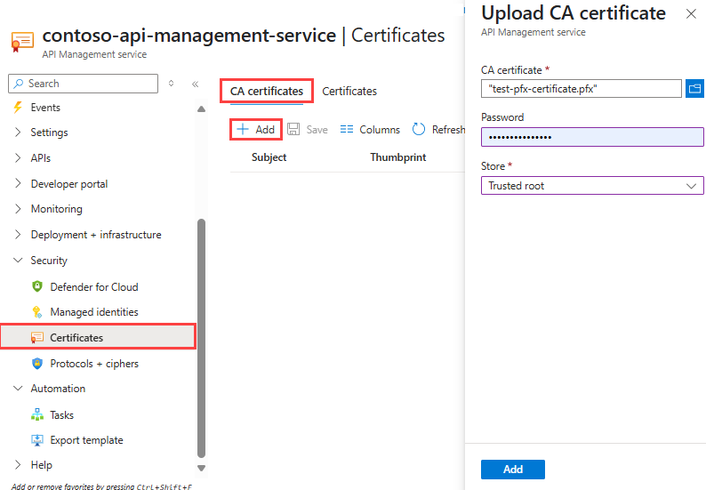
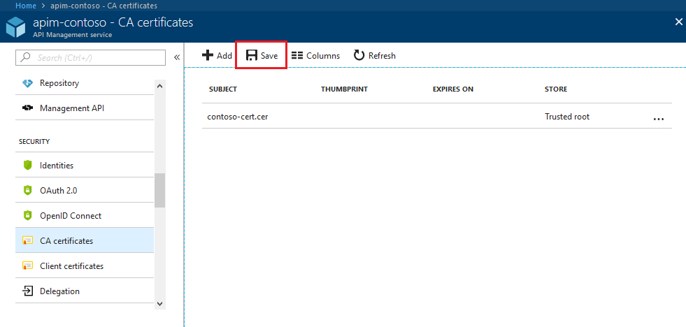
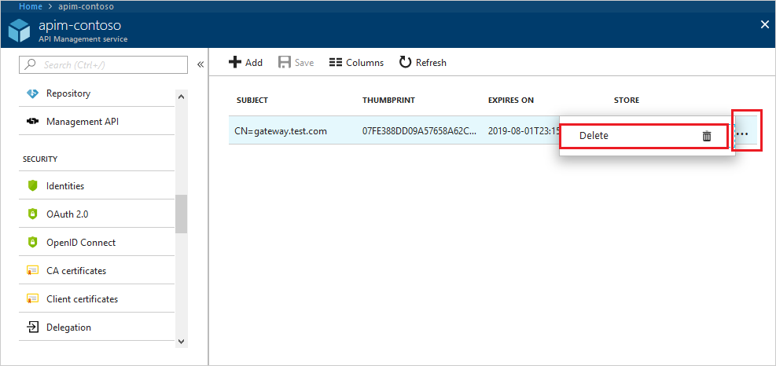

# How to add a custom CA certificate in Azure API Management

Azure API Management allows installing CA certificates on the machine inside the trusted root and intermediate certificate stores. This functionality should be used if your services require a custom CA certificate.

The article shows how to manage CA certificates of an Azure API Management service instance in the Azure portal. 

CA certificates uploaded to API Management can only be used for certificate validation by the managed API Management gateway. If you use the [self-hosted gateway](self-hosted-gateway-overview.md), see [Custom CAs for self-hosted gateway](#custom-cas-for-self-hosted-gateway) later in this article.

[!INCLUDE [updated-for-az](../../includes/updated-for-az.md)]

[!INCLUDE [premium-dev-standard-basic.md](../../includes/api-management-availability-premium-dev-standard-basic.md)]

## Upload a CA certificate

Follow the steps below to upload a new CA certificate. If you have not created an API Management service instance yet, see the tutorial [Create an API Management service instance](get-started-create-service-instance.md).

1. Navigate to your Azure API Management service instance in the Azure portal.

2. Select **CA certificates** from the menu.

3. Click the **+ Add** button.  

      

4. Browse for the certificate and decide on the certificate store. Only the public key is needed, so the password is not required.

      

5. Click **Save**. This operation may take a few minutes.

      

> [!NOTE]
> You can upload a CA certificate using the `New-AzApiManagementSystemCertificate` Powershell command.

## Delete a client certificate

To delete a certificate, click context menu **...** and select **Delete** beside the certificate.

 

## Create custom CA for self-hosted gateway 

If you use a [self-hosted gateway](self-hosted-gateway-overview.md), validation of server and client certificates using CA root certificates uploaded to API Management service is not supported. To establish trust, configure a specific client certificate so that it's trusted by the gateway as a custom "certificate authority".

Use the [Gateway Certificate Authority](/rest/api/apimanagement/2021-01-01-preview/gateway-certificate-authority) REST APIs to create and manage custom CAs for a self-hosted gateway. For example, to create a custom CA:

1. [Add a certificate](api-management-howto-mutual-certificates.md) .pfx file to your API Management instance.
1. Use the [Gateway Certificate Authority - Create Or Update](/rest/api/apimanagement/2021-01-01-preview/gateway-certificate-authority/create-or-update) REST API to associate the certificate with the self-managed gateway.

[Upload a CA certificate]: #step1
[Delete a CA certificate]: #step1a
