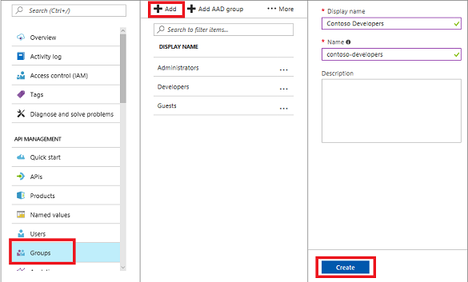
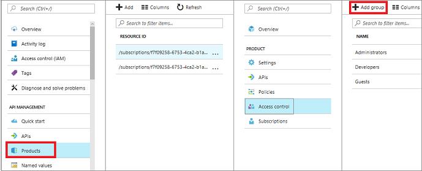
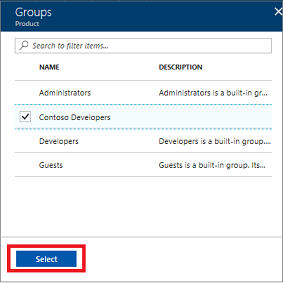
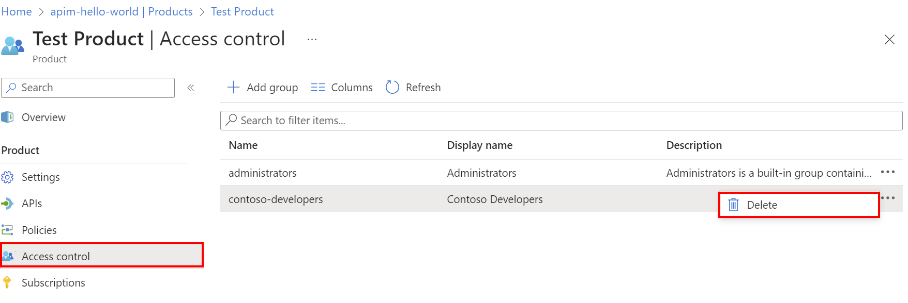
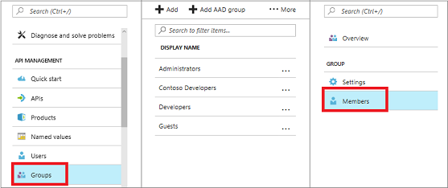
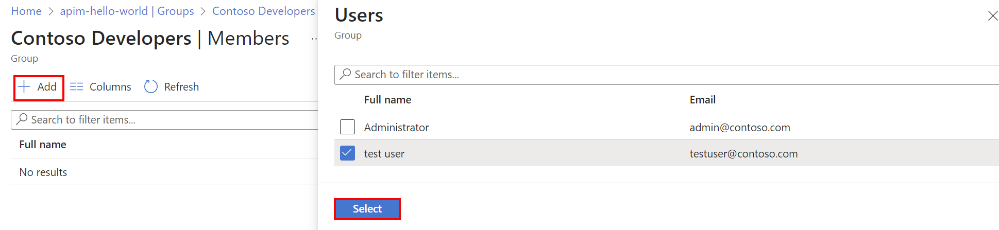

# How to create and use groups to manage developer accounts in Azure API Management

In API Management, groups are used to manage the visibility of products to developers. Products are first made visible to groups, and then developers in those groups can view and subscribe to the products that are associated with the groups. 

API Management has the following immutable system groups:

* **Administrators** - Azure subscription administrators are members of this group. Administrators manage API Management service instances, creating the APIs, operations, and products that are used by developers.
* **Developers** - Authenticated developer portal users fall into this group. Developers are the customers that build applications using your APIs. Developers are granted access to the developer portal and build applications that call the operations of an API.
* **Guests** - Unauthenticated developer portal users, such as prospective customers visiting the developer portal of an API Management instance fall into this group. They can be granted certain read-only access, such as the ability to view APIs but not call them.

In addition to these system groups, administrators can create custom groups or [leverage external groups in associated Azure Active Directory tenants][leverage external groups in associated Azure Active Directory tenants]. Custom and external groups can be used alongside system groups in giving developers visibility and access to API products. For example, you could create one custom group for developers affiliated with a specific partner organization and allow them access to the APIs from a product containing relevant APIs only. A user can be a member of more than one group.

This guide shows how administrators of an API Management instance can add new groups and associate them with products and developers.

In addition to creating and managing groups in the publisher portal, you can create and manage your groups using the API Management REST API [Group](https://docs.microsoft.com/rest/api/apimanagement/apimanagementrest/azure-api-management-rest-api-group-entity) entity.

[!INCLUDE [premium-dev-standard-basic.md](../../includes/api-management-availability-premium-dev-standard-basic.md)]

## Prerequisites

Complete tasks in this article: [Create an Azure API Management instance](get-started-create-service-instance.md).

[!INCLUDE [api-management-navigate-to-instance.md](../../includes/api-management-navigate-to-instance.md)]

## Create a group

This section shows how to add a new group to your API Management account.

1. Select the **Groups** tab to the left of the screen.
2. Click **+Add**.
3. Enter a unique name for the group and an optional description.
4. Press **Create**.

    

Once the group is created, it is added to the **Groups** list.  To edit the **Name** or **Description** of the group, click the name of the group and **Settings**. To delete the group, click the name of the group and press **Delete**.

Now that the group is created, it can be associated with products and developers.

## Associate a group with a product

1. Select the **Products** tab to the left.
2. Click the name of the desired product.
3. Press **Access control**.
4. Click **+ Add group**.

    
5. Select the group you want to add.

    

    To remove a group from the product, click **Delete**.

    

Once a product is associated with a group, developers in that group can view and subscribe to the product.

> [!NOTE]
> To add Azure Active Directory groups, see [How to authorize developer accounts using Azure Active Directory in Azure API Management](api-management-howto-aad.md).

## Associate groups with developers

This section shows how to associate groups with members.

1. Select the **Groups** tab to the left of the screen.
2. Select **Members**.

    
3. Press **+Add** and select a member.

    
4. Press **Select**.

Once the association is added between the developer and the group, you can view it in the **Users** tab.

## Next steps

* Once a developer is added to a group, they can view and subscribe to the products associated with that group. For more information, see [How create and publish a product in Azure API Management][How create and publish a product in Azure API Management],
* In addition to creating and managing groups in the publisher portal, you can create and manage your groups using the API Management REST API [Group](https://docs.microsoft.com/rest/api/apimanagement/apimanagementrest/azure-api-management-rest-api-group-entity) entity.

[Create a group]: #create-group
[Associate a group with a product]: #associate-group-product
[Associate groups with developers]: #associate-group-developer
[Next steps]: #next-steps

[How create and publish a product in Azure API Management]: api-management-howto-add-products.md

[Get started with Azure API Management]: get-started-create-service-instance.md
[Create an API Management service instance]: get-started-create-service-instance.md
[leverage external groups in associated Azure Active Directory tenants]: api-management-howto-aad.md
