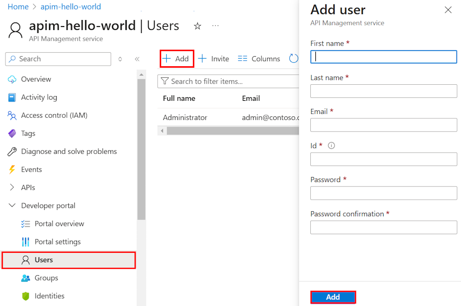

# How to manage user accounts in Azure API Management

In API Management, developers are the users of the APIs that you expose using API Management. This guide shows to how to create and invite developers to use the APIs and products that you make available to them with your API Management instance. For information on managing user accounts programmatically, see the [User entity](https://docs.microsoft.com/rest/api/apimanagement/2019-12-01/user) documentation in the [API Management REST](/rest/api/apimanagement/) reference.

[!INCLUDE [premium-dev-standard-basic.md](../../includes/api-management-availability-premium-dev-standard-basic.md)]

## Prerequisites

Complete tasks in this article: [Create an Azure API Management instance](get-started-create-service-instance.md).

[!INCLUDE [api-management-navigate-to-instance.md](../../includes/api-management-navigate-to-instance.md)]

## Create a new developer

To add a new user, follow the steps in this section:

1. Select the **Users** tab to the left of the screen.
2. Press **+Add**.
3. Enter appropriate information for the user.
4. Press **Add**.

    

By default, newly created developer accounts are **Active**, and associated with the **Developers** group. Developer accounts that are in an **active** state can be used to access all of the APIs for which they have subscriptions. To associate the newly created developer with additional groups, see [How to associate groups with developers][How to associate groups with developers].

## Invite a developer
To invite a developer, follow the steps in this section:

1. Select the **Users** tab to the left of the screen.
2. Press **+Invite**.

A confirmation message is displayed, but the newly invited developer does not appear in the list until after they accept the invitation. 

When a developer is invited, an email is sent to the developer. This email is generated using a template and is customizable. For more information, see [Configure email templates][Configure email templates].

Once the invitation is accepted, the account becomes active.

##  Deactivate or reactivate a developer account

By default, newly created or invited developer accounts are **Active**. To deactivate a developer account, click **Block**. To reactivate a blocked developer account, click **Activate**. A blocked developer account can't access the developer portal or call any APIs. To delete a user account, click **Delete**.

To block a user, follow the following steps.

1. Select the **Users** tab to the left of the screen.
2. Click on the user that you want to block.
3. Press **Block**.

## Reset a user password

To programmatically work with user accounts, see the User entity documentation in the [API Management REST API](/rest/api/apimanagement/) reference. To reset a user account password to a specific value, you can use the [Update a user](https://docs.microsoft.com/rest/api/apimanagement/apimanagementrest/azure-api-management-rest-api-user-entity#UpdateUser) operation and specify the desired password.

## Next steps
Once a developer account is created, you can associate it with roles and subscribe it to products and APIs. For more information, see [How to create and use groups][How to create and use groups].

[api-management-management-console]: ./media/api-management-howto-create-or-invite-developers/api-management-management-console.png
[api-management-add-new-user]: ./media/api-management-howto-create-or-invite-developers/api-management-add-new-user.png
[api-management-create-developer]: ./media/api-management-howto-create-or-invite-developers/api-management-create-developer.png
[api-management-invite-developer]: ./media/api-management-howto-create-or-invite-developers/api-management-invite-developer.png
[api-management-new-developer]: ./media/api-management-howto-create-or-invite-developers/api-management-new-developer.png
[api-management-invite-developer-window]: ./media/api-management-howto-create-or-invite-developers/api-management-invite-developer-window.png
[api-management-invite-developer-confirmation]: ./media/api-management-howto-create-or-invite-developers/api-management-invite-developer-confirmation.png
[api-management-pending-verification]: ./media/api-management-howto-create-or-invite-developers/api-management-pending-verification.png
[api-management-view-developer]: ./media/api-management-howto-create-or-invite-developers/api-management-view-developer.png
[api-management-reset-password]: ./media/api-management-howto-create-or-invite-developers/api-management-reset-password.png

[Create a new developer]: #create-developer
[Invite a developer]: #invite-developer
[Deactivate or reactivate a developer account]: #block-developer
[Next steps]: #next-steps
[How to create and use groups]: api-management-howto-create-groups.md
[How to associate groups with developers]: api-management-howto-create-groups.md#associate-group-developer

[Get started with Azure API Management]: get-started-create-service-instance.md
[Create an API Management service instance]: get-started-create-service-instance.md
[Configure email templates]: api-management-howto-configure-notifications.md#email-templates
