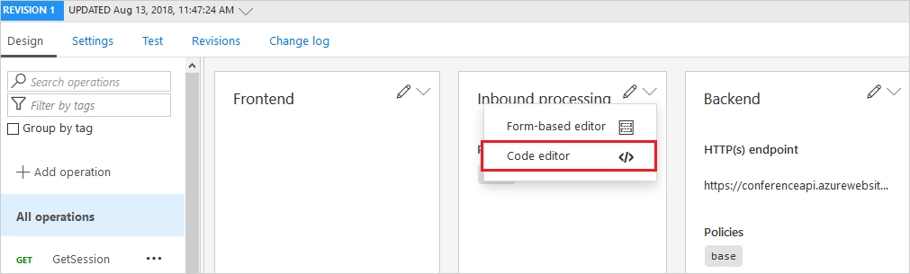

# How to deploy an Azure API Management service instance to multiple Azure regions

Azure API Management supports multi-region deployment, which enables API publishers to distribute a single Azure API management service across any number of supported Azure regions. Multi-region feature helps reduce request latency perceived by geographically distributed API consumers and improves service availability if one region goes offline.

A new Azure API Management service initially contains only one [unit][unit] in a single Azure region, the Primary region. Additional units can be added to the Primary or Secondary regions. An API Management gateway component is deployed to every selected Primary and Secondary region. Incoming API requests are automatically directed to the closest region. If a region goes offline, the API requests will be automatically routed around the failed region to the next closest gateway.

> [!NOTE]
> Only the gateway component of API Management is deployed to all regions. The service management component and developer portal are hosted in the Primary region only. Therefore, in case of the Primary region outage, access to the developer portal and ability to change configuration (e.g. adding APIs, applying policies) will be impaired until the Primary region comes back online. While the Primary region is offline available Secondary regions will continue to serve the API traffic using the latest configuration available to them.

[!INCLUDE [premium.md](../../includes/api-management-availability-premium.md)]

## <a name="add-region"> </a>Deploy API Management service to a new region

> [!NOTE]
> If you have not yet created an API Management service instance, see [Create an API Management service instance][create an api management service instance].

1. In the Azure portal, navigate to your API Management service and click on the **Locations** entry in the menu.
2. Click **+ Add** in the top bar.
3. Select the location from the drop-down list and set the number of units with the slider.
4. Click the **Add** button to confirm.
5. Repeat this process until you configure all locations.
6. Click **Save** in the top bar to start the deployment process.

## <a name="remove-region"> </a>Delete an API Management service location

1. In the Azure portal, navigate to your API Management service and click on the **Locations** entry in the menu.
2. For the location you would like to remove, open the context menu using the **...** button at the right end of the table. Select the **Delete** option.
3. Confirm the deletion and click **Save** to apply the changes.

## <a name="route-backend"> </a>Route API calls to regional backend services

Azure API Management features only one backend service URL. Even though there are Azure API Management instances in various regions, the API gateway will still forward requests to the same backend service, which is deployed in only one region. In this case, the performance gain will come only from responses cached within Azure API Management in a region specific to the request, but contacting the backend across the globe may still cause high latency.

To fully leverage geographical distribution of your system, you should have backend services deployed in the same regions as Azure API Management instances. Then, using policies and `@(context.Deployment.Region)` property, you can route the traffic to local instances of your backend.

1. Navigate to your Azure API Management instance and click on **APIs** from the left menu.
2. Select your desired API.
3. Click **Code editor** from the arrow dropdown in the **Inbound processing**.

    

4. Use the `set-backend` combined with conditional `choose` policies to construct a proper routing policy in the `<inbound> </inbound>` section of the file.

    For example, the below XML file would work for West US and East Asia regions:

    ```xml
    <policies>
        <inbound>
            <base />
            <choose>
                <when condition="@("West US".Equals(context.Deployment.Region, StringComparison.OrdinalIgnoreCase))">
                    <set-backend-service base-url="http://contoso-us.com/" />
                </when>
                <when condition="@("East Asia".Equals(context.Deployment.Region, StringComparison.OrdinalIgnoreCase))">
                    <set-backend-service base-url="http://contoso-asia.com/" />
                </when>
                <otherwise>
                    <set-backend-service base-url="http://contoso-other.com/" />
                </otherwise>
            </choose>
        </inbound>
        <backend>
            <base />
        </backend>
        <outbound>
            <base />
        </outbound>
        <on-error>
            <base />
        </on-error>
    </policies>
    ```

> [!TIP]
> You may also front your backend services with [Azure Traffic Manager](https://azure.microsoft.com/services/traffic-manager/), direct the API calls to the Traffic Manager, and let it resolve the routing automatically.

## <a name="custom-routing"> </a>Use custom routing to API Management regional gateways

API Management routes the requests to a regional _gateway_ based on [the lowest latency](../traffic-manager/traffic-manager-routing-methods.md#performance). Although it is not possible to override this setting in API Management, you can use your own Traffic Manager with custom routing rules.

1. Create your own [Azure Traffic Manager](https://azure.microsoft.com/services/traffic-manager/).
1. If you are using a custom domain, [use it with the Traffic Manager](../traffic-manager/traffic-manager-point-internet-domain.md) instead of the API Management service.
1. [Configure the API Management regional endpoints in Traffic Manager](../traffic-manager/traffic-manager-manage-endpoints.md). The regional endpoints follow the URL pattern of `https://<service-name>-<region>-01.regional.azure-api.net`, for example `https://contoso-westus2-01.regional.azure-api.net`.
1. [Configure the API Management regional status endpoints in Traffic Manager](../traffic-manager/traffic-manager-monitoring.md). The regional status endpoints follow the URL pattern of `https://<service-name>-<region>-01.regional.azure-api.net/status-0123456789abcdef`, for example `https://contoso-westus2-01.regional.azure-api.net/status-0123456789abcdef`.
1. Specify [the routing method](../traffic-manager/traffic-manager-routing-methods.md) of the Traffic Manager.

[create an api management service instance]: get-started-create-service-instance.md
[get started with azure api management]: get-started-create-service-instance.md
[deploy an api management service instance to a new region]: #add-region
[delete an api management service instance from a region]: #remove-region
[unit]: https://azure.microsoft.com/pricing/details/api-management/
[premium]: https://azure.microsoft.com/pricing/details/api-management/
