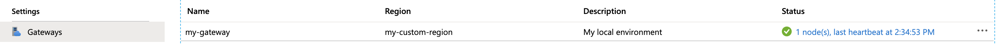

# Deploy an Azure API Management self-hosted gateway to Docker

This article provides the steps for deploying self-hosted Azure API Management gateway into a Docker environment.

> [!NOTE]
> Self-hosted gateway feature is in preview. During the preview, the self-hosted gateway is available only in the Developer and Premium tiers at no additional charge. Developer tier is limited to a single self-hosted gateway deployment.

## Prerequisites

- Complete the following quickstart: [Create an Azure API Management instance](get-started-create-service-instance.md)
- Create a Docker environment. [Docker for Desktop](https://www.docker.com/products/docker-desktop) is a good option for development and evaluation purposes. See [Docker documentation](https://docs.docker.com) for information on all Docker editions, their features, and comprehensive documentation on Docker itself.
- [Provision a gateway resource in your API Management instance](api-management-howto-provision-self-hosted-gateway.md)

## Deploy the self-hosted gateway to Docker

1. Select **Gateways** from under **Settings**.
2. Select the gateway resource you intend to deploy.
3. Select **Deployment**.
4. Note that a new token in the **Token** text box was autogenerated for you using the default **Expiry** and **Secret Key** values. Adjust either or both if desired and select **Generate** to create a new token.
4. Make sure **Docker** is selected under **Deployment scripts**.
5. Select **env.conf** file link next to the **Environment** to download the file.
6. Select **copy** icon located at the right end of the **Run** text box to save the Docker command to clipboard.
7. Paste the command to the terminal (or command) window. Adjust the port mappings and container name as needed. Note that the command expects the downloaded environment file to be present in the current directory.
```
    docker run -d -p 80:8080 -p 443:8081 --name <gateway-name> --env-file env.conf mcr.microsoft.com/azure-api-management/gateway:<tag>
```
8. Execute the command. The command instructs your Docker environment to run the container, using self-hosted gateway's image downloaded from the Microsoft Container Registry, and to map the container's HTTP (8080) and HTTPS (8081) ports to ports 80 and 443 on the host.
9. Run the below command to check the gateway pod is running:
```console
docker ps
CONTAINER ID        IMAGE                                                 COMMAND                  CREATED             STATUS              PORTS                                         NAMES
895ef0ecf13b        mcr.microsoft.com/azure-api-management/gateway:beta   "/bin/sh -c 'dotnet …"   5 seconds ago       Up 3 seconds        0.0.0.0:80->8080/tcp, 0.0.0.0:443->8081/tcp   my-gateway
```
10. Go back to Azure portal and confirm that gateway node you just deployed is reporting healthy status.



> [!TIP]
> Use <code>console docker container logs <gateway-name></code> command to view a snapshot of self-hosted gateway log.
>
> Use <code>docker container logs --help</code> command to see all log viewing options.

## Next steps

* To learn more about the self-hosted gateway, see [Azure API Management self-hosted gateway overview](self-hosted-gateway-overview.md)
