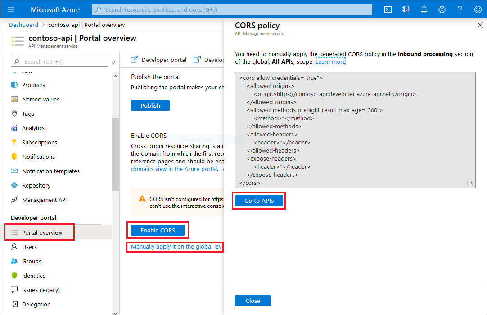

# Overview of the developer portal

Developer portal is an automatically generated, fully customizable website with the documentation of your APIs. It is where API consumers can discover your APIs, learn how to use them, request access, and try them out.

This article describes the differences between self-hosted and managed versions of the developer portal in API Management. It also provides answers to frequently asked questions.


[!INCLUDE [premium-dev-standard-basic.md](../../includes/api-management-availability-premium-dev-standard-basic.md)]

## Migration from the legacy portal

> [!IMPORTANT]
> The legacy developer portal is now deprecated and it will receive security updates only. You can continue to use it, as per usual, until its retirement in October 2023, when it will be removed from all API Management services.

Migration to the new developer portal is described in the [dedicated documentation article](developer-portal-deprecated-migration.md).

## Customization and styling

The developer portal can be customized and styled through the built-in, drag-and-drop visual editor. See [this tutorial](api-management-howto-developer-portal-customize.md) for more details.

## <a name="managed-vs-self-hosted"></a> Extensibility

Your API Management service includes a built-in, always up-to-date, **managed** developer portal. You can access it from the Azure portal interface.

If you need to extend it with custom logic, which isn't supported out-of-the-box, you can modify its codebase. The portal's codebase is [available in a GitHub repository][1]. For example, you could implement a new widget, which integrates with a third-party support system. When you implement new functionality, you can choose one of the following options:

- **Self-host** the resulting portal outside of your API Management service. When you self-host the portal, you become its maintainer and you are responsible for its upgrades. Azure Support's assistance is limited only to the basic setup of self-hosted portals, as documented in the [Wiki section of the repository][2].
- Open a pull request for the API Management team to merge new functionality to the **managed** portal's codebase.

For extensibility details and instructions, refer to the [GitHub repository][1] and [the tutorials on implementing a widget][3]. The [tutorial for customizing the managed portal](api-management-howto-developer-portal-customize.md) walks you through the portal's administrative panel, which is common for **managed** and **self-hosted** versions.

## <a name="faq"></a> Frequently asked questions

In this section, we answer common questions about the developer portal, which are of general nature. For questions specific to the self-hosted version, refer to [the wiki section of the GitHub repository](https://github.com/Azure/api-management-developer-portal/wiki).

### <a id="preview-to-ga"></a> How can I migrate from the preview version of the portal?

When you first launched the preview version of developer portal, you provisioned the preview version of its default content in your API Management service. The default content has been significantly modified in the generally available version. For example, the preview version of default content doesn't include OAuth buttons in the log-in pages, it uses different widgets for displaying APIs, and relies on limited capabilities for structuring developer portal pages. Even though there are differences in the content, the portal's engine (including underlying widgets) is automatically updated every time you publish your developer portal.

If you heavily customized your portal based on the preview version of content, you may continue to use it as is and place new widgets manually on portal's pages. Otherwise, we recommend replacing your portal's content with the new default content.

To reset the content in a managed portal, select **Reset content** in the **Operations** menu section. This operation will remove all the content of the portal and provision new default content. You will lose all developer portal customizations and changes. **You can't undo this action**.


If you're using the self-hosted version, run `scripts.v2/cleanup.bat` and `scripts.v2/generate.bat` scripts from the GitHub repository to remove existing content and provision new content. Make sure to upgrade your portal's code to the latest release from the GitHub repository beforehand.

If you first accessed the portal after the general availability announcement in November 2019, it should already feature the new default content and no further action is required.

### Functionality I need isn't supported in the portal

You can open a feature request in the [GitHub repository][1] or [implement the missing functionality yourself][3]. See the **Extensibility** section above for more details.

### <a id="automate"></a> How can I automate portal deployments?

You can programmatically access and manage the developer portal's content through the REST API, regardless if you're using a managed or a self-hosted version.

The API is documented in [the GitHub repository's wiki section][2]. It can be used for automating migrations of portal content between environments - for example, from a test environment to the production environment. You can learn more about this process [in this documentation article](https://aka.ms/apimdocs/migrateportal) on GitHub.

### How do I move from the managed to the self-hosted version?

See the detailed article in [the Wiki section of the developer portal repository on GitHub][2].

### Can I have multiple developer portals in one API Management service?

You can have one managed portal and multiple self-hosted portals. The content of all portals is stored in the same API Management service, so they will be identical. If you want to differentiate portals' appearance and functionality, you can self-host them with your own custom widgets that dynamically customize pages on runtime, for example based on the URL.

### Does the portal support Azure Resource Manager templates and/or is it compatible with API Management DevOps Resource Kit?

No.

### Is the portal's content saved with the backup/restore functionality in API Management?

No.

### Do I need to enable additional VNet connectivity for the managed portal dependencies?

In most cases - no.

If your API Management service is in an internal VNet, your developer portal is only accessible from within the network. The management endpoint's host name must resolve to the internal VIP of the service from the machine you use to access the portal's administrative interface. Make sure the management endpoint is registered in the DNS. In case of misconfiguration, you will see an error: `Unable to start the portal. See if settings are specified correctly in the configuration (...)`.

If your API Management service is in an internal VNet and you're accessing it through Application Gateway from the Internet, make sure to enable connectivity to the developer portal and the management endpoints of API Management. You may need to disable Web Application Firewall rules. See [this documentation article](api-management-howto-integrate-internal-vnet-appgateway.md) for more details.

### I have assigned a custom API Management domain and the published portal doesn't work

After you update the domain, you need to [republish the portal](api-management-howto-developer-portal-customize.md#publish) for the changes to take effect.

### I have added an identity provider and I can't see it in the portal

After you configure an identity provider (for example, Azure AD, Azure AD B2C), you need to [republish the portal](api-management-howto-developer-portal-customize.md#publish) for the changes to take effect. Make sure your developer portal pages include the OAuth buttons widget.

### I have set up delegation and the portal doesn't use it

After you set up delegation, you need to [republish the portal](api-management-howto-developer-portal-customize.md#publish) for the changes to take effect.

### My other API Management configuration changes haven't been propagated in the developer portal

Most configuration changes (for example, VNet, sign-in, product terms) require [republishing the portal](api-management-howto-developer-portal-customize.md#publish).

### <a name="cors"></a> I'm getting a CORS error when using the interactive console

The interactive console makes a client-side API request from the browser. Resolve the CORS problem by adding [a CORS policy](api-management-cross-domain-policies.md#CORS) on your API(s).

You can check the status of the CORS policy in the **Portal overview** section of your API Management service in the Azure portal. A warning box indicates an absent or misconfigured policy.



Automatically apply the CORS policy by clicking on the **Enable CORS** button.

You can also enable CORS manually.

1. Select the **Manually apply it on the global level** link to see the generated policy code.
2. Navigate to **All APIs** in the **APIs** section of your API Management service in the Azure portal.
3. Select the **</>** icon in the **Inbound processing** section.
4. Insert the policy in the **<inbound>** section of the XML file. Make sure the **<origin>** value matches your developer portal's domain.

> [!NOTE]
> 
> If you apply the CORS policy in the Product scope, instead of the API(s) scope, and your API uses subscription key authentication through a header, your console won't work.
>
> The browser automatically issues an OPTIONS HTTP request, which doesn't contain a header with the subscription key. Because of the missing subscription key, API Management can't associate the OPTIONS call with a Product, so it can't apply the CORS policy.
>
> As a workaround you can pass the subscription key in a query parameter.

> [!NOTE]
> 
> Only one CORS policy is executed. If you specified multiple CORS policies (for example, on the API level and on the all-APIs level), your interactive console may not work as expected.

### What permissions do I need to edit the developer portal?

If you're seeing the `Oops. Something went wrong. Please try again later.` error when you open the portal in the administrative mode, you may be lacking the required permissions (Azure RBAC).

The legacy portals required the permission `Microsoft.ApiManagement/service/getssotoken/action` at the service scope (`/subscriptions/<subscription-id>/resourceGroups/<resource-group>/providers/Microsoft.ApiManagement/service/<apim-service-name>`) to allow the user administrator access to the portals. The new portal requires the permission `Microsoft.ApiManagement/service/users/token/action` at the scope `/subscriptions/<subscription-id>/resourceGroups/<resource-group>/providers/Microsoft.ApiManagement/service/<apim-service-name>/users/1`.

You can use the following PowerShell script to create a role with the required permission. Remember to change the `<subscription-id>` parameter. 

```powershell
#New Portals Admin Role 
Import-Module Az 
Connect-AzAccount 
$contributorRole = Get-AzRoleDefinition "API Management Service Contributor" 
$customRole = $contributorRole 
$customRole.Id = $null
$customRole.Name = "APIM New Portal Admin" 
$customRole.Description = "This role gives the user ability to log in to the new Developer portal as administrator" 
$customRole.Actions = "Microsoft.ApiManagement/service/users/token/action" 
$customRole.IsCustom = $true 
$customRole.AssignableScopes.Clear() 
$customRole.AssignableScopes.Add('/subscriptions/<subscription-id>') 
New-AzRoleDefinition -Role $customRole 
```
 
Once the role is created, it can be granted to any user from the **Access Control (IAM)** section in the Azure portal. Assigning this role to a user will assign the permission at the service scope. The user will be able to generate SAS tokens on behalf of *any* user in the service. At the minimum, this role needs to be assigned to the administrator of the service. The following PowerShell command demonstrates how to assign the role to a user `user1` at the lowest scope to avoid granting unnecessary permissions to the user: 

```powershell
New-AzRoleAssignment -SignInName "user1@contoso.com" -RoleDefinitionName "APIM New Portal Admin" -Scope "/subscriptions/<subscription-id>/resourceGroups/<resource-group>/providers/Microsoft.ApiManagement/service/<apim-service-name>/users/1" 
```

After the permissions have been granted to a user, the user must sign out and sign in again to the Azure portal for the new permissions to take effect.

### I'm seeing the `Unable to start the portal. See if settings are specified correctly (...)` error

This error is shown when a `GET` call to `https://<management-endpoint-hostname>/subscriptions/xxx/resourceGroups/xxx/providers/Microsoft.ApiManagement/service/xxx/contentTypes/document/contentItems/configuration?api-version=2018-06-01-preview` fails. The call is issued from the browser by the administrative interface of the portal.

If your API Management service is in a VNet - refer to the VNet connectivity question above.

The call failure may also be caused by an TLS/SSL certificate, which is assigned to a custom domain and is not trusted by the browser. As a mitigation, you can remove the management endpoint custom domain - API Management will fall back to the default endpoint with a trusted certificate.

### What's the browser support for the portal?

| Browser                     | Supported       |
|-----------------------------|-----------------|
| Apple Safari                | Yes<sup>1</sup> |
| Google Chrome               | Yes<sup>1</sup> |
| Microsoft Edge              | Yes<sup>1</sup> |
| Microsoft Internet Explorer | No              |
| Mozilla Firefox             | Yes<sup>1</sup> |

 <small><sup>1</sup> Supported in the two latest production versions.</small>

## Next steps

Learn more about the new developer portal:

- [Access and customize the managed developer portal](api-management-howto-developer-portal-customize.md)
- [Set up self-hosted version of the portal][2]
- [Implement your own widget][3]

Browse other resources:

- [GitHub repository with the source code][1]

[1]: https://aka.ms/apimdevportal
[2]: https://github.com/Azure/api-management-developer-portal/wiki
[3]: https://aka.ms/apimdevportal/extend
