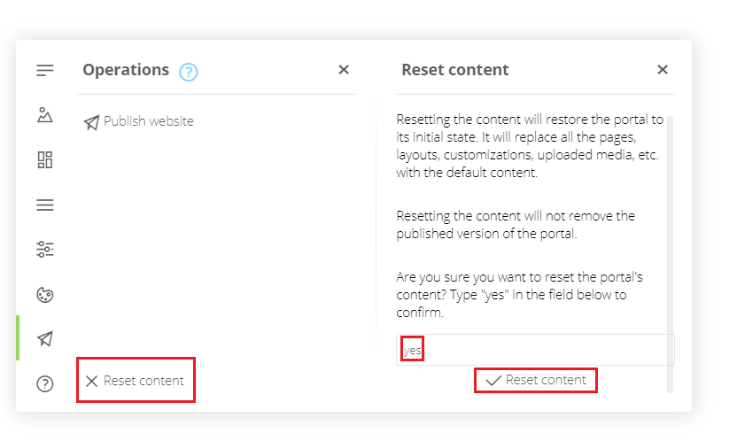

# Azure API Management developer portal overview

Developer portal is an automatically generated, fully customizable website with the documentation of your APIs. It is where API consumers can discover your APIs, learn how to use them, request access, and try them out.

This article describes the differences between self-hosted and managed versions of the developer portal in API Management. It also explains its architecture and provides answers to frequently asked questions.

> [!WARNING]
>
> [Learn how to migrate from the preview version to the generally available version](#preview-to-ga) of the developer portal.


[!INCLUDE [premium-dev-standard-basic.md](../../includes/api-management-availability-premium-dev-standard-basic.md)]

## <a name="managed-vs-self-hosted"></a> Managed and self-hosted versions

You can build your developer portal in two ways:

- **Managed version** - by editing and customizing the portal, which is built into your API Management instance and is accessible through the URL `<your-api-management-instance-name>.developer.azure-api.net`. Refer to [this documentation article](api-management-howto-developer-portal-customize.md) to learn how to access and customize the managed portal.
- **Self-hosted version** - by deploying and self-hosting your portal outside of an API Management instance. This approach allows you to edit the portal's codebase and extend the provided core functionality. You also need to upgrade the portal to the latest version yourself. For details and instructions, refer to the [GitHub repository with the source code of the portal][1] and [the tutorial on implementing a widget][4]. The [tutorial for the managed version](api-management-howto-developer-portal-customize.md) walks through the portal's administrative panel, which is also featured in the self-hosted version.

## Portal architectural concepts

The portal components can be logically divided into two categories: *code* and *content*.

*Code* is maintained in [the GitHub repository][1] and includes:

- Widgets - which represent visual elements and combine HTML, JavaScript, styling ability, settings, and content mapping. Examples are an image, a text paragraph, a form, a list of APIs etc.
- Styling definitions - which specify how widgets can be styled
- Engine - which generates static webpages from portal content and is written in JavaScript
- Visual editor - which allows for in-browser customization and authoring experience

*Content* is divided into two subcategories: *portal content* and *API Management content*.

*Portal content* is specific to the portal and includes:

- Pages - for example, landing page, API tutorials, blog posts
- Media - images, animations, and other file-based content
- Layouts - templates, which are matched against a URL and define how pages are displayed
- Styles - values for styling definitions, e.g. fonts, colors, borders
- Settings - configuration, e.g. favicon, website metadata

*Portal content*, except for media, is expressed as JSON documents.

*API Management content* includes entities such as APIs, Operations, Products, Subscriptions.

The portal is based on an adapted fork of the [Paperbits framework](https://paperbits.io/). The original Paperbits functionality has been extended to provide API Management-specific widgets (for example, a list of APIs, a list of Products) and a connector to API Management service for saving and retrieving content.

## <a name="faq"></a> Frequently asked questions

In this section, we answer common questions about the new developer portal, which are of general nature. For questions specific to the self-hosted version, refer to [the wiki section of the GitHub repository](https://github.com/Azure/api-management-developer-portal/wiki).

### <a id="preview-to-ga"/> How can I migrate from the preview version of the portal?

By using the preview version of the developer portal, you provisioned the preview content in your API Management service. The default content has been significantly modified in the generally available version for better user experience. It also includes new widgets.

If you're using the managed version, reset the content of the portal by clicking **Reset content** in the **Operations** menu section. Confirming this operation will remove all the content of the portal and provision the new default content. The portal's engine has been automatically updated in your API Management service.



If you're using the self-hosted version, use the `scripts/cleanup.bat` and `scripts/generate.bat` from the GitHub repository to remove existing content and provision new content. Make sure you upgrade your portal's code to the latest release from the GitHub repository beforehand.

If you don't want to reset the content of the portal, you may consider using newly available widgets throughout your pages. Existing widgets have been automatically updated to the latest versions.

If your portal was provisioned after the general availability announcement, it should already feature the new default content. No action is required from your side.

### How can I migrate from the old developer portal to the new developer portal?

Portals are incompatible and you need to migrate the content manually.

### Does the new portal have all the features of the old portal?

The new developer portal doesn't support *Applications* and *Issues*. If you have used *Issues* in the old portal and need them in the new one, post a comment in [a dedicated GitHub issue](https://github.com/Azure/api-management-developer-portal/issues/122).

Authentication with OAuth in the interactive developer console is not yet supported. You can track the progress through [the GitHub issue](https://github.com/Azure/api-management-developer-portal/issues/208).

### Has the old portal been deprecated?

The old developer and publisher portals are now *legacy* features - they will be receiving security updates only. New features will be implemented in the new developer portal only.

Deprecation of the legacy portals will be announced separately. If you have questions, concerns, or comments, raise them [in a dedicated GitHub issue](https://github.com/Azure/api-management-developer-portal/issues/121).

### Functionality I need isn't supported in the portal

Use the self-hosted version and [implement your own widget][4].

### How can I automate portal deployments?

You can programmatically access and manage the developer portal's content through the REST API, regardless if you're using a managed or a self-hosted version.

The API is documented in [the GitHub repository's wiki section][2]. It can also be used for automating migrations of portal content between environments - for example from a test environment to the production environment. You can learn more about this process [in this documentation article](https://aka.ms/apimdocs/migrateportal) on GitHub.

### Does the portal support Azure Resource Manager templates and/or is it compatible with API Management DevOps Resource Kit?

No.

### Do I need to enable additional VNet connectivity for the new managed portal dependencies?

In most cases - no.

If your API Management service is in an internal VNet, your developer portal is only accessible from within the network. The management endpoint's host name must resolve to the internal VIP of the service from the machine you use to access the portal's administrative interface. Make sure the management endpoint is registered in the DNS. In case of misconfiguration, you will see an error: `Unable to start the portal. See if settings are specified correctly in the configuration (...)`.

### I have assigned a custom API Management domain and the published portal doesn't work

After you update the domain, you need to [republish the portal](api-management-howto-developer-portal-customize.md#publish) for the changes to take effect.

### I have added an identity provider and I can't see it in the portal

After you configure an identity provider (for example, AAD, AAD B2C), you need to [republish the portal](api-management-howto-developer-portal-customize.md#publish) for the changes to take effect.

### I have set up delegation and the portal doesn't use it

After you set up delegation, you need to [republish the portal](api-management-howto-developer-portal-customize.md#publish) for the changes to take effect.

### My other API Management configuration changes haven't been propagated in the developer portal

Most configuration changes (for example, VNet, sign-in and product terms) require [republishing the portal](api-management-howto-developer-portal-customize.md#publish).

### I'm getting a CORS error when using the interactive console

The interactive console makes a client-side API request from the browser. You can resolve the CORS problem by adding [a CORS policy](api-management-cross-domain-policies.md#CORS) on your API(s). You can specify all the parameters manually or use wildcard `*` values. For example:

```XML
<cors>
    <allowed-origins>
        <origin>*</origin>
    </allowed-origins>
    <allowed-methods>
        <method>GET</method>
        <method>POST</method>
        <method>PUT</method>
        <method>DELETE</method>
        <method>HEAD</method>
        <method>OPTIONS</method>
        <method>PATCH</method>
        <method>TRACE</method>
    </allowed-methods>
    <allowed-headers>
        <header>*</header>
    </allowed-headers>
    <expose-headers>
        <header>*</header>
    </expose-headers>
</cors>
```

> [!NOTE]
> 
> If you apply the CORS policy in the Product scope, instead of the API(s) scope, and your API uses subscription key authentication through a header, your console won't work.
>
> The browser automatically issues an OPTIONS HTTP request, which doesn’t contain a header with the subscription key. Because of the missing subscription key, API Management can't associate the OPTIONS call with a Product, so it can’t apply the CORS policy.
>
> As a workaround you can pass the subscription key in a query parameter.

### What permissions do I need to edit the developer portal?

If you're seeing the `Oops. Something went wrong. Please try again later.` error when you open the portal in the administrative mode, you may be lacking the required permissions (RBAC).

The legacy portals required the permission `Microsoft.ApiManagement/service/getssotoken/action` at the service scope (`/subscriptions/<subscription-id>/resourceGroups/<resource-group>/providers/Microsoft.ApiManagement/service/<apim-service-name>`) to allow the user administrator access to the portals. The new portal requires the permission `Microsoft.ApiManagement/service/users/token/action` at the scope `/subscriptions/<subscription-id>/resourceGroups/<resource-group>/providers/Microsoft.ApiManagement/service/<apim-service-name>/users/1`.

You can use the following PowerShell script to create a role with the required permission. Remember to change the `<subscription-id>` parameter. 

```PowerShell
#New Portals Admin Role 
Import-Module Az 
Connect-AzAccount 
$contributorRole = Get-AzRoleDefinition "API Management Service Contributor" 
$customRole = $contributorRole 
$customRole.Id = $null
$customRole.Name = "APIM New Portal Admin" 
$customRole.Description = "This role gives the user ability to log in to the new Developer portal as administrator" 
$customRole.Actions = "Microsoft.ApiManagement/service/users/token/action" 
$customRole.IsCustom = $true 
$customRole.AssignableScopes.Clear() 
$customRole.AssignableScopes.Add('/subscriptions/<subscription-id>') 
New-AzRoleDefinition -Role $customRole 
```
 
Once the role is created, it can be granted to any user from the **Access Control (IAM)** section in the Azure portal. Assigning this role to a user will assign the permission at the service scope. The user will be able to generate SAS tokens on behalf of *any* user in the service. At the minimum, this role needs to be assigned to the administrator of the service. The following PowerShell command demonstrates how to assign the role to a user `user1` at the lowest scope to avoid granting unnecessary permissions to the user: 

```PowerShell
New-AzRoleAssignment -SignInName "user1@contoso.com" -RoleDefinitionName "APIM New Portal Admin" -Scope "/subscriptions/<subscription-id>/resourceGroups/<resource-group>/providers/Microsoft.ApiManagement/service/<apim-service-name>/users/1" 
```

After the permissions have been granted to a user, the user must sign out and sign in again to the Azure portal for the new permissions to take effect.

### I'm seeing the `Unable to start the portal. See if settings are specified correctly (...)` error

This error is shown when a `GET` call to `https://<management-endpoint-hostname>/subscriptions/xxx/resourceGroups/xxx/providers/Microsoft.ApiManagement/service/xxx/contentTypes/document/contentItems/configuration?api-version=2018-06-01-preview` fails. The call is issued from the browser by the administrative interface of the portal.

If your API Management service is in a VNet - refer to the VNet connectivity question above.

The call failure may also be caused by an SSL certificate, which is assigned to a custom domain and is not trusted by the browser. As a mitigation, you can remove the management endpoint custom domain - API Management will fall back to the default endpoint with a trusted certificate.

## Next steps

Learn more about the new developer portal:

- [Access and customize the managed developer portal](api-management-howto-developer-portal-customize.md)
- [Set up self-hosted version of the portal][2]
- [Implement your own widget][4]

Browse other resources:

- [GitHub repository with the source code][1]
- [Public roadmap of the project][3]

[1]: https://aka.ms/apimdevportal
[2]: https://github.com/Azure/api-management-developer-portal/wiki
[3]: https://github.com/Azure/api-management-developer-portal/projects
[4]: https://aka.ms/apimdevportal/extend