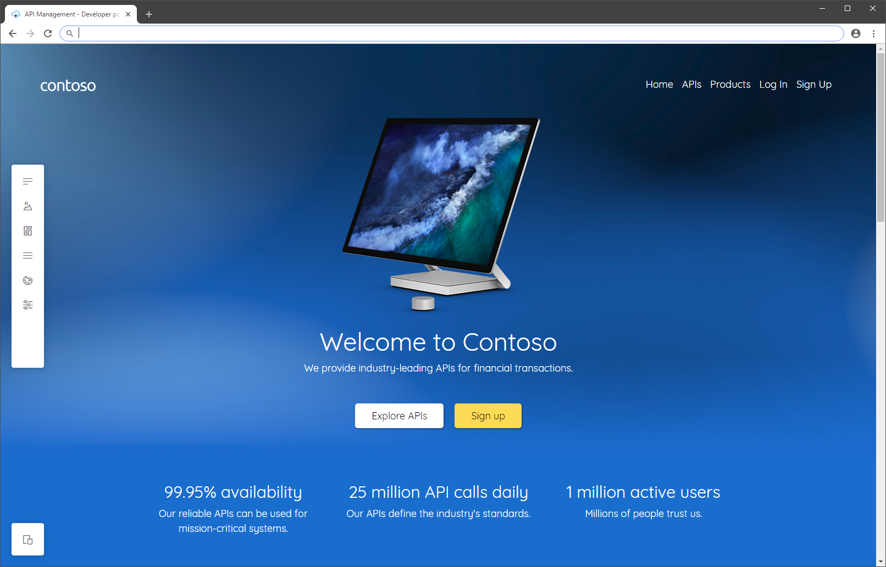

# Overview of the developer portal

Developer portal is an automatically generated, fully customizable website with the documentation of your APIs. It is where API consumers can discover your APIs, learn how to use them, request access, and try them out.

As introduced in this article, you can customize and extend the developer portal for your specific scenarios. 

[!INCLUDE [premium-dev-standard-basic.md](../../includes/api-management-availability-premium-dev-standard-basic.md)]

## Customize and style the managed portal

Your API Management service includes a built-in, always up-to-date, **managed** developer portal. You can access it from the Azure portal interface.

[Customize and style](api-management-howto-developer-portal-customize.md) the managed portal through the built-in, drag-and-drop visual editor: 

* Use the visual editor to modify pages, media, layouts, menus, styles, or website settings. 

* Take advantage of built-in widgets to add text, images, buttons, and other objects that the portal supports out-of-the-box. 

* Control how the portal content appears to different [users and groups](api-management-howto-create-groups.md) configured in your API Management instance. For example, display certain pages only to groups that are associated with particular products, or to users that can access specific APIs. 

> [!NOTE]
> The managed developer portal receives and applies updates automatically. Changes that you've saved but not published to the developer portal remain in that state during an update.

##  Options to extend portal functionality
In some cases you might need functionality beyond the customization and styling options provided in the managed developer portal. If you need to implement custom logic, which isn't supported out-of-the-box, you have [several options](developer-portal-extend-custom-functionality.md):
* [Add custom HTML](developer-portal-extend-custom-functionality.md#use-custom-html-code-widget) directly through a developer portal widget designed for small customizations - for example, add HTML for a form or to embed a video player. The custom code is rendered in an inline frame (IFrame).
* [Create and upload a custom widget](developer-portal-extend-custom-functionality.md#create-and-upload-custom-widget) to develop and add more complex custom portal features.
* [Self-host the portal](developer-portal-self-host.md), only if you need to make modifications to the core of the developer portal [codebase](https://github.com/Azure/api-management-developer-portal). This option requires advanced configuration. Azure Support's assistance is limited only to the basic setup of self-hosted portals.

> [!NOTE]
> Because the API Management developer portal codebase is maintained on [GitHub](https://github.com/Azure/api-management-developer-portal), you can open issues and make pull requests for the API Management team to merge new functionality at any time.
>

## Next steps

Learn more about the developer portal:

- [Access and customize the managed developer portal](api-management-howto-developer-portal-customize.md)
- [Extend functionality of the managed developer portal](developer-portal-extend-custom-functionality.md)
- [Set up self-hosted version of the portal](developer-portal-self-host.md)

Browse other resources:

- [GitHub repository with the source code](https://github.com/Azure/api-management-developer-portal)
- [Frequently asked questions about the developer portal](developer-portal-faq.md)
