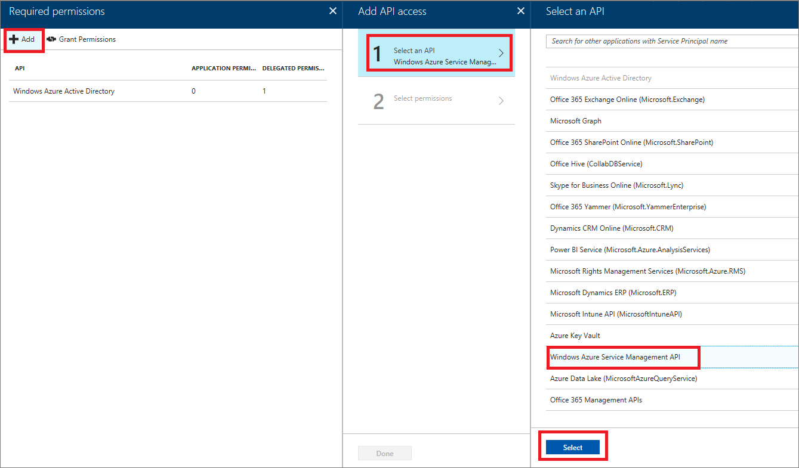

# How to implement disaster recovery using service backup and restore in Azure API Management

By choosing to publish and manage your APIs via Azure API Management you are taking advantage of many fault tolerance and infrastructure capabilities that you would otherwise have to design, implement, and manage. The Azure platform mitigates a large fraction of potential failures at a fraction of the cost.

To recover from availability problems affecting the region where your API Management service is hosted, you should be ready to reconstitute your service in a different region at any time. Depending on your availability goals and recovery time objective, you might want to reserve a backup service in one or more regions and try to maintain their configuration and content in sync with the active service. The service "backup and restore" feature provides the necessary building block for implementing your disaster recovery strategy.

This guide shows how to authenticate Azure Resource Manager requests, and how to back up and restore your API Management service instances.

> [!NOTE]
> The process for backing up and restoring an API Management service instance for disaster recovery can also be used for replicating API Management service instances for scenarios such as staging.
>
> Each backup expires after 30 days. If you attempt to restore a backup after the 30-day expiration period has expired, the restore will fail with a `Cannot restore: backup expired` message.
>
>

## Authenticating Azure Resource Manager requests

> [!IMPORTANT]
> The REST API for backup and restore uses Azure Resource Manager and has a different authentication mechanism than the REST APIs for managing your API Management entities. The steps in this section describe how to authenticate Azure Resource Manager requests. For more information, see [Authenticating Azure Resource Manager requests](http://msdn.microsoft.com/library/azure/dn790557.aspx).

All of the tasks that you do on resources using the Azure Resource Manager must be authenticated with Azure Active Directory using the following steps:

* Add an application to the Azure Active Directory tenant.
* Set permissions for the application that you added.
* Get the token for authenticating requests to Azure Resource Manager.

### Create an Azure Active Directory application

1. Sign in to the [Azure portal](https://portal.azure.com). 
2. Using the subscription that contains your API Management service instance, navigate to the **App registrations** tab in **Azure Active Directory** (Azure Active Directory > Manage/App registrations).

    > [!NOTE]
    > If the Azure Active Directory default directory is not visible to your account, contact the administrator of the Azure subscription to grant the required permissions to your account.
3. Click **New application registration**.

    The **Create** window appears on the right. That is where you enter the AAD app relevant information.
4. Enter a name for the application.
5. For the application type, select **Native**.
6. Enter a placeholder URL such as `http://resources` for the **Redirect URI**, as it is a required field, but the value is not used later. Click the check box to save the application.
7. Click **Create**.

### Add an application

1. Once the application is created, click **Settings**.
2. Click **Required permissions**.
3. Click **+Add**.
4. Press **Select an API**.
5. Choose **Windows** **Azure Service Management API**.
6. Press **Select**. 

    

7. Click **Delegated Permissions** beside the newly added application, check the box for **Access Azure Service Management (preview)**.
8. Press **Select**.
9. Click **Grant Permissions**.

### Configuring your app

Prior to invoking the APIs that generate the backup and restore it, it is necessary to get a token. The following example uses the [Microsoft.IdentityModel.Clients.ActiveDirectory](https://www.nuget.org/packages/Microsoft.IdentityModel.Clients.ActiveDirectory) NuGet package to retrieve the token.

```csharp
using Microsoft.IdentityModel.Clients.ActiveDirectory;
using System;

namespace GetTokenResourceManagerRequests
{
    class Program
    {
        static void Main(string[] args)
        {
            var authenticationContext = new AuthenticationContext("https://login.microsoftonline.com/{tenant id}");
            var result = authenticationContext.AcquireTokenAsync("https://management.azure.com/", "{application id}", new Uri("{redirect uri}"), new PlatformParameters(PromptBehavior.Auto)).Result;

            if (result == null) {
                throw new InvalidOperationException("Failed to obtain the JWT token");
            }

            Console.WriteLine(result.AccessToken);

            Console.ReadLine();
        }
    }
}
```

Replace `{tentand id}`, `{application id}`, and `{redirect uri}` using the following instructions:

1. Replace `{tenant id}` with the tenant id of the Azure Active Directory application you created. You can access the id by clicking **App registrations** -> **Endpoints**.

    ![Endpoints][api-management-endpoint]
2. Replace `{application id}` with the value you get by navigating to the **Settings** page.
3. Replace the `{redirect uri}` with the value from the **Redirect URIs** tab of your Azure Active Directory application.

    Once the values are specified, the code example should return a token similar to the following example:

    ![Token][api-management-arm-token]

    > [!NOTE]
    > The token may expire after a certain period. Execute the code sample again to generate a new token.

## Calling the backup and restore operations

The REST APIs are [Api Management Service - Backup](https://docs.microsoft.com/rest/api/apimanagement/apimanagementservice/backup) and [Api Management Service - Restore](https://docs.microsoft.com/rest/api/apimanagement/apimanagementservice/restore).

Before calling the "backup and restore" operations described in the following sections, set the authorization request header for your REST call.

```csharp
request.Headers.Add(HttpRequestHeader.Authorization, "Bearer " + token);
```

### <a name="step1"> </a>Back up an API Management service
To back up an API Management service issue the following HTTP request:

```
POST https://management.azure.com/subscriptions/{subscriptionId}/resourceGroups/{resourceGroupName}/providers/Microsoft.ApiManagement/service/{serviceName}/backup?api-version={api-version}
```

where:

* `subscriptionId` - id of the subscription containing the API Management service you are attempting to back up
* `resourceGroupName` - name of the resource group of your Azure API Management service
* `serviceName` - the name of the API Management service you are making a backup of specified at the time of its creation
* `api-version` - replace  with `2018-06-01-preview`

In the body of the request, specify the target Azure storage account name, access key, blob container name, and backup name:


```json
{
  "storageAccount": "{storage account name for the backup}",
  "accessKey": "{access key for the account}",
  "containerName": "{backup container name}",
  "backupName": "{backup blob name}"
}
```

Set the value of the `Content-Type` request header to `application/json`.

Backup is a long running operation that may take multiple minutes to complete.  If the request was successful and the backup process was initiated, you receive a `202 Accepted` response status code with a `Location` header.  Make 'GET' requests to the URL in the `Location` header to find out the status of the operation. While the backup is in progress, you continue to receive a '202 Accepted' status code. A Response code of `200 OK` indicates successful completion of the backup operation.

Note the following constraints when making a backup request.

* **Container** specified in the request body **must exist**.
* While backup is in progress you **should not attempt any service management operations** such as SKU upgrade or downgrade, domain name change, etc.
* Restore of a **backup is guaranteed only for 30 days** since the moment of its creation.
* **Usage data** used for creating analytics reports **is not included** in the backup. Use [Azure API Management REST API][Azure API Management REST API] to periodically retrieve analytics reports for safekeeping.
* The frequency with which you perform service backups affect your recovery point objective. To minimize it, the recommendation is implementing regular backups as well as performing on-demand backups after making important changes to your API Management service.
* **Changes** made to the service configuration (for example, APIs, policies, developer portal appearance) while backup operation is in process **might not be included in the backup and therefore will be lost**.

### <a name="step2"> </a>Restore an API Management service
To restore an API Management service from a previously created backup make the following HTTP request:

```
POST https://management.azure.com/subscriptions/{subscriptionId}/resourceGroups/{resourceGroupName}/providers/Microsoft.ApiManagement/service/{serviceName}/restore?api-version={api-version}
```

where:

* `subscriptionId` - id of the subscription containing the API Management service you are restoring a backup into
* `resourceGroupName` - name of the resource group containing the Azure API Management service you are restoring a backup into
* `serviceName` - the name of the API Management service being restored into specified at the time of its creation
* `api-version` - replace  with `2018-06-01-preview`

In the body of the request, specify the backup file location, that is, Azure storage account name, access key, blob container name, and backup name:

```json
{
  "storageAccount": "{storage account name for the backup}",
  "accessKey": "{access key for the account}",
  "containerName": "{backup container name}",
  "backupName": "{backup blob name}"
}
```

Set the value of the `Content-Type` request header to `application/json`.

Restore is a long running operation that may take up to 30 or more minutes to complete. If the request was successful and the restore process was initiated, you receive a `202 Accepted` response status code with a `Location` header. Make 'GET' requests to the URL in the `Location` header to find out the status of the operation. While the restore is in progress, you continue to receive '202 Accepted' status code. A response code of `200 OK` indicates successful completion of the restore operation.

> [!IMPORTANT]
> **The SKU** of the service being restored into **must match** the SKU of the backed-up service being restored.
>
> **Changes** made to the service configuration (for example, APIs, policies, developer portal appearance) while restore operation is in progress **could be overwritten**.

> [!NOTE]
> Backup and restore operations can also be performed with PowerShell *Backup-AzureRmApiManagement* and *Restore-AzureRmApiManagement* commands respectively.

## Next steps

Check out the following resources for different walkthroughs of the backup/restore process.

* [Replicate Azure API Management Accounts](https://www.returngis.net/en/2015/06/replicate-azure-api-management-accounts/)
* [Automating API Management Backup and Restore with Logic Apps](https://github.com/Azure/api-management-samples/tree/master/tutorials/automating-apim-backup-restore-with-logic-apps)
* [Azure API Management: Backing Up and Restoring Configuration](http://blogs.msdn.com/b/stuartleeks/archive/2015/04/29/azure-api-management-backing-up-and-restoring-configuration.aspx)
  *The approach detailed by Stuart does not match the official guidance but it is interesting.*

[Backup an API Management service]: #step1
[Restore an API Management service]: #step2

[Azure API Management REST API]: http://msdn.microsoft.com/library/azure/dn781421.aspx

[api-management-add-aad-application]: ./media/api-management-howto-disaster-recovery-backup-restore/api-management-add-aad-application.png

[api-management-aad-permissions]: ./media/api-management-howto-disaster-recovery-backup-restore/api-management-aad-permissions.png
[api-management-aad-permissions-add]: ./media/api-management-howto-disaster-recovery-backup-restore/api-management-aad-permissions-add.png
[api-management-aad-delegated-permissions]: ./media/api-management-howto-disaster-recovery-backup-restore/api-management-aad-delegated-permissions.png
[api-management-aad-default-directory]: ./media/api-management-howto-disaster-recovery-backup-restore/api-management-aad-default-directory.png
[api-management-aad-resources]: ./media/api-management-howto-disaster-recovery-backup-restore/api-management-aad-resources.png
[api-management-arm-token]: ./media/api-management-howto-disaster-recovery-backup-restore/api-management-arm-token.png
[api-management-endpoint]: ./media/api-management-howto-disaster-recovery-backup-restore/api-management-endpoint.png
