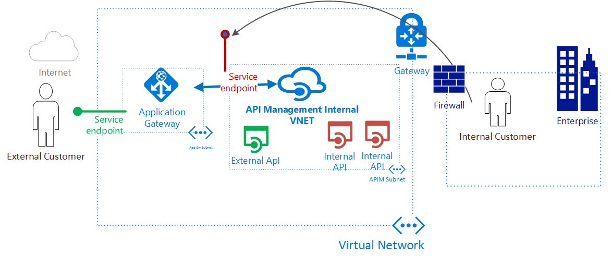

# Integrate API Management in an Internal VNET with Application Gateway 

##<a name="overview"> </a> Overview
 
The API Management service can be configured in a virtual network in internal mode which makes it accessible only from within the virtual network. Azure Application Gateway is a PAAS Service which provides a Layer-7 load balancer. It acts as a reverse-proxy service, and provides among its offering a Web Application Firewall (WAF).

Combining API Management provisioned in an internal VNET with the Application Gateway frontend enables the following scenarios:

* Use the same API Management resource for consumption by both internal consumers and external consumers.
* Use a single API Management resource and have a subset of APIs defined in API Management available for external consumers.
* Provide a turn-key way to switch access to API Management from the public Internet on and off. 

##<a name="scenario"> </a> Scenario
This post we will cover how to use a single API Management service for both internal and external consumers and make it act as a single frontend for both on-prem and cloud APIs. You can then choose to expose only a subset of those APIs (highlighted in green) for External Consumption also, using the PathBasedRouting functionality available in Application Gateway.

In this setup, all your APIs are managed only from within your Virtual network. Internal consumers (highlighted in orange), can access all your Internal and External APIs. Internal consumers benefit from the traffic never going out to Internet, with high speed provided via Express Route circuits.



## <a name="before-you-begin"> </a> Before you begin

1. Install the latest version of the Azure PowerShell cmdlets by using the Web Platform Installer. You can download and install the latest version from the **Windows PowerShell** section of the [Downloads page](https://azure.microsoft.com/downloads/).
2. You create a virtual network and create separate subnets for API Management and Application Gateway. 
3. If you intend to create a Custom DNS Server for the Virtual network, you create is before starting the deployment and ensure a Virtual machine created in a new subnet in the Virtual network can resolve all Azure service endpoints.

## What is required to create an integration between api management and application gateway?

* **Back-end server pool:** This is the Internal virtual IP address of the API Management service.
* **Back-end server pool settings:** Every pool has settings like port, protocol, and cookie-based affinity. These settings are tied to a pool and are applied to all servers within the pool.
* **Front-end port:** This port is the public port that is opened on the application gateway. Traffic hits this port, and then gets redirected to one of the back-end servers.
* **Listener:** The listener has a front-end port, a protocol (Http or Https, these values are case-sensitive), and the SSL certificate name (if configuring SSL offload).
* **Rule:** The rule binds the listener, the back-end server pool and defines which back-end server pool the traffic should be directed to when it hits a particular listener.
* **Custom Health Probe:** Application Gateway, by default, uses IP Address based probes to figure out which servers in the BackendAddressPool are active. API Management service only responds to requests which have the correct host header, hence the default probes fail. We need to define custom health probe to tell application gateway that the service is alive and it should forward the requests.
* **Custom domain certificate:** To access API Management from Internet you need to do a CNAME mapping of the hostname to the Application Gateway Front-end DNS name. The same hostname header and certificate is applied to API Management, so that when the request comes via Application Gateway, API Management recognizes that as valid and responds.
## <a name="overview-steps"> </a> Steps required for integrating API Management and Application Gateway 

1. Create a resource group for Resource Manager.
2. Create a virtual network, subnet, and public IP for the application gateway. Create another subnet for api management.
3. Create an api management service in Internal VNET mode inside the VNET subnet created above.
4. Update the api management service with custom domain name.
5. Create an application gateway configuration object.
6. Create an application gateway resource.
7. Cname the api management proxy hostname to public dns name of application gateway resource.

## Create a resource group for Resource Manager

Make sure that you are using the latest version of Azure PowerShell. More info is available at [Using Windows PowerShell with Resource Manager](../powershell-azure-resource-manager.md).

### Step 1

Log in to Azure

```powershell
Login-AzureRmAccount
```

You are prompted to authenticate with your credentials.<BR>

### Step 2

Check the subscriptions for the account and select it.

```powershell
Get-AzureRmSubscription -Subscriptionid "GUID of subscription" | Select-AzureRmSubscription
```

### Step 3

Create a resource group (skip this step if you're using an existing resource group).

```powershell
New-AzureRmResourceGroup -Name apim-appGw-RG -Location "West US"
```
Azure Resource Manager requires that all resource groups specify a location. This is used as the default location for resources in that resource group. Make sure that all commands to create an application gateway use the same resource group.

## Create a virtual network and a subnet for the application gateway

The following example shows how to create a virtual network by using Resource Manager.

### Step 1

Assign the address range 10.0.0.0/24 to the subnet variable to be used for application gateway while creating a virtual network.

```powershell
$appgatewaysubnet = New-AzureRmVirtualNetworkSubnetConfig -Name appgateway01 -AddressPrefix 10.0.0.0/24
```

### Step 2

Assign the address range 10.0.1.0/24 to the subnet variable to be used for api management while creating a virtual network.

```powershell
$apimsubnet = New-AzureRmVirtualNetworkSubnetConfig -Name appgateway01 -AddressPrefix 10.0.1.0/24
```

### Step 3

Create a virtual network named **appgwvnet** in resource group **apim-appGw-RG** for the West US region using the prefix 10.0.0.0/16 with subnets 10.0.0.0/24 and 10.0.1.0/24.

```powershell
$vnet = New-AzureRmVirtualNetwork -Name appgwvnet -ResourceGroupName apim-appGw-RG -Location "West US" -AddressPrefix 10.0.0.0/16 -Subnet $appgatewaysubnet,$apimsubnet
```

### Step 4

Assign a subnet variable for the next steps

```powershell
$appgatewaysubnetdata=$vnet.Subnets[0]
$apimsubnetdata=$vnet.Subnets[1]
```
## Create an API Management service in Internal VNET mode

The following example shows how to create an API Management service in Internal VNET

### Step 1
Create an api management virtual network object using the subnet $apimsubnetdata created above.

```powershell
$apimVirtualNetwork = New-AzureRmApiManagementVirtualNetwork -Location "West US" -SubnetResourceId $apimsubnetdata.Id
```
### Step 2
Create an api management service inside the Virtual network

```powershell
$apimService = New-AzureRmApiManagement -ResourceGroupName "apim-appGw-RG" -Location "West US" -Name "ContosoApi" -Organization Contoso -AdminEmail admin@contoso.com -VirtualNetwork $apimVirtualNetwork -VpnType "Internal" -Sku "Premium"
```
After the above command succeeds refer to [DNS Configuration required to access Internal VNET API Management service][api-management-using-with-internal-vnet.md#apim-dns-configuration] to access it.

## Update API Management service with custom domain name

We will now apply custom domain name to the Api Management service endpoint Proxy, which we want to access from Internet.

### Step 1
Upload the certificate with private key showing your authority to setup custom domain on the domain, say `*.contoso.net`. 

```powershell
$certUploadResult = Import-AzureRmApiManagementHostnameCertificate -ResourceGroupName "apim-appGw-RG" -Name "ContosoApi" -HostnameType "Proxy" -PfxPath <full path to .pfx file> -PfxPassword <password for certificate file>
```

### Step 2
Once we have uploaded the certificate, we can create a hostname configuration object for Proxy with hostname `api.contoso.net`, as the certificate had shown our authority on `*.contoso.net` domain. 

```powershell
$proxyHostnameConfig = New-AzureRmApiManagementHostnameConfiguration -CertificateThumbprint $certUploadResult.Thumbprint -Hostname "api.contoso.net"
$result = Set-AzureRmApiManagementHostnames -Name "ContosoApi" -ResourceGroupName "apim-appGw-RG" –PortalHostnameConfiguration $proxyHostnameConfig
```

## Create a public IP address for the front-end configuration

Create a public IP resource **publicIP01** in resource group **apim-appGw-RG** for the West US region.

```powershell
$publicip = New-AzureRmPublicIpAddress -ResourceGroupName apim-appGw-RG -name publicIP01 -location "West US" -AllocationMethod Dynamic
```

An IP address is assigned to the application gateway when the service starts.

## Create application gateway configuration

All configuration items must be set up before creating the application gateway. The following steps create the configuration items that are needed for an application gateway resource.

### Step 1

Create an application gateway IP configuration named **gatewayIP01**. When Application Gateway starts, it picks up an IP address from the subnet configured and route network traffic to the IP addresses in the back-end IP pool. Keep in mind that each instance takes one IP address.

```powershell
$gipconfig = New-AzureRmApplicationGatewayIPConfiguration -Name gatewayIP01 -Subnet $appgatewaysubnetdata
```

### Step 2

Configure the front-end IP port for the public IP endpoint. This port is the port that end users connect to.

```powershell
$fp01 = New-AzureRmApplicationGatewayFrontendPort -Name 'port01'  -Port 443
```
### Step 3

Configure the front-end IP with public IP endpoint.

```powershell
$fipconfig01 = New-AzureRmApplicationGatewayFrontendIPConfig -Name "frontend1" -PublicIPAddress $publicip
```

### Step 4

Configure the certificate for the application gateway. This certificate is used to decrypt and re-encrypt the traffic on the application gateway.

```powershell
$cert = New-AzureRmApplicationGatewaySslCertificate -Name cert01 -CertificateFile <full path to .pfx file> -Password <password for certificate file>
```

### Step 5

Create the HTTP listener for the application gateway. Assign the front-end ip configuration, port, and ssl certificate to use.

```powershell
$listener = New-AzureRmApplicationGatewayHttpListener -Name listener01 -Protocol Https -FrontendIPConfiguration $fipconfig01 -FrontendPort $fp01 -SslCertificate $cert
```

### Step 6

Here we create a custom probe to the API Management service `ContosoApi` proxy domain endpoint. The path `/status-0123456789abcdef` is a default health endpoint hosted on all the API Management services. The hostname `contosoapi.azure-api.net` is the default proxy hostname configured when a service `contosoapi` is created in Public Azure.

```powershell
$apimprobe = New-AzureRmApplicationGatewayProbeConfig -Name apimproxyprobe -Protocol Https -HostName "contosoapi.azure-api.net" -Path "/status-0123456789abcdef" -Interval 30 -Timeout 120 -UnhealthyThreshold 8
```

### Step 7

Upload the certificate to be used on the ssl enabled backend pool resources.

```powershell
$authcert = New-AzureRmApplicationGatewayAuthenticationCertificate -Name 'whitelistcert1' -CertificateFile <full path to .cer file>
```

### Step 8

Configure application gateway setting **apimPoolSetting** for the traffic in the back-end pool. This step also has a time-out configuration that is for the back-end pool response to an application gateway request. When a back-end response hits a time-out limit, Application Gateway cancels the request. This value is different from a probe time-out that is only for the back-end response to probe checks.

```powershell
$apimPoolSetting = New-AzureRmApplicationGatewayBackendHttpSettings -Name apimPoolSetting -Port 443 -Protocol Https -CookieBasedAffinity Disabled -Probe $apimprobe -AuthenticationCertificates $authcert -RequestTimeout 180
```

### Step 9

Configure the back-end IP address pool named **apimbackend**  with Internal virtual IP address for API Management service created above.

```powershell
$apimProxyBackendPool = New-AzureRmApplicationGatewayBackendAddressPool -Name apimbackend -BackendIPAddresses $apimService.StaticIPs[0]
```

### Step 10
Configure URL rule paths for the back-end pools. We can have multiple APIs configured in API Management, like `Echo API (/echo/), Calculator API (/calc/) etc.` and we can choose to allow access only to `Echo API` from Internet. 

The following example creates a simple rule for "/echo/" path routing traffic to back-end "apimProxyBackendPool".

```powershell
$echoapiRule = New-AzureRmApplicationGatewayPathRuleConfig -Name "externalapis" -Paths "/echo/*" -BackendAddressPool $apimProxyBackendPool -BackendHttpSettings $apimPoolSetting

$urlPathMap = New-AzureRmApplicationGatewayUrlPathMapConfig -Name "urlpathmap" -PathRules $echoapiRule -DefaultBackendAddressPool $apimProxyBackendPool -DefaultBackendHttpSettings $apimPoolSetting
```

The above step ensures that only requests for path "/echo" are allowed through application gateway. Requests to other APIs configured in API Management will throw 404 from Application Gateway when accessed from Internet. 

### Step 11

Create a rule setting. This step configures the application gateway to use URL path-based routing.

```powershell
$rule01 = New-AzureRmApplicationGatewayRequestRoutingRule -Name "rule1" -RuleType PathBasedRouting -HttpListener $listener -UrlPathMap $urlPathMap
```

### Step 12

Configure the number of instances and size for the application gateway. Here we are using the [WAF Sku][../application-gateway/application-gateway-webapplicationfirewall-overview.md] for increased security of the API Management resource.

```powershell
$sku = New-AzureRmApplicationGatewaySku -Name WAF_Medium -Tier WAF -Capacity 2
```

### Step 13

We configure the mode for WAF to be "Prevention" mode
```powershell
$config = New-AzureRmApplicationGatewayWebApplicationFirewallConfiguration -Enabled $true -FirewallMode "Prevention"
```

## Create Application Gateway

Create an application gateway with all configuration objects from the preceding steps.

```powershell
$appgw = New-AzureRmApplicationGateway -Name appgwtest -ResourceGroupName apim-appGw-RG -Location "West US" -BackendAddressPools $apimProxyBackendPool -BackendHttpSettingsCollection $apimPoolSetting  -FrontendIpConfigurations $fipconfig01 -GatewayIpConfigurations $gipconfig -FrontendPorts $fp01 -HttpListeners $listener -UrlPathMaps $urlPathMap -RequestRoutingRules $rule01 -Sku $sku -WebApplicationFirewallConfig $config -SslCertificates $cert -AuthenticationCertificates $authcert -Probes $apimprobe
```

## Cname the api management proxy hostname to public dns name of application gateway resource

Once the gateway is created, the next step is to configure the front end for communication. When using a public IP, application gateway requires a dynamically assigned DNS name, which is not friendly. To configure the frontend IP CNAME record, retrieve details of the application gateway and its associated IP/DNS name using the PublicIPAddress element attached to the application gateway. The application gateway's DNS name should be used to create a CNAME record, which points the proxy host name we configured above `api.contoso.net` to this DNS name. The use of A-records is not recommended since the VIP may change on restart of application gateway.

```powershell
Get-AzureRmPublicIpAddress -ResourceGroupName apim-appGw-RG -Name publicIP01
```

##<a name="summary"> </a> Summary
Azure API Management service in a VNET provides a single gateway interface, to manage access to all your APIs, whether they are hosted On-Prem or in Cloud. You get deep insights to who and how your APIs are being used. Integrating Application Gateway with API Management gives you more flexibility on what APIs you want to give access on the Internet, as well as providing a Web Application Firewall as frontend to your API Management instance.

##<a name="next-steps"> </a> Next steps
* Learn more about Azure Application Gateway
  * [Application Gateway Overview](../application-gateway/application-gateway-introduction.md)
  * [Application Gateway Web Application Firewall](../application-gateway/application-gateway-webapplicationfirewall-overview.md)
* Learn more about API Management in VNET
  * [Using API Management in VNET](api-management-using-with-vnet.md)


