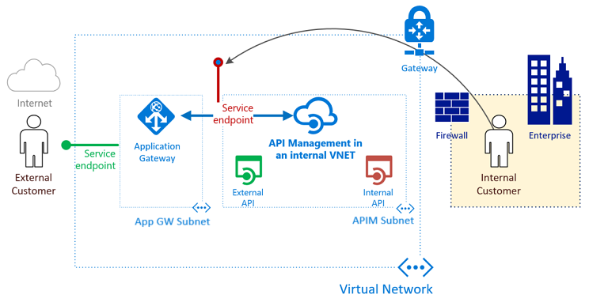

# Integrate API Management in an internal virtual network with Application Gateway

You can configure Azure API Management in a [virtual network in internal mode](api-management-using-with-internal-vnet.md), which makes it accessible only within the virtual network. [Azure Application Gateway](../application-gateway/overview.md) is a platform as a service (PaaS) that acts as a Layer-7 load balancer. It acts as a reverse-proxy service and provides among its offerings Azure Web Application Firewall (WAF).

By combining API Management provisioned in an internal virtual network with the Application Gateway front end, you can:

* Use the same API Management resource for consumption by both internal consumers and external consumers.
* Use a single API Management resource and have a subset of APIs defined in API Management available for external consumers.
* Provide a turnkey way to switch access to API Management from the public internet on and off.

For architectural guidance, see:
* **Basic enterprise integration**: [Reference architecture](/azure/architecture/reference-architectures/enterprise-integration/basic-enterprise-integration?toc=%2Fazure%2Fapi-management%2Ftoc.json&bc=/azure/api-management/breadcrumb/toc.json)
* **API Management landing zone accelerator**: [Reference architecture](/azure/architecture/example-scenario/integration/app-gateway-internal-api-management-function?toc=%2Fazure%2Fapi-management%2Ftoc.json&bc=/azure/api-management/breadcrumb/toc.json) and [design guidance](/azure/cloud-adoption-framework/scenarios/app-platform/api-management/landing-zone-accelerator?toc=%2Fazure%2Fapi-management%2Ftoc.json&bc=/azure/api-management/breadcrumb/toc.json)


> [!NOTE]
> This article has been updated to use the [Application Gateway WAF_v2 SKU](../application-gateway/application-gateway-autoscaling-zone-redundant.md).

[!INCLUDE [premium-dev.md](../../includes/api-management-availability-premium-dev.md)]

## Prerequisites

[!INCLUDE [updated-for-az](../../includes/updated-for-az.md)]

To follow the steps described in this article, you must have:

* An active Azure subscription.

    [!INCLUDE [quickstarts-free-trial-note](../../includes/quickstarts-free-trial-note.md)]

* Certificates
     - PFX files for API Management's custom host names: gateway, developer portal, and management endpoint.
     - A CER file for the root certificate of the PFX certificates.
     
    For more information, see [Certificates for the back end](../application-gateway/certificates-for-backend-authentication.md). For testing purposes, optionally generate [self-signed certificates](../application-gateway/self-signed-certificates.md).
* The latest version of Azure PowerShell. If you haven't already, [install Azure PowerShell](/powershell/azure/install-azure-powershell).

## Scenario

In this article, you learn how to use a single API Management instance for internal and external consumers and make it act as a single front end for both on-premises and cloud APIs. You create an API Management instance of the newer single-tenant version 2 (stv2) type. You also understand how to expose only a subset of your APIs for external consumption by using routing functionality available in Application Gateway. In the example, the APIs are highlighted in green.

In the first setup example, all your APIs are managed only from within your virtual network. Internal consumers can access all your internal and external APIs. Traffic never goes out to the internet. High-performance connectivity can be delivered via Azure ExpressRoute circuits. In the example, the internal consumers are highlighted in orange.



### What's required to integrate API Management and Application Gateway?

* **Back-end server pool**: This server pool is the internal virtual IP address of API Management.
* **Back-end server pool settings**: Every pool has settings like port, protocol, and cookie-based affinity. These settings are applied to all servers within the pool.
* **Front-end port**: This public port is opened on the application gateway. Traffic that hits it gets redirected to one of the back-end servers.
* **Listener**: The listener has a front-end port, a protocol (Http or Https, these values are case sensitive), and the TLS/SSL certificate name (if configuring TLS offload).
* **Rule**: The rule binds a listener to a back-end server pool.
* **Custom health probe**: Application Gateway, by default, uses IP address-based probes to figure out which servers in `BackendAddressPool` are active. API Management only responds to requests with the correct host header, so the default probes fail. You define a custom health probe to help the application gateway determine that the service is alive and should forward requests.
* **Custom domain certificates**: To access API Management from the internet, create DNS records to map its host names to the Application Gateway front-end IP address. This mapping ensures that the Host header and certificate sent to API Management are valid. In this example, we use three certificates. They're for API Management's gateway (the back end), the developer portal, and the management endpoint.

### Expose the developer portal and management endpoint externally through Application Gateway

In this article, we also expose the *developer portal* and the *management endpoint* to external audiences through the application gateway. Extra steps are needed to create a listener, probe, settings, and rules for each endpoint. All details are provided in their respective steps.

If you use Azure Active Directory or third-party authentication, enable the [cookie-based session affinity](../application-gateway/features.md#session-affinity) feature in Application Gateway.

> [!WARNING]
> To prevent Application Gateway WAF from breaking the download of OpenAPI specifications in the developer portal, disable the firewall rule `942200 - "Detects MySQL comment-/space-obfuscated injections and backtick termination"`.
> 
> Application Gateway WAF rules that might break the portal's functionality include:
> 
> - `920300`, `920330`, `931130`, `942100`, `942110`, `942180`, `942200`, `942260`, `942340`, `942370` for the administrative mode
> - `942200`, `942260`, `942370`, `942430`, `942440` for the published portal

## Setting Variables

Throughout this guide, you will need to define several variables. Naming is based on the [Cloud Adoption Framework abbreviation](/azure/cloud-adoption-framework/ready/azure-best-practices/resource-abbreviations) guidance.

```powershell
# These variables must be changed.
$subscriptionId = "00000000-0000-0000-0000-000000000000"      # GUID of your Azure subscription
$domain = "contoso.net"                                       # The custom domain for your certificate
$apimServiceName = "apim-contoso"                             # API Management service instance name, must be globally unique    
$apimDomainNameLabel = $apimServiceName                       # Domain name label for API Management's public IP address, must be globally unique
$apimAdminEmail = "admin@contoso.net"                         # Administrator's email address - use your email address

$gatewayHostname = "api.$domain"                              # API gateway host
$portalHostname = "portal.$domain"                            # API developer portal host
$managementHostname = "management.$domain"                    # API management endpoint host

$baseCertPath = "C:\Users\Contoso\"                           # The base path where all certificates are stored
$trustedRootCertCerPath = "${baseCertPath}trustedroot.cer"    # Full path to contoso.net trusted root .cer file
$gatewayCertPfxPath = "${baseCertPath}gateway.pfx"            # Full path to api.contoso.net .pfx file
$portalCertPfxPath = "${baseCertPath}portal.pfx"              # Full path to portal.contoso.net .pfx file
$managementCertPfxPath = "${baseCertPath}management.pfx"      # Full path to management.contoso.net .pfx file

$gatewayCertPfxPassword = "certificatePassword123"            # Password for api.contoso.net pfx certificate
$portalCertPfxPassword = "certificatePassword123"             # Password for portal.contoso.net pfx certificate
$managementCertPfxPassword = "certificatePassword123"         # Password for management.contoso.net pfx certificate


# These variables may be changed.
$resGroupName = "rg-apim-agw"                                 # Resource group name that will hold all assets
$location = "West US"                                         # Azure region that will hold all assets
$apimOrganization = "Contoso"                                 # Organization name    
$appgwName = "agw-contoso"                                    # The name of the Application Gateway
```

## Create a resource group for Resource Manager

To create a resource group for Azure Resource Manager:

1. Sign in to Azure.
    
    ```powershell
    Connect-AzAccount
    ```

1. Authenticate with your credentials.

1. Select the subscription you want.
    
    ```powershell    
    Get-AzSubscription -Subscriptionid $subscriptionId | Select-AzSubscription
    ```

1. Create a resource group. You can skip this step if you're using an existing resource group.

    ```powershell    
    New-AzResourceGroup -Name $resGroupName -Location $location
    ```

Resource Manager requires that all resource groups specify a location. This location is used as the default for resources in that resource group. Make sure that all commands to create an application gateway use the same resource group.

## Create a virtual network and a subnet for the application gateway

The following example shows how to create a virtual network by using Resource Manager. The virtual network in this example consists of separate subnets for Application Gateway and API Management.

1. Create a network security group (NSG) and NSG rules for the Application Gateway subnet.

    ```powershell
    $appGwRule1 = New-AzNetworkSecurityRuleConfig -Name appgw-in -Description "AppGw inbound" `
        -Access Allow -Protocol * -Direction Inbound -Priority 100 -SourceAddressPrefix `
        GatewayManager -SourcePortRange * -DestinationAddressPrefix * -DestinationPortRange 65200-65535
    $appGwRule2 = New-AzNetworkSecurityRuleConfig -Name appgw-in-internet -Description "AppGw inbound Internet" `
        -Access Allow -Protocol "TCP" -Direction Inbound -Priority 110 -SourceAddressPrefix `
        Internet -SourcePortRange * -DestinationAddressPrefix * -DestinationPortRange 443
        
    $appGwNsg = New-AzNetworkSecurityGroup -ResourceGroupName $resGroupName -Location $location -Name `
        "nsg-agw" -SecurityRules $appGwRule1, $appGwRule2
    ```
    
1.  Create a network security group (NSG) and NSG rules for the API Management subnet. [API Management stv2 requires several specific NSG rules](api-management-using-with-internal-vnet.md#enable-vnet-connection).

    ```powershell
    $apimRule1 = New-AzNetworkSecurityRuleConfig -Name APIM-Management -Description "APIM inbound" `
        -Access Allow -Protocol Tcp -Direction Inbound -Priority 100 -SourceAddressPrefix ApiManagement `
        -SourcePortRange * -DestinationAddressPrefix VirtualNetwork -DestinationPortRange 3443
    $apimRule2 = New-AzNetworkSecurityRuleConfig -Name AllowAppGatewayToAPIM -Description "Allows inbound App Gateway traffic to APIM" `
        -Access Allow -Protocol Tcp -Direction Inbound -Priority 110 -SourceAddressPrefix "10.0.0.0/24" `
        -SourcePortRange * -DestinationAddressPrefix "10.0.1.0/24" -DestinationPortRange 443
    $apimRule3 = New-AzNetworkSecurityRuleConfig -Name AllowAzureLoadBalancer -Description "Allows inbound Azure Infrastructure Load Balancer traffic to APIM" `
        -Access Allow -Protocol Tcp -Direction Inbound -Priority 120 -SourceAddressPrefix AzureLoadBalancer `
        -SourcePortRange * -DestinationAddressPrefix "10.0.1.0/24" -DestinationPortRange 6390
    $apimRule4 = New-AzNetworkSecurityRuleConfig -Name AllowKeyVault -Description "Allows outbound traffic to Azure Key Vault" `
        -Access Allow -Protocol Tcp -Direction Outbound -Priority 100 -SourceAddressPrefix "10.0.1.0/24" `
        -SourcePortRange * -DestinationAddressPrefix AzureKeyVault -DestinationPortRange 443
    
    $apimNsg = New-AzNetworkSecurityGroup -ResourceGroupName $resGroupName -Location $location -Name `
        "nsg-apim" -SecurityRules $apimRule1, $apimRule2, $apimRule3, $apimRule4
    ```

1. Assign the address range 10.0.0.0/24 to the subnet variable to be used for Application Gateway while you create a virtual network.

    ```powershell
    $appGatewaySubnet = New-AzVirtualNetworkSubnetConfig -Name "appGatewaySubnet" -NetworkSecurityGroup $appGwNsg -AddressPrefix "10.0.0.0/24"
    ```

1. Assign the address range 10.0.1.0/24 to the subnet variable to be used for API Management while you create a virtual network.
    
    ```powershell
    $apimSubnet = New-AzVirtualNetworkSubnetConfig -Name "apimSubnet" -NetworkSecurityGroup $apimNsg -AddressPrefix "10.0.1.0/24"
    ```

1. Create a virtual network named **vnet-contoso**. Use the prefix 10.0.0.0/16 with subnets 10.0.0.0/24 and 10.0.1.0/24.

    ```powershell
    $vnet = New-AzVirtualNetwork -Name "vnet-contoso" -ResourceGroupName $resGroupName `
      -Location $location -AddressPrefix "10.0.0.0/16" -Subnet $appGatewaySubnet,$apimSubnet
    ```

1. Assign subnet variables for the next steps.

    ```powershell
    $appGatewaySubnetData = $vnet.Subnets[0]
    $apimSubnetData = $vnet.Subnets[1]
    ```

## Create an API Management instance inside a virtual network

The following example shows how to create an API Management instance in a virtual network configured for internal access only.

1. API Management stv2 requires a public IP with a unique `DomainNameLabel`:

    ```powershell
    $apimPublicIpAddressId = New-AzPublicIpAddress -ResourceGroupName $resGroupName -name "pip-apim" -location $location `
        -AllocationMethod Static -Sku Standard -Force -DomainNameLabel $apimDomainNameLabel
    ```

1. Create an API Management virtual network object by using the subnet `$apimSubnetData` you created.

    ```powershell
    $apimVirtualNetwork = New-AzApiManagementVirtualNetwork -SubnetResourceId $apimSubnetData.Id
    ```

1. Create an API Management instance inside the virtual network. This example creates the service in the Developer service tier. Substitute a unique name for your API Management instance.
    
    ```powershell
    $apimService = New-AzApiManagement -ResourceGroupName $resGroupName -Location $location -Name $apimServiceName -Organization $apimOrganization `
        -AdminEmail $apimAdminEmail -VirtualNetwork $apimVirtualNetwork -VpnType "Internal" -Sku "Developer" -PublicIpAddressId $apimPublicIpAddressId.Id
    ```

It can take between 30 and 40 minutes to create and activate an API Management instance in this tier. After the previous command succeeds, see [DNS configuration required to access internal virtual network API Management service](api-management-using-with-internal-vnet.md#dns-configuration) to confirm access to it.

## Set up custom domain names in API Management

To set up custom domain names in API Management:

1. Initialize the following variables with the details of the certificates with private keys for the domains and the trusted root certificate. In this example, we use `api.contoso.net`, `portal.contoso.net`, and `management.contoso.net`.  

    ```powershell
    $certGatewayPwd = ConvertTo-SecureString -String $gatewayCertPfxPassword -AsPlainText -Force
    $certPortalPwd = ConvertTo-SecureString -String $portalCertPfxPassword -AsPlainText -Force
    $certManagementPwd = ConvertTo-SecureString -String $managementCertPfxPassword -AsPlainText -Force
    ```

1. Create and set the `Hostname` configuration objects for the API Management endpoints.
    
    ```powershell
    $gatewayHostnameConfig = New-AzApiManagementCustomHostnameConfiguration -Hostname $gatewayHostname `
      -HostnameType Proxy -PfxPath $gatewayCertPfxPath -PfxPassword $certGatewayPwd
    $portalHostnameConfig = New-AzApiManagementCustomHostnameConfiguration -Hostname $portalHostname `
      -HostnameType DeveloperPortal -PfxPath $portalCertPfxPath -PfxPassword $certPortalPwd
    $managementHostnameConfig = New-AzApiManagementCustomHostnameConfiguration -Hostname $managementHostname `
      -HostnameType Management -PfxPath $managementCertPfxPath -PfxPassword $certManagementPwd
    
    $apimService.ProxyCustomHostnameConfiguration = $gatewayHostnameConfig
    $apimService.PortalCustomHostnameConfiguration = $portalHostnameConfig
    $apimService.ManagementCustomHostnameConfiguration = $managementHostnameConfig
    
    Set-AzApiManagement -InputObject $apimService
    ```

> [!NOTE]
> To configure connectivity to the legacy developer portal, you need to replace `-HostnameType DeveloperPortal` with `-HostnameType Portal`.

## Configure a private zone for DNS resolution in the virtual network

To configure a private DNS zone for DNS resolution in the virtual network:

1. Create a private DNS zone and link the virtual network.

    ```powershell
    $myZone = New-AzPrivateDnsZone -Name $domain -ResourceGroupName $resGroupName 
    $link = New-AzPrivateDnsVirtualNetworkLink -ZoneName $domain `
      -ResourceGroupName $resGroupName -Name "mylink" `
      -VirtualNetworkId $vnet.id
    ```

1. Create A-records for the custom domain host names that map to the private IP address of API Management.

    ```powershell
    $apimIP = $apimService.PrivateIPAddresses[0]
    
    New-AzPrivateDnsRecordSet -Name api -RecordType A -ZoneName $domain `
      -ResourceGroupName $resGroupName -Ttl 3600 `
      -PrivateDnsRecords (New-AzPrivateDnsRecordConfig -IPv4Address $apimIP)
    New-AzPrivateDnsRecordSet -Name portal -RecordType A -ZoneName $domain `
      -ResourceGroupName $resGroupName -Ttl 3600 `
      -PrivateDnsRecords (New-AzPrivateDnsRecordConfig -IPv4Address $apimIP)
    New-AzPrivateDnsRecordSet -Name management -RecordType A -ZoneName $domain `
      -ResourceGroupName $resGroupName -Ttl 3600 `
      -PrivateDnsRecords (New-AzPrivateDnsRecordConfig -IPv4Address $apimIP)
    ```

## Create a public IP address for the front-end configuration

Create a Standard public IP resource **publicIP01** in the resource group.

```powershell
$publicip = New-AzPublicIpAddress -ResourceGroupName $resGroupName `
  -name "pip-appgateway" -location $location -AllocationMethod Static -Sku Standard
```

An IP address is assigned to the application gateway when the service starts.

## Create application gateway configuration

All configuration items must be set up before you create the application gateway. The following steps create the configuration items that are needed for an Application Gateway resource.

1. Create an Application Gateway IP configuration named **gatewayIP01**. When Application Gateway starts, it picks up an IP address from the subnet configured and routes network traffic to the IP addresses in the back-end IP pool. Keep in mind that each instance takes one IP address.

    ```powershell
    $gipconfig = New-AzApplicationGatewayIPConfiguration -Name "gatewayIP01" -Subnet $appGatewaySubnetData
    ```

1. Configure the front-end IP port for the public IP endpoint. This port is the one that users connect to.

    ```powershell
    $fp01 = New-AzApplicationGatewayFrontendPort -Name "port01"  -Port 443
    ```

1. Configure the front-end IP with a public IP endpoint.

    ```powershell
    $fipconfig01 = New-AzApplicationGatewayFrontendIPConfig -Name "frontend1" -PublicIPAddress $publicip
    ```

1. Configure the certificates for the application gateway. They're used to decrypt and reencrypt the traffic that passes through.

    > [!NOTE]
    > Application Gateway supports defining custom TLS options, disabling certain TLS protocol versions, and specifying cipher suites and the order of preference. To learn more about configurable TLS options, see the [TLS policy overview](../application-gateway/application-gateway-ssl-policy-overview.md).
    
    ```powershell
    $certGateway = New-AzApplicationGatewaySslCertificate -Name "gatewaycert" `
      -CertificateFile $gatewayCertPfxPath -Password $certGatewayPwd
    $certPortal = New-AzApplicationGatewaySslCertificate -Name "portalcert" `
      -CertificateFile $portalCertPfxPath -Password $certPortalPwd
    $certManagement = New-AzApplicationGatewaySslCertificate -Name "managementcert" `
      -CertificateFile $managementCertPfxPath -Password $certManagementPwd
    ```

1. Create the HTTP listeners for the application gateway. Assign the front-end IP configuration, port, and TLS/SSL certificates to them.

    ```powershell
    $gatewayListener = New-AzApplicationGatewayHttpListener -Name "gatewaylistener" `
      -Protocol "Https" -FrontendIPConfiguration $fipconfig01 -FrontendPort $fp01 `
      -SslCertificate $certGateway -HostName $gatewayHostname -RequireServerNameIndication true
    $portalListener = New-AzApplicationGatewayHttpListener -Name "portallistener" `
      -Protocol "Https" -FrontendIPConfiguration $fipconfig01 -FrontendPort $fp01 `
      -SslCertificate $certPortal -HostName $portalHostname -RequireServerNameIndication true
    $managementListener = New-AzApplicationGatewayHttpListener -Name "managementlistener" `
      -Protocol "Https" -FrontendIPConfiguration $fipconfig01 -FrontendPort $fp01 `
      -SslCertificate $certManagement -HostName $managementHostname -RequireServerNameIndication true
    ```

1. Create custom probes to the API Management `ContosoApi` gateway domain endpoint. The path `/status-0123456789abcdef` is a default health endpoint hosted on all instances of API Management. Set `api.contoso.net` as a custom probe host name to secure it with the TLS/SSL certificate.

    > [!NOTE]
    > The host name `contosoapi.azure-api.net` is the default proxy host name configured when a service named `contosoapi` is created in public Azure.
    >

    ```powershell
    $apimGatewayProbe = New-AzApplicationGatewayProbeConfig -Name "apimgatewayprobe" `
      -Protocol "Https" -HostName $gatewayHostname -Path "/status-0123456789abcdef" `
      -Interval 30 -Timeout 120 -UnhealthyThreshold 8
    $apimPortalProbe = New-AzApplicationGatewayProbeConfig -Name "apimportalprobe" `
      -Protocol "Https" -HostName $portalHostname -Path "/signin" `
      -Interval 60 -Timeout 300 -UnhealthyThreshold 8
    $apimManagementProbe = New-AzApplicationGatewayProbeConfig -Name "apimmanagementprobe" `
      -Protocol "Https" -HostName $managementHostname -Path "/ServiceStatus" `
      -Interval 60 -Timeout 300 -UnhealthyThreshold 8
    ```

1. Upload the trusted root certificate to be configured on the HTTP settings.
    
    ```powershell
    $trustedRootCert = New-AzApplicationGatewayTrustedRootCertificate -Name "allowlistcert1" -CertificateFile $trustedRootCertCerPath
    ```

1. Configure HTTP back-end settings for the application gateway, including a timeout limit for back-end requests, after which they're canceled. This value is different from the probe timeout.

    ```powershell
    $apimPoolGatewaySetting = New-AzApplicationGatewayBackendHttpSettings -Name "apimPoolGatewaySetting" `
      -Port 443 -Protocol "Https" -CookieBasedAffinity "Disabled" -Probe $apimGatewayProbe `
      -TrustedRootCertificate $trustedRootCert -PickHostNameFromBackendAddress -RequestTimeout 180
    $apimPoolPortalSetting = New-AzApplicationGatewayBackendHttpSettings -Name "apimPoolPortalSetting" `
      -Port 443 -Protocol "Https" -CookieBasedAffinity "Disabled" -Probe $apimPortalProbe `
      -TrustedRootCertificate $trustedRootCert -PickHostNameFromBackendAddress -RequestTimeout 180
    $apimPoolManagementSetting = New-AzApplicationGatewayBackendHttpSettings -Name "apimPoolManagementSetting" `
      -Port 443 -Protocol "Https" -CookieBasedAffinity "Disabled" -Probe $apimManagementProbe `
      -TrustedRootCertificate $trustedRootCert -PickHostNameFromBackendAddress -RequestTimeout 180
    ```

1. Configure a back-end IP address pool for each API Management endpoint by using its respective domain name.

    ```powershell
    $apimGatewayBackendPool = New-AzApplicationGatewayBackendAddressPool -Name "gatewaybackend" `
      -BackendFqdns $gatewayHostname
    $apimPortalBackendPool = New-AzApplicationGatewayBackendAddressPool -Name "portalbackend" `
      -BackendFqdns $portalHostname
    $apimManagementBackendPool = New-AzApplicationGatewayBackendAddressPool -Name "managementbackend" `
      -BackendFqdns $managementHostname
    ```

1. Create rules for the application gateway to use basic routing.

    ```powershell
    $gatewayRule = New-AzApplicationGatewayRequestRoutingRule -Name "gatewayrule" `
      -RuleType Basic -HttpListener $gatewayListener -BackendAddressPool $apimGatewayBackendPool `
      -BackendHttpSettings $apimPoolGatewaySetting -Priority 10
    $portalRule = New-AzApplicationGatewayRequestRoutingRule -Name "portalrule" `
      -RuleType Basic -HttpListener $portalListener -BackendAddressPool $apimPortalBackendPool `
      -BackendHttpSettings $apimPoolPortalSetting -Priority 20
    $managementRule = New-AzApplicationGatewayRequestRoutingRule -Name "managementrule" `
      -RuleType Basic -HttpListener $managementListener -BackendAddressPool $apimManagementBackendPool `
      -BackendHttpSettings $apimPoolManagementSetting -Priority 30
    ```

    > [!TIP]
    > Change `-RuleType` and routing to restrict access to certain pages of the developer portal.

1. Configure the number of instances and size for the application gateway. In this example, we use [WAF_v2 SKU](../web-application-firewall/ag/ag-overview.md) for increased security of the API Management resource.

   Use a minimum of two instances (_Capacity_) for production workloads. You might want to use only one instance for nonproduction scenarios or for general experimentation. For more information, see [Azure Application Gateway pricing](../application-gateway/understanding-pricing.md#instance-count).

    ```powershell
    $sku = New-AzApplicationGatewaySku -Name "WAF_v2" -Tier "WAF_v2" -Capacity 2
    ```

1. Configure the WAF mode.

    > [!TIP]
    > For a short period during setup and to test your firewall rules, you might want to configure "Detection" mode, which monitors and logs threat alerts but doesn't block traffic. You can then make any updates to firewall rules before transitioning to "Prevention" mode, which blocks intrusions and attacks that the rules detect.

    ```powershell
    $config = New-AzApplicationGatewayWebApplicationFirewallConfiguration -Enabled $true -FirewallMode "Prevention"
    ```

1. Because TLS 1.0 currently is the default, set the application gateway to use one of the recent [TLS 1.2 policy](../application-gateway/application-gateway-ssl-policy-overview.md#predefined-tls-policy).

    ```powershell
    $policy = New-AzApplicationGatewaySslPolicy -PolicyType Predefined -PolicyName AppGwSslPolicy20220101
    ```

## Create an application gateway

To create an Application Gateway resource:

1. Create an application gateway with all the configuration objects from the preceding steps.

    ```powershell    
    $appgw = New-AzApplicationGateway -Name $appgwName -ResourceGroupName $resGroupName -Location $location `
      -BackendAddressPools $apimGatewayBackendPool,$apimPortalBackendPool,$apimManagementBackendPool `
      -BackendHttpSettingsCollection $apimPoolGatewaySetting, $apimPoolPortalSetting, $apimPoolManagementSetting `
      -FrontendIpConfigurations $fipconfig01 -GatewayIpConfigurations $gipconfig -FrontendPorts $fp01 `
      -HttpListeners $gatewayListener,$portalListener,$managementListener `
      -RequestRoutingRules $gatewayRule,$portalRule,$managementRule `
      -Sku $sku -WebApplicationFirewallConfig $config -SslCertificates $certGateway,$certPortal,$certManagement `
      -TrustedRootCertificate $trustedRootCert -Probes $apimGatewayProbe,$apimPortalProbe,$apimManagementProbe `
      -SslPolicy $policy
    ```

1. After the application gateway deploys, confirm the health status of the API Management back ends in the portal or by running the following command:

    ```powershell
    Get-AzApplicationGatewayBackendHealth -Name $appgwName -ResourceGroupName $resGroupName
    ```

Ensure that the health status of each back-end pool is Healthy. If you need to troubleshoot an unhealthy back end or a back end with unknown health status, see [Troubleshoot back-end health issues in Application Gateway](../application-gateway/application-gateway-backend-health-troubleshooting.md).

## Create DNS records to access API Management endpoints from the internet

After the gateway is created, configure communication to API Management from the internet. Create DNS A-records that map each of the API Management endpoint host names that you configured to the application gateway's static public IP address. In this article, example host names are `api.contoso.net`, `portal.contoso.net`, and `management.contoso.net`.

For testing purposes, you might update the hosts file on your local machine with entries that map the application gateway's public IP address to the API Management endpoint host names.

## Summary

API Management configured in a virtual network provides a single gateway interface for all configured APIs, whether they're hosted on-premises or in the cloud. Integrating Application Gateway with API Management provides you with the flexibility to selectively enable particular APIs to be accessible on the internet. Integration also provides a WAF as a front end to your API Management instance.

## Next steps

* Set up using an [Azure Resource Manager template](https://github.com/Azure/azure-quickstart-templates/tree/master/quickstarts/microsoft.apimanagement/api-management-create-with-internal-vnet-application-gateway).
* Learn more about Application Gateway:

  * [Application Gateway overview](../application-gateway/overview.md)
  * [Application Gateway Web Application Firewall](../web-application-firewall/ag/ag-overview.md)
  * [Application Gateway using path-based routing](../application-gateway/tutorial-url-route-powershell.md)

* Learn more about API Management and virtual networks:

  * [Use API Management with an internal virtual network](api-management-using-with-internal-vnet.md)
  * [Use API Management with virtual networks](api-management-using-with-vnet.md)
