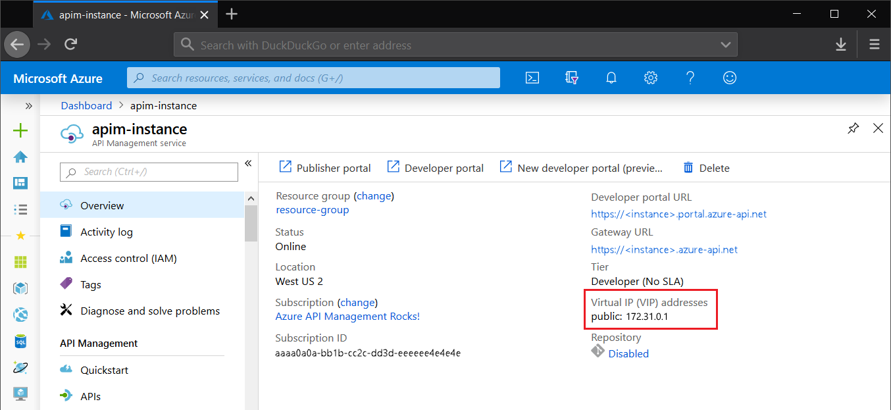
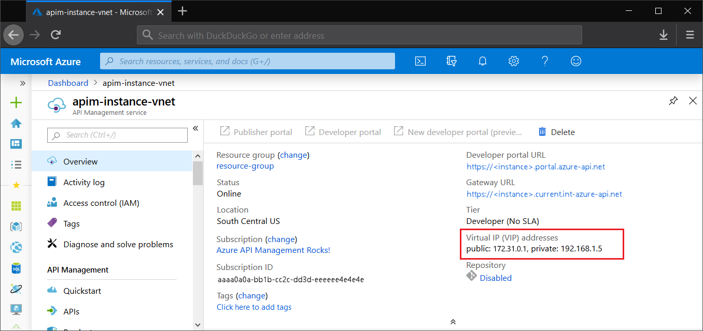

# IP addresses of Azure API Management

In this article we describe how to retrieve the IP addresses of Azure API Management service. IP addresses can be public or private if the service is in a virtual network.

You can use IP addresses to create firewall rules, filter the incoming traffic to the backend services, or restrict the outbound traffic.

## IP addresses of API Management service

Every API Management service instance in Developer, Basic, Standard, or Premium tier has public IP addresses, which are exclusive only to that service instance (they are not shared with other resources). 

You can retrieve the IP addresses from the overview dashboard of your resource in the Azure portal.



You can also fetch them programmatically with the following API call:

```
GET https://management.azure.com/subscriptions/<subscription-id>/resourceGroups/<resource-group>/providers/Microsoft.ApiManagement/service/<service-name>?api-version=<api-version>
```

Public IP addresses will be part of the response:

```json
{
  ...
  "properties": {
    ...
    "publicIPAddresses": [
      "13.77.143.53"
    ],
    ...
  }
  ...
}
```

In [multi-regional deployments](api-management-howto-deploy-multi-region.md), each regional deployment has one public IP address.

## IP addresses of API Management service in VNet

If your API Management service is inside a virtual network, it will have two types of IP addresses - public and private.

Public IP addresses are used for internal communication on port `3443` - for managing configuration (for example, through Azure Resource Manager). In the external VNet configuration, they are also used for runtime API traffic. When a request is sent from API Management to a public-facing (Internet-facing) backend, a public IP address will be visible as the origin of the request.

Private virtual IP (VIP) addresses, available **only** in the [internal VNet mode](api-management-using-with-internal-vnet.md), are used to connect from within the network to API Management endpoints - gateways, the developer portal, and the management plane for direct API access. You can use them for setting up DNS records within the network.

You will see addresses of both types in the Azure portal and in the response of the API call:




```json
GET https://management.azure.com/subscriptions/<subscription-id>/resourceGroups/<resource-group>/providers/Microsoft.ApiManagement/service/<service-name>?api-version=<api-version>

{
  ...
  "properties": {
    ...
    "publicIPAddresses": [
      "13.85.20.170"
    ],
    "privateIPAddresses": [
      "192.168.1.5"
    ],
    ...
  },
  ...
}
```

API Management uses a public IP address for connections outside the VNet and a private IP address for connections within the VNet.

## IP addresses of Consumption tier API Management service

If your API Management service is a Consumption tier service, it doesn't have a dedicated IP address. Consumption tier service runs on a shared infrastructure and without a deterministic IP address. 

For traffic restriction purposes, you can use the range of IP addresses of Azure data centers. Refer to [the Azure Functions documentation article](../azure-functions/ip-addresses.md#data-center-outbound-ip-addresses) for precise steps.

## Changes to the IP addresses

In the Developer, Basic, Standard, and Premium tiers of API Management, the public IP addresses (VIP) are static for the lifetime of a service, with the following exceptions:

* The service is deleted and then re-created.
* The service subscription is [suspended](https://github.com/Azure/azure-resource-manager-rpc/blob/master/v1.0/subscription-lifecycle-api-reference.md#subscription-states) or [warned](https://github.com/Azure/azure-resource-manager-rpc/blob/master/v1.0/subscription-lifecycle-api-reference.md#subscription-states) (for example, for nonpayment) and then reinstated.
* Azure Virtual Network is added to or removed from the service.
* API Management service is switched between External and Internal VNet deployment mode.

In [multi-regional deployments](api-management-howto-deploy-multi-region.md), the regional IP address changes if a region is vacated and then reinstated. The regional IP address also changes when you enable, add, or remove [availability zones](zone-redundancy.md).
